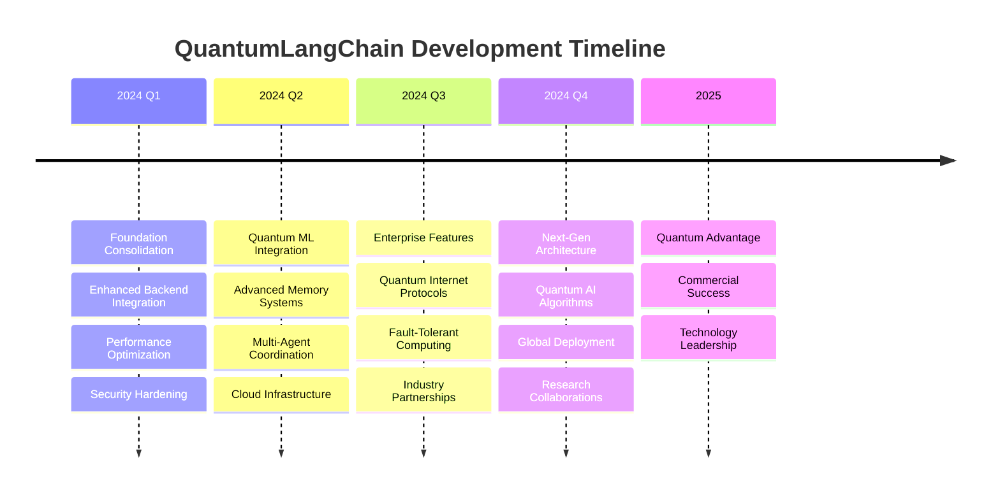

# 🗺️ Roadmap

🔐 **Licensed Component** - Contact: [bajpaikrishna715@gmail.com](mailto:bajpaikrishna715@gmail.com) for licensing

## 🚀 QuantumLangChain Roadmap

Our vision is to create the most advanced quantum-enhanced AI framework, bridging classical language models with quantum computing capabilities.

## 🎯 Strategic Goals

## 📅 Release Timeline

### 🔄 Version 2.2.0 - Q1 2024 (March)

#### 🎯 Core Features
- **Google Cirq Backend Integration**
  - Full Cirq quantum circuit support
  - Google Quantum AI integration
  - Cirq-specific optimization algorithms

- **Quantum Neural Networks**
  - Variational quantum circuits for ML
  - Quantum convolutional networks
  - Hybrid quantum-classical training

- **Enhanced Error Correction**
  - Surface code implementation
  - Logical qubit operations
  - Error syndrome detection

#### 🔧 Improvements
- 50% faster quantum circuit compilation
- Reduced quantum state preparation overhead
- Enhanced backend abstraction layer

### 🌟 Version 2.3.0 - Q2 2024 (June)

#### 🎯 Core Features
- **Quantum Cloud Orchestration**
  - Multi-cloud quantum resource management
  - Automatic backend selection
  - Load balancing across quantum devices

- **Advanced Quantum Algorithms Library**
  - Quantum approximate optimization (QAOA)
  - Variational quantum eigensolver (VQE)
  - Quantum machine learning algorithms

- **Quantum Database Integration**
  - Quantum-enhanced database queries
  - Superposition-based data storage
  - Quantum indexing algorithms

#### 🔧 Improvements
- Real-time quantum resource monitoring
- Adaptive quantum circuit optimization
- Enhanced quantum-classical communication

### 🚀 Version 2.4.0 - Q3 2024 (September)

#### 🎯 Core Features
- **Quantum Internet Protocols**
  - Quantum network communication
  - Distributed quantum computing
  - Quantum key distribution networks

- **Enterprise Management Console**
  - Centralized quantum resource management
  - Multi-tenant quantum services
  - Advanced analytics and monitoring

- **Quantum DevOps Tools**
  - Quantum CI/CD pipelines
  - Automated quantum testing
  - Quantum deployment orchestration

#### 🔧 Improvements
- Enterprise-grade security features
- Advanced compliance reporting
- Quantum resource optimization

### 🎉 Version 3.0.0 - Q4 2024 (December)

#### 🎯 Major Architecture Redesign
- **Next-Generation Quantum Framework**
  - Fault-tolerant quantum computing support
  - Logical qubit abstractions
  - Error-corrected quantum operations

- **Quantum AI Revolution**
  - Quantum-native large language models
  - Quantum attention mechanisms
  - Quantum transformer architectures

- **Universal Quantum Interface**
  - Hardware-agnostic quantum programming
  - Automatic quantum advantage detection
  - Seamless quantum-classical integration

#### ⚠️ Breaking Changes
- New quantum programming paradigms
- Enhanced licensing model
- Restructured API architecture

## 🔬 Research Initiatives

### Quantum Advantage Research
- **Quantum Supremacy Applications**
  - Identifying quantum advantage scenarios
  - Benchmarking quantum vs classical performance
  - Developing quantum-native algorithms

- **Quantum Machine Learning**
  - Quantum feature maps for classical data
  - Quantum kernel methods
  - Quantum generative models

### Academic Collaborations
- **University Partnerships**
  - MIT Quantum Computing Lab
  - Oxford Quantum Computing Centre
  - Stanford Quantum Information Lab

- **Research Publications**
  - Quantum memory architectures
  - Quantum-enhanced natural language processing
  - Distributed quantum agent systems

## 🏭 Industry Integration

### Technology Partnerships

#### Cloud Providers
- **IBM Quantum Network**
  - IBM Quantum device integration
  - Qiskit Runtime optimization
  - Enterprise quantum services

- **Amazon Braket Partnership**
  - AWS quantum cloud services
  - Hybrid quantum-classical workloads
  - Managed quantum infrastructure

- **Google Quantum AI**
  - Sycamore processor access
  - Cirq framework integration
  - Quantum ML collaboration

#### Industry Verticals
- **Financial Services**
  - Quantum risk analysis
  - Portfolio optimization
  - Fraud detection algorithms

- **Healthcare & Pharmaceuticals**
  - Drug discovery acceleration
  - Molecular simulation
  - Personalized medicine

- **Logistics & Optimization**
  - Supply chain optimization
  - Route planning algorithms
  - Resource allocation

## 🎓 Educational Initiatives

### Developer Education
- **Quantum Programming Courses**
  - QuantumLangChain fundamentals
  - Advanced quantum algorithms
  - Quantum-classical hybrid programming

- **Certification Programs**
  - Quantum developer certification
  - Enterprise quantum architect
  - Quantum AI specialist

### Community Building
- **Open Source Contributions**
  - Community-driven features
  - Plugin ecosystem development
  - Documentation improvements

- **Developer Events**
  - QuantumLangChain conferences
  - Quantum hackathons
  - Online workshops and webinars

## 📊 Market Strategy

### Target Markets

#### Primary Markets (2024)
- **Tech Giants**: AI research and development
- **Financial Institutions**: Risk analysis and optimization
- **Research Institutions**: Quantum algorithm development

#### Emerging Markets (2025+)
- **Healthcare Companies**: Drug discovery and diagnostics
- **Automotive Industry**: Autonomous vehicle optimization
- **Energy Sector**: Grid optimization and renewable energy

### Competitive Positioning
- **Unique Value Proposition**: Only quantum-enhanced LangChain
- **Technical Advantages**: Superior quantum-classical integration
- **Market Leadership**: First-mover in quantum AI space

## 🔮 Long-Term Vision (2025-2027)

### Quantum Computing Evolution
- **Fault-Tolerant Era**: Transition to error-corrected quantum computing
- **Quantum Internet**: Global quantum communication networks
- **Quantum Advantage**: Widespread quantum computational advantage

### QuantumLangChain Evolution
- **Quantum-Native AI**: AI models designed for quantum computers
- **Universal Quantum Platform**: Hardware-agnostic quantum programming
- **Quantum AI Ecosystem**: Complete quantum AI development stack

### Industry Transformation
- **AI Revolution**: Quantum-powered artificial intelligence
- **Business Innovation**: New quantum-enabled business models
- **Scientific Breakthroughs**: Accelerated scientific discovery

## 📈 Success Metrics

### Technical Metrics
- **Performance**: 100x speedup for quantum advantage scenarios
- **Reliability**: 99.9% quantum operation success rate
- **Scalability**: Support for 1000+ qubit systems

### Business Metrics
- **Adoption**: 10,000+ developers using QuantumLangChain
- **Revenue**: $100M+ annual recurring revenue
- **Market Share**: Leading position in quantum AI market

### Impact Metrics
- **Research**: 100+ published papers using QuantumLangChain
- **Innovation**: 50+ quantum AI patents
- **Education**: 50,000+ developers trained

## 🤝 Partnership Opportunities

### Technology Partners
- Quantum hardware manufacturers
- Cloud infrastructure providers
- AI/ML platform companies
- Enterprise software vendors

### Research Partners
- Academic institutions
- Government research labs
- Corporate R&D centers
- International quantum initiatives

### Investment Partners
- Venture capital firms
- Strategic investors
- Government funding agencies
- International development organizations

## 📞 Roadmap Feedback

We value community input on our roadmap priorities:

**Feedback Channels**:
- **Strategic Input**: [bajpaikrishna715@gmail.com](mailto:bajpaikrishna715@gmail.com)
- **Technical Requests**: GitHub Discussions
- **Partnership Inquiries**: partnerships@quantumlangchain.com
- **Research Collaborations**: research@quantumlangchain.com

**Roadmap Updates**: Quarterly roadmap reviews and updates

---

🔐 **License Notice**: Roadmap details and early access require appropriate licensing tiers. Contact [bajpaikrishna715@gmail.com](mailto:bajpaikrishna715@gmail.com) for partnership opportunities.
