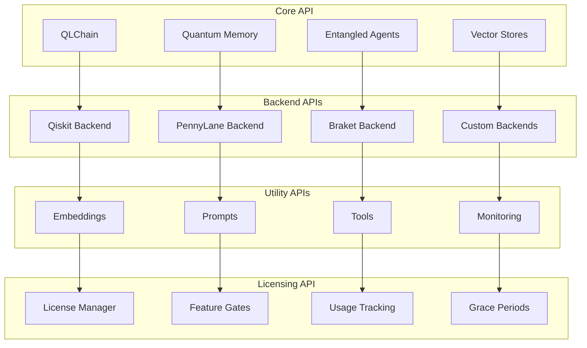

# 🔧 API Reference

🔐 **Licensed Component** - Contact: [bajpaikrishna715@gmail.com](mailto:bajpaikrishna715@gmail.com) for licensing

## QuantumLangChain API Overview

This comprehensive API reference covers all modules, classes, and functions available in QuantumLangChain.



## 🧬 Core Classes

### QLChain

The main interface for quantum-enhanced language processing.

```python
class QLChain(LicensedComponent):
    """
    Quantum-enhanced language chain for advanced AI reasoning.
    
    Combines quantum computing principles with classical language models
    to provide enhanced reasoning, creativity, and problem-solving capabilities.
    """
    
    def __init__(
        self,
        backend: str = "qiskit",
        quantum_dim: int = 4,
        classical_dim: int = 512,
        entanglement_strength: float = 0.7,
        temperature: float = 0.7,
        max_tokens: int = 2048,
        memory: Optional[QuantumMemory] = None,
        **kwargs
    ):
        """
        Initialize QLChain.
        
        Args:
            backend: Quantum backend ("qiskit", "pennylane", "braket")
            quantum_dim: Number of qubits for quantum processing
            classical_dim: Classical embedding dimension
            entanglement_strength: Strength of quantum entanglement (0-1)
            temperature: Sampling temperature for responses
            max_tokens: Maximum tokens in response
            memory: Optional quantum memory system
            **kwargs: Additional configuration parameters
            
        Raises:
            LicenseError: If license validation fails
            ValueError: If invalid parameters provided
        """
    
    async def arun(
        self,
        query: str,
        context: Optional[str] = None,
        reasoning_depth: int = 1,
        quantum_creativity: float = 0.5,
        **kwargs
    ) -> Dict[str, Any]:
        """
        Run quantum-enhanced reasoning asynchronously.
        
        Args:
            query: Input query or prompt
            context: Optional context information
            reasoning_depth: Depth of quantum reasoning (1-5)
            quantum_creativity: Quantum creativity boost (0-1)
            **kwargs: Additional parameters
            
        Returns:
            Dict containing response and metadata
            
        Example:
            >>> chain = QLChain()
            >>> result = await chain.arun("Explain quantum computing")
            >>> print(result['response'])
        """
    
    def run(
        self,
        query: str,
        context: Optional[str] = None,
        **kwargs
    ) -> Dict[str, Any]:
        """
        Synchronous version of arun.
        
        Args:
            query: Input query or prompt
            context: Optional context information
            **kwargs: Additional parameters
            
        Returns:
            Dict containing response and metadata
        """
    
    async def astream(
        self,
        query: str,
        **kwargs
    ) -> AsyncIterator[str]:
        """
        Stream quantum reasoning results.
        
        Args:
            query: Input query or prompt
            **kwargs: Additional parameters
            
        Yields:
            String chunks of the response as they're generated
            
        Example:
            >>> async for chunk in chain.astream("Tell me about AI"):
            ...     print(chunk, end="")
        """
    
    def get_quantum_state(self) -> QuantumState:
        """
        Get current quantum state of the system.
        
        Returns:
            Current quantum state representation
        """
    
    def reset_quantum_state(self) -> None:
        """Reset quantum state to initial condition."""
    
    def get_performance_metrics(self) -> Dict[str, float]:
        """
        Get performance metrics for the chain.
        
        Returns:
            Dictionary of performance metrics
        """
```

### QuantumMemory

Quantum-enhanced memory system for advanced information storage and retrieval.

```python
class QuantumMemory(LicensedComponent):
    """
    Quantum memory system with superposition storage and entangled retrieval.
    """
    
    def __init__(
        self,
        classical_dim: int = 512,
        quantum_dim: int = 4,
        decoherence_rate: float = 0.01,
        error_correction: bool = False,
        persistence: bool = False,
        **kwargs
    ):
        """
        Initialize quantum memory.
        
        Args:
            classical_dim: Classical memory dimension
            quantum_dim: Quantum memory dimension (qubits)
            decoherence_rate: Rate of quantum decoherence
            error_correction: Enable quantum error correction
            persistence: Enable persistent storage
            **kwargs: Additional configuration
        """
    
    async def store(
        self,
        key: str,
        value: Any,
        importance: float = 0.5,
        tags: Optional[List[str]] = None,
        **metadata
    ) -> bool:
        """
        Store information in quantum memory.
        
        Args:
            key: Unique identifier for the memory
            value: Information to store
            importance: Importance weight (0-1)
            tags: Optional tags for categorization
            **metadata: Additional metadata
            
        Returns:
            True if storage successful
        """
    
    async def retrieve(
        self,
        query: str,
        similarity_threshold: float = 0.7,
        max_results: int = 10,
        **kwargs
    ) -> List[MemoryItem]:
        """
        Retrieve information using quantum search.
        
        Args:
            query: Search query
            similarity_threshold: Minimum similarity for results
            max_results: Maximum number of results
            **kwargs: Additional search parameters
            
        Returns:
            List of matching memory items
        """
    
    async def quantum_interference_search(
        self,
        query: str,
        interference_strength: float = 0.8,
        **kwargs
    ) -> List[MemoryItem]:
        """
        Advanced search using quantum interference patterns.
        
        Args:
            query: Search query
            interference_strength: Quantum interference strength
            **kwargs: Additional parameters
            
        Returns:
            Enhanced search results with quantum interference
        """
    
    def get_memory_stats(self) -> MemoryStats:
        """
        Get memory usage statistics.
        
        Returns:
            Memory statistics object
        """
```

### EntangledAgent

Agent with quantum entanglement capabilities for multi-agent coordination.

```python
class EntangledAgent(LicensedComponent):
    """
    Quantum-entangled agent for advanced multi-agent systems.
    """
    
    def __init__(
        self,
        name: str,
        role: str,
        specialization: Optional[str] = None,
        quantum_dim: int = 4,
        capabilities: Optional[List[str]] = None,
        **kwargs
    ):
        """
        Initialize entangled agent.
        
        Args:
            name: Agent name/identifier
            role: Agent role (coordinator, executor, analyzer, etc.)
            specialization: Agent specialization area
            quantum_dim: Quantum dimension for entanglement
            capabilities: List of agent capabilities
            **kwargs: Additional configuration
        """
    
    async def entangle_with(
        self,
        other_agent: 'EntangledAgent',
        entanglement_strength: float = 0.8
    ) -> bool:
        """
        Establish quantum entanglement with another agent.
        
        Args:
            other_agent: Target agent for entanglement
            entanglement_strength: Strength of entanglement (0-1)
            
        Returns:
            True if entanglement successful
        """
    
    async def communicate(
        self,
        message: Any,
        target: Optional[str] = None,
        quantum_channel: bool = True
    ) -> Any:
        """
        Communicate with entangled agents.
        
        Args:
            message: Message to send
            target: Target agent name (None for broadcast)
            quantum_channel: Use quantum communication channel
            
        Returns:
            Response from target agent(s)
        """
    
    async def collaborate(
        self,
        task: Task,
        partners: List['EntangledAgent']
    ) -> Result:
        """
        Collaborate with other agents on a task.
        
        Args:
            task: Task to collaborate on
            partners: List of partner agents
            
        Returns:
            Collaborative task result
        """
    
    def get_entanglement_state(self) -> EntanglementState:
        """
        Get current entanglement state.
        
        Returns:
            Current entanglement state information
        """
```

## 🏗️ Chain Types

### RAGQuantumChain

Retrieval-Augmented Generation with quantum enhancement.

```python
class RAGQuantumChain(QLChain):
    """
    Quantum-enhanced Retrieval-Augmented Generation chain.
    """
    
    def __init__(
        self,
        vectorstore: VectorStore,
        quantum_retrieval_strength: float = 0.8,
        retrieval_k: int = 10,
        **kwargs
    ):
        """
        Initialize RAG quantum chain.
        
        Args:
            vectorstore: Vector store for document retrieval
            quantum_retrieval_strength: Quantum enhancement strength
            retrieval_k: Number of documents to retrieve
            **kwargs: Additional QLChain parameters
        """
    
    async def quantum_retrieval(
        self,
        query: str,
        k: Optional[int] = None,
        quantum_interference: bool = True,
        **kwargs
    ) -> List[Document]:
        """
        Quantum-enhanced document retrieval.
        
        Args:
            query: Retrieval query
            k: Number of documents to retrieve
            quantum_interference: Use quantum interference
            **kwargs: Additional retrieval parameters
            
        Returns:
            List of retrieved documents
        """
```

### ConversationalQuantumChain

Conversational AI with quantum memory.

```python
class ConversationalQuantumChain(QLChain):
    """
    Conversational chain with quantum memory persistence.
    """
    
    def __init__(
        self,
        memory: QuantumConversationMemory,
        personality: Optional[str] = None,
        **kwargs
    ):
        """
        Initialize conversational quantum chain.
        
        Args:
            memory: Quantum conversation memory
            personality: AI personality type
            **kwargs: Additional QLChain parameters
        """
    
    async def conversation_turn(
        self,
        input_text: str,
        session_id: str,
        **kwargs
    ) -> str:
        """
        Process single conversation turn.
        
        Args:
            input_text: User input
            session_id: Conversation session ID
            **kwargs: Additional parameters
            
        Returns:
            AI response
        """
```

## 📊 Vector Stores

### QuantumVectorStore

Vector store with quantum search capabilities.

```python
class QuantumVectorStore(LicensedComponent):
    """
    Vector store with quantum-enhanced similarity search.
    """
    
    def __init__(
        self,
        embeddings: Embeddings,
        quantum_search: bool = True,
        dimension: Optional[int] = None,
        **kwargs
    ):
        """
        Initialize quantum vector store.
        
        Args:
            embeddings: Embedding function
            quantum_search: Enable quantum search
            dimension: Vector dimension
            **kwargs: Additional configuration
        """
    
    async def aadd_texts(
        self,
        texts: List[str],
        metadatas: Optional[List[Dict]] = None,
        quantum_enhancement: bool = True,
        **kwargs
    ) -> List[str]:
        """
        Add texts to vector store.
        
        Args:
            texts: List of texts to add
            metadatas: Optional metadata for each text
            quantum_enhancement: Apply quantum enhancement
            **kwargs: Additional parameters
            
        Returns:
            List of document IDs
        """
    
    async def asimilarity_search(
        self,
        query: str,
        k: int = 4,
        quantum_interference: bool = False,
        **kwargs
    ) -> List[Document]:
        """
        Quantum-enhanced similarity search.
        
        Args:
            query: Search query
            k: Number of results
            quantum_interference: Use quantum interference
            **kwargs: Additional search parameters
            
        Returns:
            List of similar documents
        """
```

## 🔌 Backend APIs

### QiskitBackend

```python
class QiskitBackend(QuantumBackend):
    """Qiskit quantum computing backend."""
    
    def __init__(
        self,
        backend_name: str = "qasm_simulator",
        shots: int = 1024,
        optimization_level: int = 1,
        **kwargs
    ):
        """Initialize Qiskit backend."""
    
    async def execute_circuit(
        self,
        circuit: QuantumCircuit,
        **kwargs
    ) -> Result:
        """Execute quantum circuit."""
```

### PennyLaneBackend

```python
class PennyLaneBackend(QuantumBackend):
    """PennyLane quantum computing backend."""
    
    def __init__(
        self,
        device: str = "default.qubit",
        shots: int = 1000,
        **kwargs
    ):
        """Initialize PennyLane backend."""
    
    async def execute_circuit(
        self,
        circuit: pennylane.QNode,
        **kwargs
    ) -> Any:
        """Execute quantum circuit."""
```

## 🛠️ Utilities

### QuantumEmbeddings

```python
class QuantumEmbeddings(LicensedComponent):
    """Quantum-enhanced embeddings."""
    
    def __init__(
        self,
        classical_dim: int = 768,
        quantum_dim: int = 8,
        entanglement_strength: float = 0.8,
        **kwargs
    ):
        """Initialize quantum embeddings."""
    
    async def aembed_documents(
        self,
        texts: List[str]
    ) -> List[List[float]]:
        """Embed documents with quantum enhancement."""
    
    async def aembed_query(
        self,
        text: str
    ) -> List[float]:
        """Embed query with quantum enhancement."""
```

### QuantumPromptTemplate

```python
class QuantumPromptTemplate:
    """Template for quantum-enhanced prompts."""
    
    def __init__(
        self,
        template: str,
        quantum_variables: List[str],
        classical_variables: List[str],
        **kwargs
    ):
        """Initialize quantum prompt template."""
    
    def format(self, **kwargs) -> QuantumPrompt:
        """Format template with variables."""
```

## 🔒 Licensing API

### LicenseManager

```python
class LicenseManager:
    """Manages licensing and feature access."""
    
    @staticmethod
    def validate_license(
        required_features: List[str],
        required_tier: str = "basic"
    ) -> bool:
        """Validate license for features."""
    
    @staticmethod
    def get_license_info() -> LicenseInfo:
        """Get current license information."""
    
    @staticmethod
    def check_grace_period() -> GracePeriodInfo:
        """Check grace period status."""
```

### Decorators

```python
def requires_license(
    tier: str = "basic",
    features: Optional[List[str]] = None
):
    """
    Decorator for license-protected functions.
    
    Args:
        tier: Required license tier
        features: Required features
    """

def track_usage(
    feature: str,
    weight: float = 1.0
):
    """
    Decorator for usage tracking.
    
    Args:
        feature: Feature being used
        weight: Usage weight
    """
```

## 📊 Monitoring

### PerformanceMonitor

```python
class PerformanceMonitor:
    """Monitor system performance and usage."""
    
    def track(self, operation: str) -> ContextManager:
        """Track operation performance."""
    
    def get_metrics(self) -> Dict[str, Any]:
        """Get performance metrics."""
    
    def reset_metrics(self) -> None:
        """Reset performance metrics."""
```

## 🚨 Exceptions

### Core Exceptions

```python
class QuantumLangChainError(Exception):
    """Base exception for QuantumLangChain."""

class LicenseError(QuantumLangChainError):
    """License validation or access error."""

class QuantumError(QuantumLangChainError):
    """Quantum processing error."""

class BackendError(QuantumLangChainError):
    """Quantum backend error."""

class MemoryError(QuantumLangChainError):
    """Quantum memory error."""

class EntanglementError(QuantumLangChainError):
    """Agent entanglement error."""
```

## 🔧 Configuration

### Global Configuration

```python
from quantumlangchain.config import Config

# Set global configuration
Config.set({
    "default_backend": "qiskit",
    "default_quantum_dim": 4,
    "enable_debugging": False,
    "license_check_interval": 3600,
    "grace_period_hours": 24
})

# Get configuration
backend = Config.get("default_backend")
```

## 📖 Usage Examples

### Basic Usage

```python
from quantumlangchain import QLChain

# Simple initialization
chain = QLChain()

# Advanced initialization
chain = QLChain(
    backend="qiskit",
    quantum_dim=8,
    entanglement_strength=0.9,
    temperature=0.7
)

# Run query
result = await chain.arun("Explain quantum computing")
```

### Error Handling

```python
from quantumlangchain import QLChain
from quantumlangchain.exceptions import LicenseError, QuantumError

try:
    chain = QLChain(quantum_dim=16)
    result = await chain.arun("Complex question")
except LicenseError as e:
    print(f"License error: {e}")
    print("Contact: bajpaikrishna715@gmail.com")
except QuantumError as e:
    print(f"Quantum error: {e}")
except Exception as e:
    print(f"Unexpected error: {e}")
```

## 🔐 License Requirements

All API features require valid licensing:

- **Basic API**: Basic license tier
- **Advanced API**: Professional license tier  
- **Enterprise API**: Enterprise license tier
- **Research API**: Research license tier

Contact [bajpaikrishna715@gmail.com](mailto:bajpaikrishna715@gmail.com) for licensing.

This API reference provides comprehensive coverage of all QuantumLangChain functionality for building next-generation quantum-enhanced AI applications.
