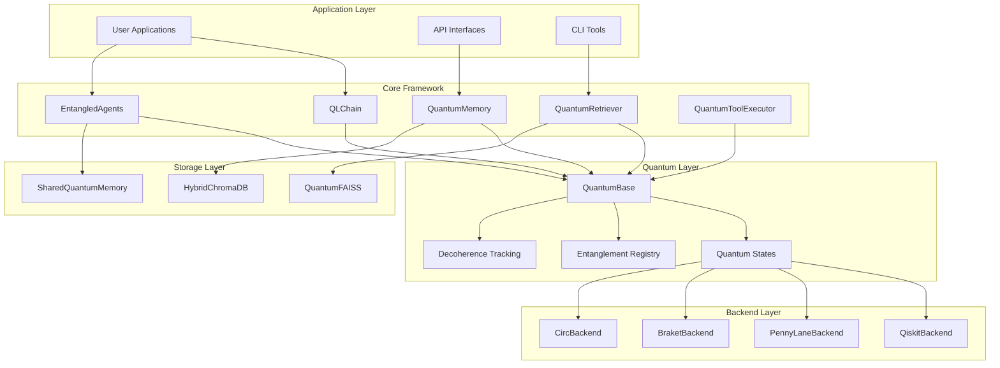
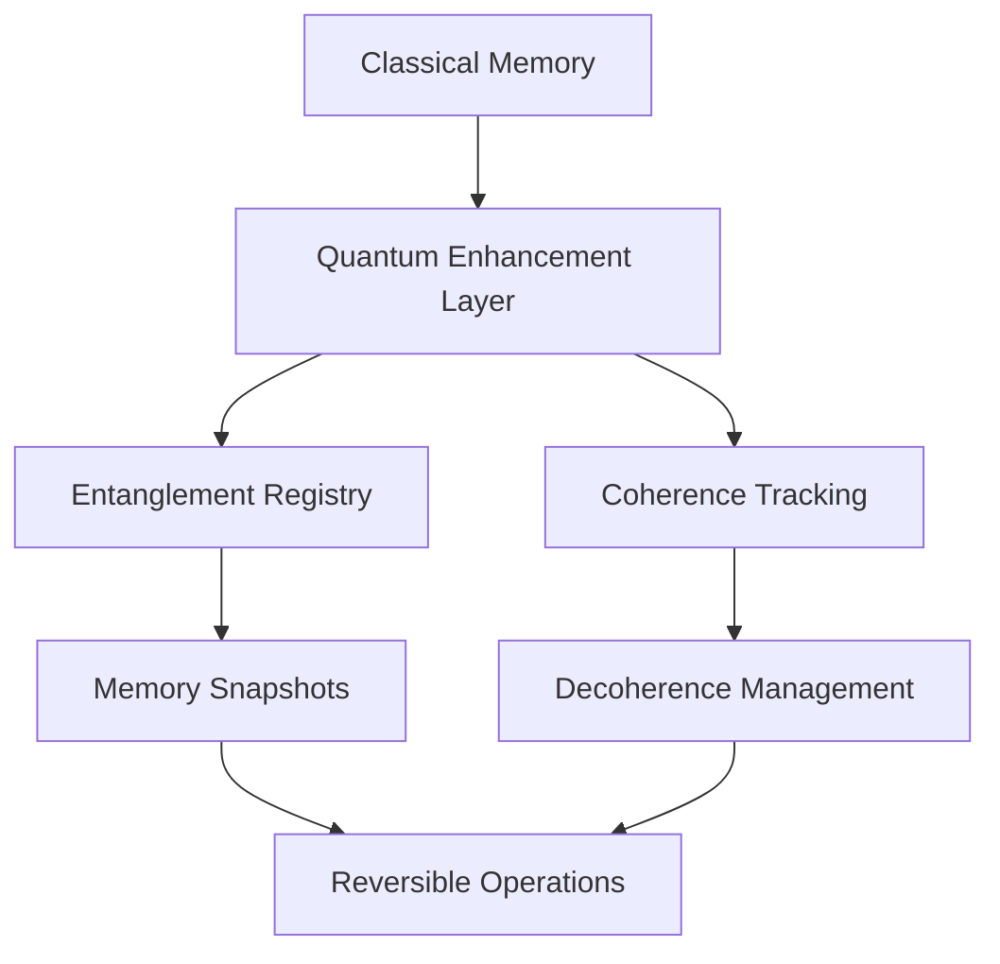
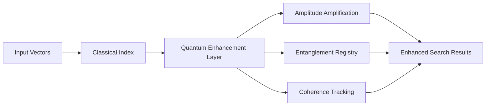

# QuantumLangChain Architecture

This document provides a comprehensive overview of QuantumLangChain's architecture, design principles, and quantum-classical integration patterns.

## Overview

QuantumLangChain is built on a modular, quantum-native architecture that seamlessly integrates classical AI frameworks with quantum computing capabilities. The framework is designed around the principle of **quantum coherence preservation** while maintaining **classical compatibility**.



## Core Components

### 1. QuantumBase Class

The foundation of all quantum-enhanced components:

```python
class QuantumBase:
    """Abstract base class for all quantum-enhanced components."""
    
    def __init__(self, config: Optional[QuantumConfig] = None):
        self.quantum_state: QuantumState = QuantumState.COHERENT
        self.decoherence_level: float = 0.0
        self.entanglement_registry: Dict[str, Any] = {}
        self.config = config or QuantumConfig()
    
    async def initialize(self) -> None:
        """Initialize quantum state and resources."""
        pass
    
    async def reset_quantum_state(self) -> None:
        """Reset to coherent quantum state."""
        pass
    
    def create_entanglement(self, other: 'QuantumBase', strength: float) -> str:
        """Create entanglement with another quantum component."""
        pass
```

### 2. Quantum State Management

#### Quantum States

```python
class QuantumState(Enum):
    COHERENT = "coherent"          # Pure quantum state
    SUPERPOSITION = "superposition" # Multiple states simultaneously
    ENTANGLED = "entangled"        # Correlated with other systems
    COLLAPSED = "collapsed"        # After measurement
    DECOHERENT = "decoherent"      # Lost quantum properties
```

#### Decoherence Tracking

```python
def update_decoherence(self, delta: float):
    """Update decoherence level and manage state transitions."""
    self.decoherence_level = min(1.0, self.decoherence_level + delta)
    
    if self.decoherence_level > self.config.decoherence_threshold:
        self.quantum_state = QuantumState.DECOHERENT
```

### 3. Backend Architecture

#### Abstract Backend Interface

```python
class QuantumBackend:
    """Abstract interface for quantum computing backends."""
    
    async def execute_circuit(self, circuit: Any, shots: int) -> Dict[str, Any]:
        """Execute quantum circuit and return results."""
        pass
    
    async def create_entangling_circuit(self, qubits: List[int]) -> Any:
        """Create circuit for entangling specified qubits."""
        pass
    
    def get_backend_info(self) -> Dict[str, Any]:
        """Get backend capabilities and information."""
        pass
```

#### Backend Implementations

1. **QiskitBackend**: IBM Quantum integration
2. **PennyLaneBackend**: Xanadu quantum ML
3. **BraketBackend**: AWS quantum computing
4. **CircBackend**: Google Cirq support

## Design Principles

### 1. Quantum Coherence First

All operations are designed to preserve quantum coherence when possible:

- **Minimal Decoherence**: Operations minimize quantum decoherence
- **Coherence Tracking**: Real-time monitoring of quantum state quality
- **Graceful Degradation**: Automatic fallback to classical methods when needed

### 2. Entanglement as a Service

Quantum entanglement is treated as a first-class resource:

```python
# Create entanglement between memory systems
memory1 = QuantumMemory()
memory2 = QuantumMemory()
entanglement_id = memory1.create_entanglement(memory2, strength=0.8)

# Entangled operations affect both systems
await memory1.store("key", "value", quantum_enhanced=True)
# memory2 automatically reflects quantum correlations
```

### 3. Hybrid Classical-Quantum Execution

Seamless integration between classical and quantum processing:

```python
async def hybrid_chain_execution(self, input_data):
    # Classical preprocessing
    processed_input = self.classical_preprocess(input_data)
    
    # Quantum enhancement
    if self.quantum_state != QuantumState.DECOHERENT:
        quantum_result = await self.quantum_process(processed_input)
    else:
        quantum_result = self.classical_fallback(processed_input)
    
    # Classical postprocessing
    return self.classical_postprocess(quantum_result)
```

## Memory Architecture

### Quantum Memory Hierarchy



### Memory Types

1. **QuantumMemory**: Individual quantum-enhanced memory
2. **SharedQuantumMemory**: Multi-agent shared memory
3. **MemorySnapshots**: Reversible quantum states
4. **EntangledMemory**: Correlated memory systems

## Agent Architecture

### Entangled Agent System

```python
class EntangledAgents:
    """Multi-agent system with quantum collaboration."""
    
    def __init__(self, agent_configs: List[Dict]):
        self.agents = self._create_agents(agent_configs)
        self.shared_memory = SharedQuantumMemory()
        self.entanglement_matrix = self._initialize_entanglement()
    
    async def collaborative_solve(self, problem: str) -> Dict[str, Any]:
        # Create quantum superposition of agent approaches
        agent_states = await self._create_agent_superposition(problem)
        
        # Allow quantum interference between solutions
        interfered_states = await self._apply_quantum_interference(agent_states)
        
        # Measure final solution
        solution = await self._measure_consensus(interfered_states)
        
        return solution
```

### Agent Communication Protocols

1. **Quantum Channels**: Entanglement-based communication
2. **Classical Channels**: Traditional message passing
3. **Hybrid Protocols**: Combined quantum-classical communication

## Vector Store Architecture

### Quantum-Enhanced Vector Stores



### Search Algorithms

1. **Amplitude Amplification**: Quantum search enhancement
2. **Grover's Algorithm**: Quadratic speedup for specific searches
3. **Quantum Interference**: Result ranking through interference patterns
4. **Entanglement Correlation**: Boost correlated documents

## Performance Optimization

### Quantum Circuit Optimization

```python
class CircuitOptimizer:
    """Optimize quantum circuits for minimal decoherence."""
    
    def optimize_circuit(self, circuit: Any) -> Any:
        # Minimize circuit depth
        optimized = self.reduce_depth(circuit)
        
        # Optimize gate sequences
        optimized = self.optimize_gates(optimized)
        
        # Apply error correction
        optimized = self.add_error_correction(optimized)
        
        return optimized
```

### Decoherence Mitigation

1. **Circuit Depth Minimization**
2. **Gate Sequence Optimization**
3. **Error Correction Codes**
4. **Dynamical Decoupling**

## Scalability Patterns

### Horizontal Scaling

```python
# Distribute quantum agents across multiple backends
agents = EntangledAgents(
    agent_configs=configs,
    backend_distribution={
        "agents_0_2": QiskitBackend(),
        "agents_3_5": PennyLaneBackend(),
        "agents_6_8": BraketBackend()
    }
)
```

### Vertical Scaling

```python
# Scale quantum resources within a single backend
config = QuantumConfig(
    num_qubits=32,        # Scale up qubits
    circuit_depth=100,    # Deeper circuits
    shots=10000,          # More measurements
    parallel_circuits=8   # Parallel execution
)
```

## Security and Privacy

### Quantum Cryptography

```python
class QuantumSecurity:
    """Quantum-enhanced security features."""
    
    def quantum_encrypt(self, data: str, key: str) -> str:
        """Encrypt data using quantum key distribution."""
        pass
    
    def verify_entanglement_integrity(self, entanglement_id: str) -> bool:
        """Verify entanglement hasn't been tampered with."""
        pass
```

### Privacy-Preserving Quantum Computing

1. **Quantum Homomorphic Encryption**
2. **Secure Multi-Party Quantum Computation**
3. **Quantum Anonymous Communication**

## Error Handling and Recovery

### Quantum Error Correction

```python
class QuantumErrorCorrection:
    """Handle quantum errors and decoherence."""
    
    async def detect_errors(self, quantum_state: Any) -> List[str]:
        """Detect quantum errors in current state."""
        pass
    
    async def correct_errors(self, errors: List[str]) -> bool:
        """Apply quantum error correction."""
        pass
    
    async def recover_from_decoherence(self) -> bool:
        """Recover from quantum decoherence."""
        pass
```

### Fallback Mechanisms

1. **Classical Fallback**: Automatic switch to classical algorithms
2. **Reduced Quantum**: Use fewer qubits when resources limited
3. **Error Mitigation**: Statistical error correction
4. **State Restoration**: Restore from quantum snapshots

## Future Extensions

### Planned Features

1. **Quantum Neural Networks**: Direct integration with QNNs
2. **Quantum Reinforcement Learning**: RL with quantum advantage
3. **Quantum Federated Learning**: Distributed quantum ML
4. **Quantum Natural Language Processing**: Quantum-enhanced NLP

### Research Directions

1. **Quantum Advantage Verification**: Prove quantum speedup
2. **Fault-Tolerant Quantum Computing**: Error-corrected quantum algorithms
3. **Quantum-Classical Hybrid Optimization**: Co-design optimization
4. **Quantum Machine Learning Theory**: Theoretical foundations

## Integration Patterns

### LangChain Integration

```python
from langchain.chains import BaseChain
from quantumlangchain import QLChain

# Direct replacement for LangChain chains
classical_chain = BaseChain(...)
quantum_chain = QLChain(...)  # Drop-in replacement with quantum enhancement
```

### Framework Interoperability

1. **Hugging Face Transformers**: Quantum-enhanced language models
2. **PyTorch Integration**: Quantum layers in neural networks
3. **TensorFlow Quantum**: Google's quantum ML framework
4. **Qiskit Machine Learning**: IBM's quantum ML tools

This architecture enables QuantumLangChain to deliver unprecedented capabilities in quantum-enhanced artificial intelligence while maintaining compatibility with existing classical AI systems.
