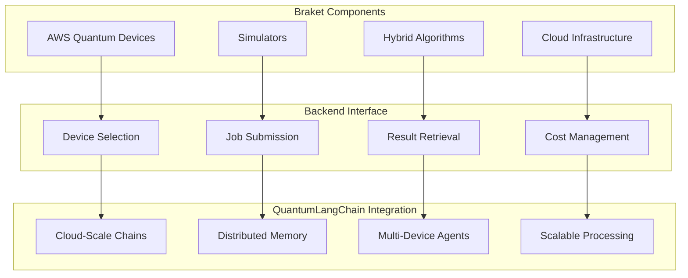

# ☁️ Braket Backend

🔐 **Licensed Component** - Contact: [bajpaikrishna715@gmail.com](mailto:bajpaikrishna715@gmail.com) for licensing

## Amazon Braket Integration Architecture



## 🌟 Core Features

### Braket Backend Configuration

```python
from quantumlangchain.backends import BraketBackend

# Initialize Braket backend
backend = BraketBackend(
    device="arn:aws:braket::device/quantum-simulator/amazon/sv1",
    s3_folder=("amazon-braket-bucket", "results"),
    poll_timeout_seconds=3600
)

# Configure for QuantumLangChain
qlchain = QLChain(
    backend=backend,
    quantum_dim=12,
    cloud_processing=True
)
```

## 🔐 License Requirements

- **Basic Braket**: Basic license tier (simulators only)
- **Professional Braket**: Professional license tier (quantum devices)
- **Enterprise Braket**: Enterprise license tier (premium access)
- **Research Braket**: Research license tier (research partnerships)

Contact [bajpaikrishna715@gmail.com](mailto:bajpaikrishna715@gmail.com) for licensing.
