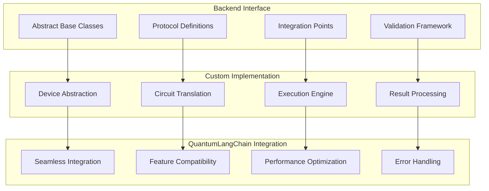

# 🔧 Custom Backends

🔐 **Licensed Component** - Contact: [bajpaikrishna715@gmail.com](mailto:bajpaikrishna715@gmail.com) for licensing

## Custom Backend Architecture



## 🌟 Core Features

### Custom Backend Development

```python
from quantumlangchain.backends import CustomBackend

class MyQuantumBackend(CustomBackend):
    def __init__(self, **config):
        super().__init__()
        self.config = config
    
    async def execute_circuit(self, circuit, **kwargs):
        # Custom implementation
        return result

# Register custom backend
backend = MyQuantumBackend(device="my_device")
qlchain = QLChain(backend=backend)
```

## 🔐 License Requirements

- **Basic Custom**: Basic license tier (simple backends)
- **Professional Custom**: Professional license tier (advanced backends)
- **Enterprise Custom**: Enterprise license tier (commercial backends)
- **Research Custom**: Research license tier (experimental backends)

Contact [bajpaikrishna715@gmail.com](mailto:bajpaikrishna715@gmail.com) for licensing.
