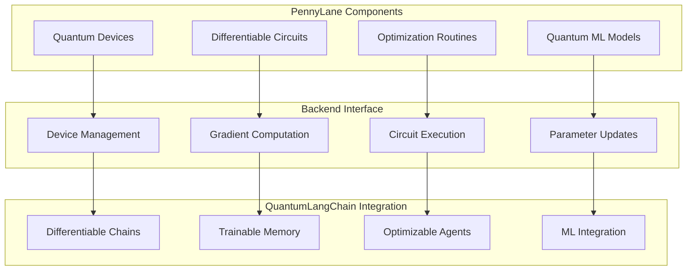

# 🌊 PennyLane Backend

🔐 **Licensed Component** - Contact: [bajpaikrishna715@gmail.com](mailto:bajpaikrishna715@gmail.com) for licensing

## PennyLane Integration Architecture



## 🌟 Core Features

### PennyLane Backend Configuration

```python
from quantumlangchain.backends import PennyLaneBackend

# Initialize PennyLane backend
backend = PennyLaneBackend(
    device="default.qubit",
    shots=1000,
    interface="autograd"
)

# Configure for QuantumLangChain
qlchain = QLChain(
    backend=backend,
    quantum_dim=8,
    differentiable=True
)
```

## 🔐 License Requirements

- **Basic PennyLane**: Basic license tier (basic devices)
- **Professional PennyLane**: Professional license tier (advanced devices)
- **Enterprise PennyLane**: Enterprise license tier (hardware integration)
- **Research PennyLane**: Research license tier (experimental features)

Contact [bajpaikrishna715@gmail.com](mailto:bajpaikrishna715@gmail.com) for licensing.
