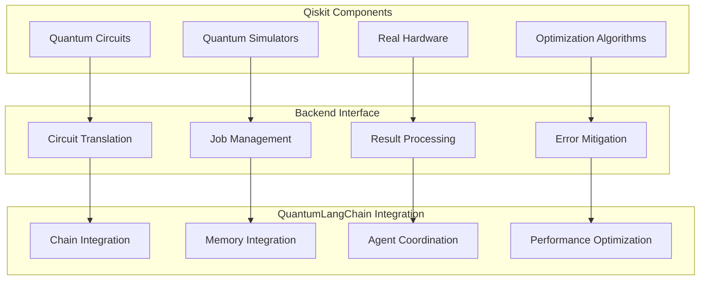

# 🔬 Qiskit Backend

🔐 **Licensed Component** - Contact: [bajpaikrishna715@gmail.com](mailto:bajpaikrishna715@gmail.com) for licensing

## Qiskit Integration Architecture



## 🌟 Core Features

### Qiskit Backend Configuration

```python
from quantumlangchain.backends import QiskitBackend

# Initialize Qiskit backend
backend = QiskitBackend(
    backend_name="qasm_simulator",
    shots=1024,
    optimization_level=2,
    noise_model=None
)

# Configure for QuantumLangChain
qlchain = QLChain(
    backend=backend,
    quantum_dim=8
)
```

## 🔐 License Requirements

- **Basic Qiskit**: Basic license tier (simulator only)
- **Professional Qiskit**: Professional license tier (hardware access)
- **Enterprise Qiskit**: Enterprise license tier (premium features)
- **Research Qiskit**: Research license tier (experimental access)

Contact [bajpaikrishna715@gmail.com](mailto:bajpaikrishna715@gmail.com) for licensing.
