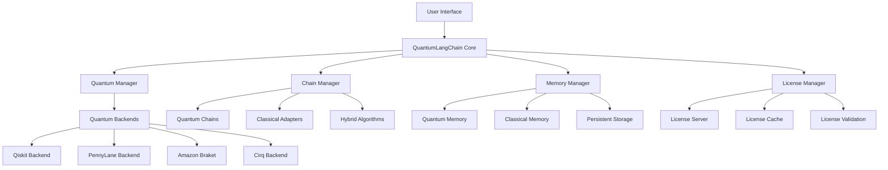
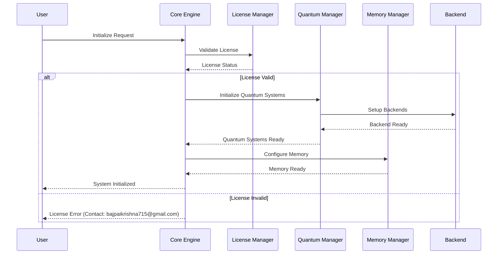

# 🏗️ Architecture Overview

QuantumLangChain is built on a modular, extensible architecture that seamlessly integrates quantum computing capabilities with classical AI frameworks. This document provides a comprehensive overview of the system architecture, design principles, and core components.

## 🎯 Core Design Principles

### 1. Quantum-Classical Hybridization

- **Adaptive Processing**: Automatically chooses optimal processing mode (quantum vs classical)
- **Seamless Integration**: Transparent switching between quantum and classical operations
- **Performance Optimization**: Uses quantum enhancement only when beneficial

### 2. Modular Architecture

- **Component Isolation**: Each module is independently deployable and testable
- **Interface Standardization**: Consistent APIs across all quantum backends
- **Plugin System**: Extensible architecture for custom quantum algorithms

### 3. Enterprise-Ready Design

- **Licensing Integration**: Built-in license management and compliance checking
- **Scalability**: Horizontal and vertical scaling support
- **Security**: Enterprise-grade security and access control

## 🏛️ System Architecture



## 🔧 Core Components

### QuantumLangChain Core Engine

The central orchestration layer that coordinates all quantum and classical operations:

```python
class QuantumLangChainCore:
    """
    Central engine coordinating quantum-classical operations
    Contact: bajpaikrishna715@gmail.com for enterprise licensing
    """
    
    def __init__(self):
        self.license_manager = LicenseManager()
        self.quantum_manager = QuantumManager()
        self.chain_manager = ChainManager()
        self.memory_manager = MemoryManager()
        
    @requires_license
    async def initialize(self):
        """Initialize all subsystems with license validation"""
        await self.license_manager.validate()
        await self.quantum_manager.initialize_backends()
        await self.chain_manager.setup_quantum_chains()
        await self.memory_manager.configure_quantum_memory()
```

### License Management System

Enterprise-grade licensing with real-time validation:

```python
class LicenseManager:
    """
    Comprehensive license management system
    
    Features:
    - Real-time license validation
    - Grace period management (24 hours)
    - Feature gating and compliance
    - Usage analytics and reporting
    """
    
    def __init__(self):
        self.license_cache = LicenseCache()
        self.validator = LicenseValidator()
        self.grace_period = GracePeriodManager()
        
    async def validate_license(self) -> LicenseStatus:
        """Validate current license status"""
        if self.grace_period.is_active():
            return LicenseStatus.GRACE_PERIOD
            
        license_data = await self.license_cache.get_license()
        return await self.validator.validate(license_data)
```

### Quantum Backend Abstraction

Unified interface for multiple quantum computing platforms:

```python
class QuantumBackend(ABC):
    """Abstract base class for quantum computing backends"""
    
    @abstractmethod
    async def execute_circuit(self, circuit: QuantumCircuit) -> QuantumResult:
        """Execute quantum circuit and return results"""
        pass
    
    @abstractmethod
    async def get_backend_info(self) -> BackendInfo:
        """Get backend capabilities and status"""
        pass
    
    @abstractmethod
    async def optimize_circuit(self, circuit: QuantumCircuit) -> QuantumCircuit:
        """Optimize circuit for this backend"""
        pass

class QiskitBackend(QuantumBackend):
    """IBM Qiskit backend implementation"""
    
    def __init__(self, provider: str = "aer", backend: str = "aer_simulator"):
        self.provider = provider
        self.backend_name = backend
        self.backend = None
        
    async def execute_circuit(self, circuit: QuantumCircuit) -> QuantumResult:
        """Execute circuit on Qiskit backend"""
        job = await self.backend.run(circuit, shots=self.shots)
        result = await job.result()
        return QuantumResult.from_qiskit(result)
```

## 🧠 Quantum Memory Architecture

Advanced quantum-enhanced memory system with entanglement:

```python
class QuantumMemory:
    """
    Quantum-enhanced memory system with entanglement capabilities
    
    Architecture:
    - Classical vector storage for traditional embeddings
    - Quantum state storage for superposition-based memory
    - Entanglement networks for associative memory
    - Temporal coherence for timeline management
    """
    
    def __init__(self, classical_dim: int = 512, quantum_dim: int = 8):
        self.classical_memory = ClassicalVectorStore(dim=classical_dim)
        self.quantum_memory = QuantumStateMemory(qubits=quantum_dim)
        self.entanglement_network = EntanglementNetwork()
        self.temporal_coherence = TemporalCoherence()
        
    @requires_license
    async def store_memory(self, content: str, quantum_enhanced: bool = True):
        """Store memory with optional quantum enhancement"""
        classical_embedding = await self.embed_classical(content)
        await self.classical_memory.store(classical_embedding)
        
        if quantum_enhanced:
            quantum_state = await self.create_quantum_state(content)
            await self.quantum_memory.store(quantum_state)
            await self.entanglement_network.create_associations(quantum_state)
```

## 🔗 Chain Architecture

Quantum-enhanced chain processing with adaptive algorithms:

```python
class QuantumChain:
    """
    Quantum-enhanced processing chain
    
    Features:
    - Adaptive quantum/classical switching
    - Superposition-based parallel processing
    - Entanglement for context preservation
    - Quantum error correction
    """
    
    def __init__(self, quantum_threshold: float = 0.7):
        self.quantum_threshold = quantum_threshold
        self.quantum_processor = QuantumProcessor()
        self.classical_processor = ClassicalProcessor()
        self.decision_engine = QuantumClassicalDecisionEngine()
        
    @requires_license
    async def process(self, input_data: Any) -> ChainResult:
        """Process input through quantum-enhanced chain"""
        complexity_score = await self.analyze_complexity(input_data)
        
        if complexity_score > self.quantum_threshold:
            return await self.quantum_processor.process(input_data)
        else:
            return await self.classical_processor.process(input_data)
```

## 🤖 Multi-Agent Quantum System

Entangled agent collaboration with quantum communication:

```python
class EntangledAgents:
    """
    Multi-agent system with quantum entanglement
    
    Capabilities:
    - Quantum state sharing between agents
    - Parallel problem solving in superposition
    - Consensus through quantum measurement
    - Distributed quantum computing
    """
    
    def __init__(self, agent_count: int = 3):
        self.agents = []
        self.entanglement_matrix = QuantumEntanglementMatrix(agent_count)
        self.consensus_engine = QuantumConsensusEngine()
        
    @requires_license
    async def collaborative_solve(self, problem: str) -> AgentResult:
        """Solve problem through quantum-entangled collaboration"""
        # Create quantum superposition of solution approaches
        quantum_state = await self.create_solution_superposition(problem)
        
        # Distribute entangled states to agents
        for i, agent in enumerate(self.agents):
            entangled_state = self.entanglement_matrix.get_state(i)
            await agent.receive_quantum_state(entangled_state)
        
        # Parallel processing in quantum superposition
        partial_solutions = await asyncio.gather(*[
            agent.process_quantum(quantum_state) for agent in self.agents
        ])
        
        # Quantum consensus measurement
        final_solution = await self.consensus_engine.measure_consensus(
            partial_solutions
        )
        
        return final_solution
```

## 📊 Performance Monitoring

Real-time quantum system monitoring and optimization:

```python
class QuantumPerformanceMonitor:
    """
    Real-time monitoring of quantum system performance
    
    Metrics:
    - Quantum operation latency
    - Decoherence rates
    - Entanglement fidelity
    - Classical-quantum switching efficiency
    """
    
    def __init__(self):
        self.metrics_collector = QuantumMetricsCollector()
        self.performance_analyzer = PerformanceAnalyzer()
        self.optimization_engine = QuantumOptimizationEngine()
        
    async def monitor_execution(self, operation: QuantumOperation):
        """Monitor quantum operation performance"""
        start_time = time.time()
        
        # Collect pre-execution metrics
        pre_metrics = await self.metrics_collector.collect_state()
        
        # Execute operation
        result = await operation.execute()
        
        # Collect post-execution metrics
        post_metrics = await self.metrics_collector.collect_state()
        
        # Analyze performance
        performance_data = await self.performance_analyzer.analyze(
            pre_metrics, post_metrics, time.time() - start_time
        )
        
        # Suggest optimizations
        optimizations = await self.optimization_engine.suggest_improvements(
            performance_data
        )
        
        return PerformanceReport(result, performance_data, optimizations)
```

## 🔐 Security Architecture

Enterprise-grade security with quantum-safe encryption:

```python
class QuantumSecurityManager:
    """
    Quantum-safe security management
    
    Features:
    - Quantum key distribution (QKD)
    - Post-quantum cryptography
    - Quantum random number generation
    - Secure multi-party quantum computation
    """
    
    def __init__(self):
        self.qkd_manager = QuantumKeyDistribution()
        self.post_quantum_crypto = PostQuantumCrypto()
        self.quantum_rng = QuantumRandomNumberGenerator()
        
    async def establish_secure_channel(self, parties: List[str]) -> SecureChannel:
        """Establish quantum-safe communication channel"""
        # Generate quantum keys
        quantum_keys = await self.qkd_manager.distribute_keys(parties)
        
        # Setup post-quantum encryption
        encryption_keys = await self.post_quantum_crypto.generate_keys()
        
        # Create secure channel
        channel = SecureChannel(quantum_keys, encryption_keys)
        
        return channel
```

## 📈 Scalability Design

Horizontal and vertical scaling for enterprise deployment:

```python
class QuantumScalingManager:
    """
    Automatic scaling for quantum workloads
    
    Scaling Strategies:
    - Quantum resource pooling
    - Dynamic backend selection
    - Load balancing across quantum devices
    - Classical fallback for overflow
    """
    
    def __init__(self):
        self.resource_pool = QuantumResourcePool()
        self.load_balancer = QuantumLoadBalancer()
        self.auto_scaler = QuantumAutoScaler()
        
    async def scale_for_workload(self, workload: QuantumWorkload):
        """Automatically scale resources for workload"""
        # Analyze workload requirements
        requirements = await self.analyze_workload(workload)
        
        # Check available resources
        available_resources = await self.resource_pool.get_available()
        
        # Scale if needed
        if requirements.exceeds_capacity(available_resources):
            await self.auto_scaler.scale_up(requirements)
        
        # Distribute workload
        distribution = await self.load_balancer.distribute(
            workload, available_resources
        )
        
        return distribution
```

## 🔄 Data Flow Architecture

Optimized data flow between quantum and classical components:



## 🚀 Deployment Architecture

Production-ready deployment patterns:

### Containerized Deployment

```yaml
# docker-compose.yml for QuantumLangChain
version: '3.8'
services:
  quantum-core:
    image: quantumlangchain/core:latest
    environment:
      - LICENSE_KEY=${LICENSE_KEY}
      - QUANTUM_BACKENDS=qiskit,pennylane
      - MEMORY_QUANTUM_DIM=8
    ports:
      - "8000:8000"
    volumes:
      - quantum_data:/app/data
    
  license-server:
    image: quantumlangchain/license-server:latest
    environment:
      - CONTACT_EMAIL=bajpaikrishna715@gmail.com
    ports:
      - "8001:8001"
    
  quantum-backends:
    image: quantumlangchain/backends:latest
    environment:
      - QISKIT_TOKEN=${QISKIT_TOKEN}
      - AWS_ACCESS_KEY=${AWS_ACCESS_KEY}
    
volumes:
  quantum_data:
```

### Kubernetes Deployment

```yaml
apiVersion: apps/v1
kind: Deployment
metadata:
  name: quantumlangchain-core
spec:
  replicas: 3
  selector:
    matchLabels:
      app: quantumlangchain-core
  template:
    metadata:
      labels:
        app: quantumlangchain-core
    spec:
      containers:
      - name: quantum-core
        image: quantumlangchain/core:latest
        env:
        - name: LICENSE_KEY
          valueFrom:
            secretKeyRef:
              name: quantum-license
              key: license-key
        resources:
          requests:
            memory: "2Gi"
            cpu: "1000m"
          limits:
            memory: "4Gi"
            cpu: "2000m"
```

## 📋 System Requirements

### Minimum Requirements

- **CPU**: 4 cores, 2.5 GHz
- **Memory**: 8 GB RAM
- **Storage**: 20 GB available space
- **Network**: Stable internet connection for license validation
- **Python**: 3.8+ with quantum computing libraries

### Recommended Requirements

- **CPU**: 8+ cores, 3.0+ GHz
- **Memory**: 16+ GB RAM
- **Storage**: 100+ GB SSD
- **GPU**: NVIDIA GPU for quantum simulation acceleration
- **Network**: High-bandwidth connection for quantum cloud access

### Production Requirements

- **CPU**: 16+ cores, 3.5+ GHz
- **Memory**: 32+ GB RAM
- **Storage**: 500+ GB NVMe SSD
- **Network**: Redundant high-speed connections
- **Monitoring**: Full observability stack
- **Backup**: Automated backup and disaster recovery

## 🔗 Integration Points

### External System Integration

```python
class IntegrationManager:
    """
    Manage integrations with external systems
    
    Supported Integrations:
    - LangChain compatibility layer
    - HuggingFace model integration
    - OpenAI API bridging
    - AWS Bedrock connectivity
    - Custom API endpoints
    """
    
    def __init__(self):
        self.adapters = {}
        self.register_adapters()
        
    def register_adapters(self):
        """Register all available integration adapters"""
        self.adapters['langchain'] = LangChainAdapter()
        self.adapters['huggingface'] = HuggingFaceAdapter()
        self.adapters['openai'] = OpenAIAdapter()
        self.adapters['bedrock'] = BedrockAdapter()
```

## 📞 Support & Licensing

For enterprise architecture consultation and licensing:

- **Email**: [bajpaikrishna715@gmail.com](mailto:bajpaikrishna715@gmail.com)
- **Machine ID**: Use `quantumlangchain.get_machine_id()` for licensing
- **Grace Period**: 24-hour evaluation period available
- **Enterprise Support**: Architecture reviews and custom implementations

The QuantumLangChain architecture is designed for scalability, security, and performance while maintaining ease of use and comprehensive licensing compliance.

## 🔜 Future Architecture Enhancements

- **Quantum Internet Integration**: Direct quantum network connectivity
- **Edge Quantum Computing**: Distributed quantum processing
- **Neuromorphic Integration**: Brain-inspired quantum architectures
- **Quantum Machine Learning Acceleration**: Specialized quantum ML chips

Ready to explore quantum-enhanced AI? Contact **[bajpaikrishna715@gmail.com](mailto:bajpaikrishna715@gmail.com)** for licensing and enterprise deployment! 🌊⚛️
