# 🛡️ Decoherence and Error Correction

🔐 **Licensed Component** - Contact: [bajpaikrishna715@gmail.com](mailto:bajpaikrishna715@gmail.com) for licensing

## Quantum Decoherence in AI Systems

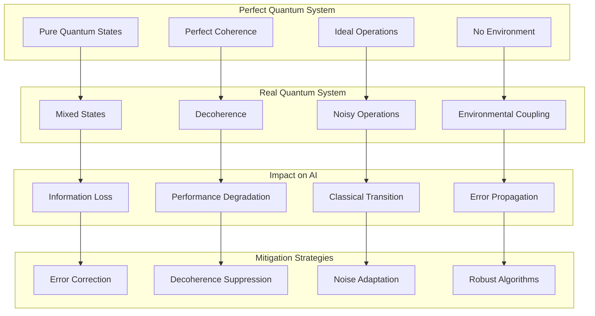

## 🌟 Decoherence Mechanisms

### Environmental Decoherence

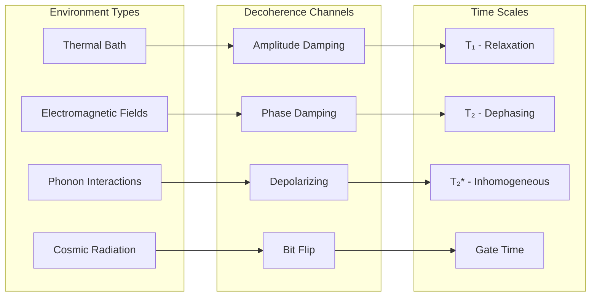

### Decoherence Models

Mathematical representation of decoherence:

```text
ρ(t) = ∑ᵢ Kᵢ(t) ρ(0) Kᵢ†(t)
```

```mermaid
graph TB
    subgraph "Lindblad Master Equation"
        A[dρ/dt = -i[H,ρ] + L[ρ]]
        B[Lindblad Superoperator]
        C[Jump Operators]
        D[Dissipation Terms]
    end
    
    subgraph "Kraus Operators"
        E[K₀ - Identity Evolution]
        F[K₁ - Bit Flip]
        G[K₂ - Phase Flip]
        H[K₃ - Bit-Phase Flip]
    end
    
    subgraph "Physical Effects"
        I[Energy Relaxation]
        J[Pure Dephasing]
        K[Depolarization]
        L[Spontaneous Emission]
    end
    
    A --> E
    B --> F
    C --> G
    D --> H
    
    E --> I
    F --> J
    G --> K
    H --> L
```

## 🔧 Quantum Error Correction

### Classical vs Quantum Error Correction

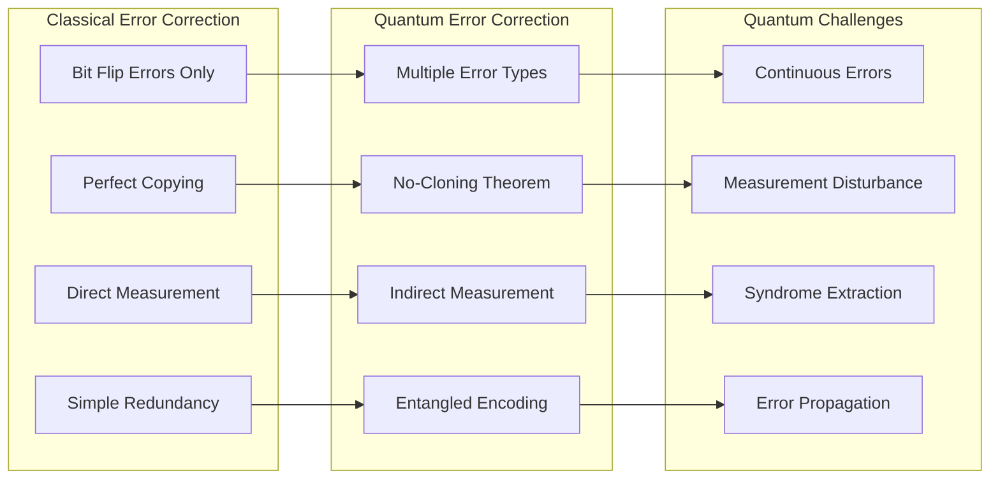

### Stabilizer Codes

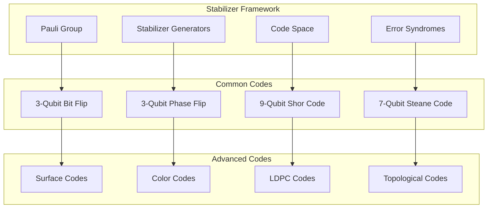

### Surface Code Architecture

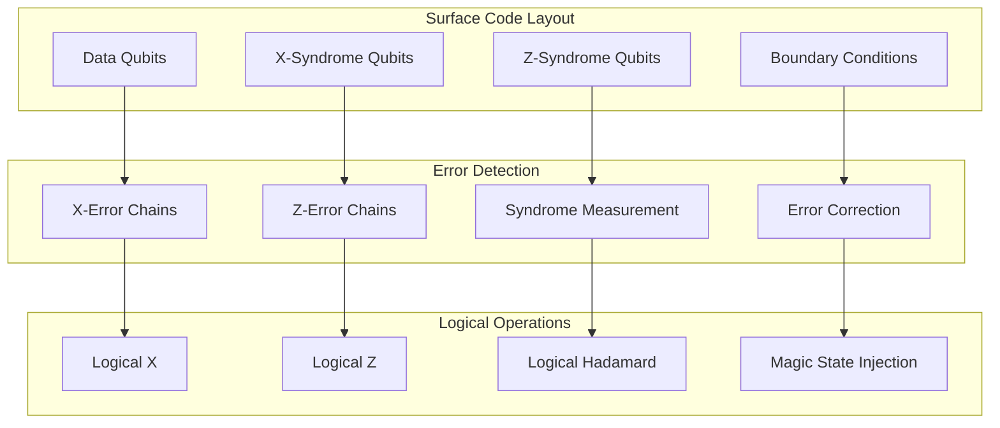

## 🛠️ Error Mitigation Techniques

### Near-Term Error Mitigation

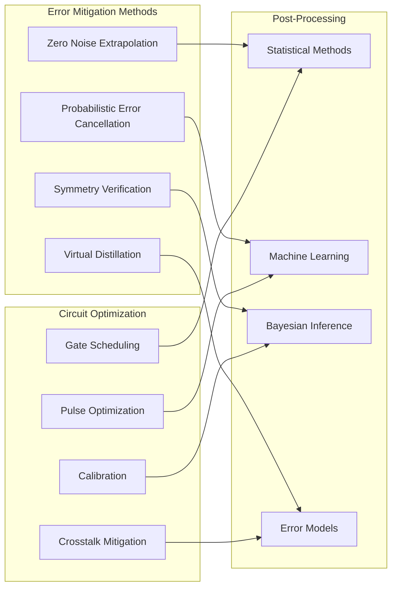

### Dynamical Decoupling

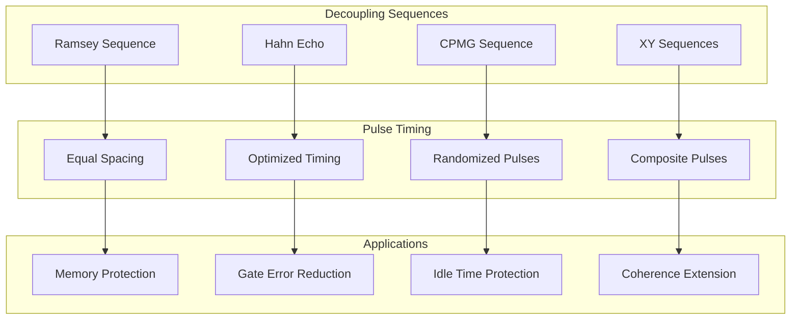

## 🧠 AI-Specific Error Handling

### Quantum AI Error Types

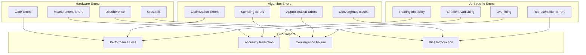

### Robust Quantum AI Algorithms

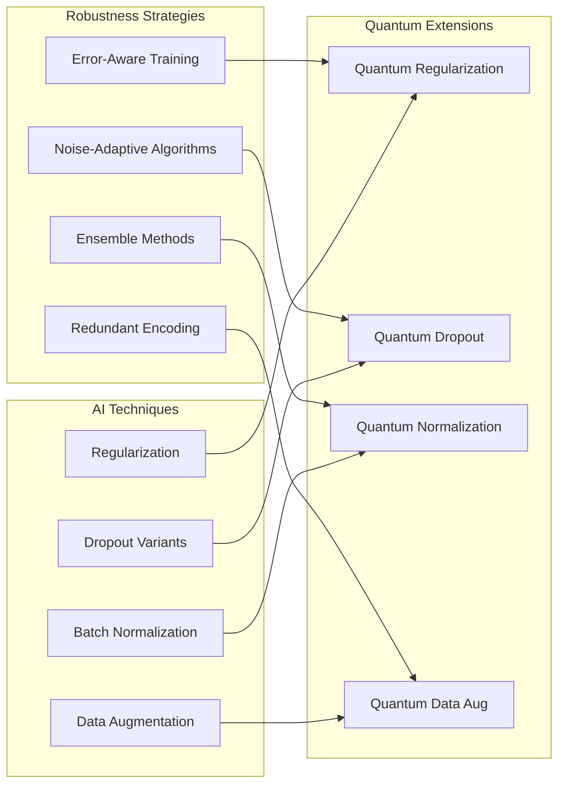

## 📊 Error Analysis and Benchmarking

### Error Characterization

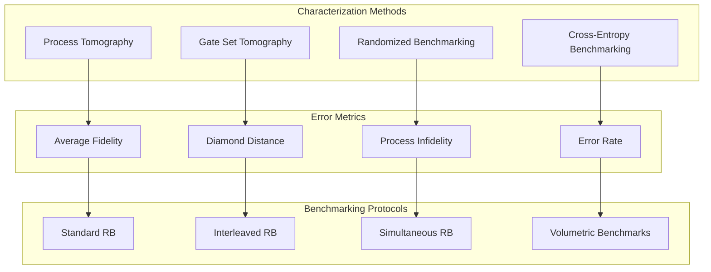

### Performance Monitoring

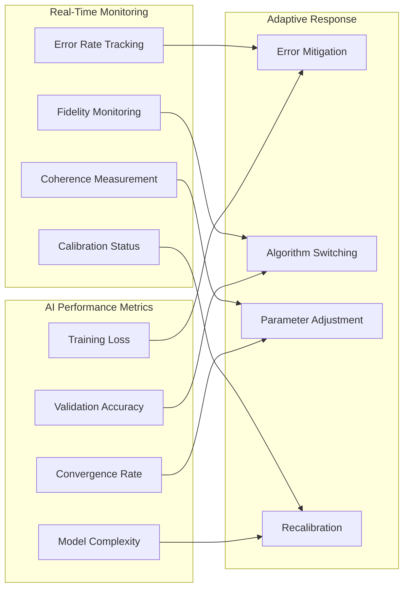

## 🎯 QuantumLangChain Implementation

### Decoherence-Aware Architecture

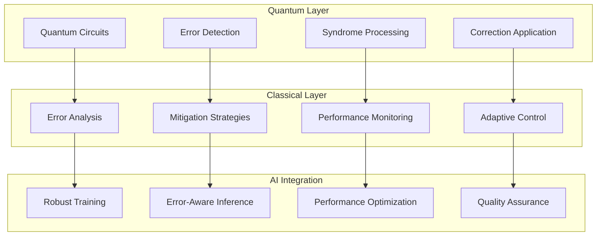

### Quantum Memory Error Handling

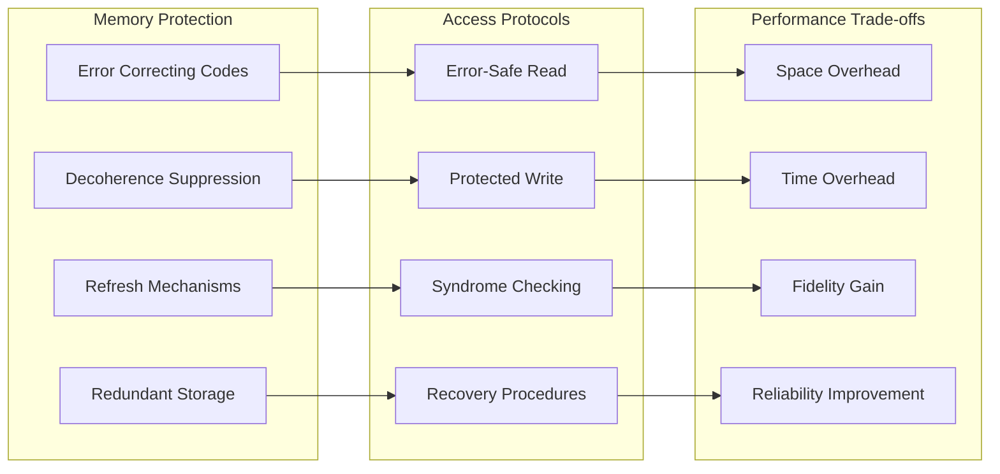

## 🔮 Future Developments

### Fault-Tolerant Quantum AI

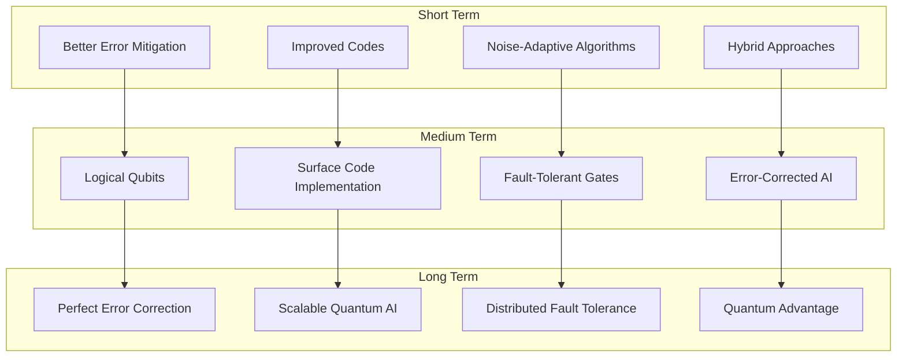

### Research Directions

- **Quantum Error Correction for AI**
- **Machine Learning for Error Mitigation**
- **Adaptive Quantum Algorithms**
- **Fault-Tolerant Quantum Machine Learning**
- **Distributed Quantum Error Correction**

## 🔐 License Requirements

- **Basic Error Handling**: Basic license tier
- **Advanced Error Correction**: Professional license tier
- **Fault-Tolerant Systems**: Enterprise license tier
- **Research Applications**: Research license tier

Contact [bajpaikrishna715@gmail.com](mailto:bajpaikrishna715@gmail.com) for licensing.

## 📈 Performance Guarantees

QuantumLangChain provides:

- **Error-aware algorithms** with graceful degradation
- **Adaptive error mitigation** based on system performance
- **Robust training procedures** resistant to quantum noise
- **Quality monitoring** with real-time performance tracking
- **Fault-tolerant scalability** for future quantum systems

Error correction and decoherence mitigation are essential for practical quantum AI applications.
