# 🔗 Entanglement in AI

🔐 **Licensed Component** - Contact: [bajpaikrishna715@gmail.com](mailto:bajpaikrishna715@gmail.com) for licensing

## Quantum Entanglement in AI Systems

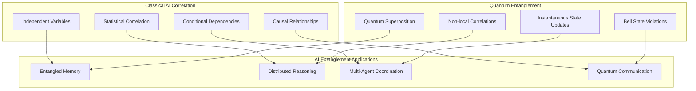

## 🌟 Fundamental Concepts

### Bell States and AI Correlation

```mermaid
graph LR
    subgraph "Bell States"
        A[|Φ+⟩ = (|00⟩ + |11⟩)/√2]
        B[|Φ-⟩ = (|00⟩ - |11⟩)/√2]
        C[|Ψ+⟩ = (|01⟩ + |10⟩)/√2]
        D[|Ψ-⟩ = (|01⟩ - |10⟩)/√2]
    end
    
    subgraph "AI Applications"
        E[Perfect Correlation]
        F[Anti-correlation]
        G[Phase Correlation]
        H[Complex Entanglement]
    end
    
    subgraph "System Properties"
        I[Non-locality]
        J[Instant Updates]
        K[Measurement Effects]
        L[Information Sharing]
    end
    
    A --> E
    B --> F
    C --> G
    D --> H
    
    E --> I
    F --> J
    G --> K
    H --> L
```

### Entanglement Entropy

The degree of entanglement in AI systems:

```text
S(ρ_A) = -Tr(ρ_A log₂ ρ_A)
```

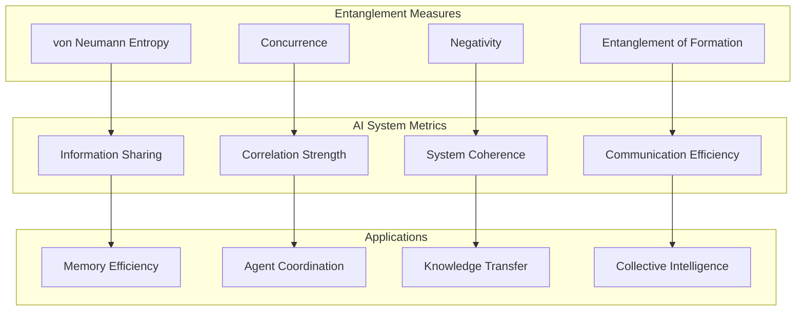

## 🧠 Entangled Memory Systems

### Quantum Memory Architecture

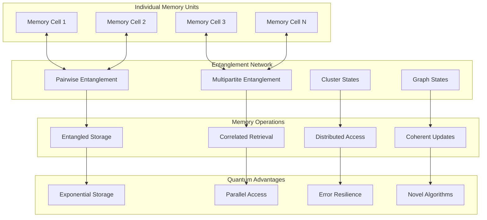

### Memory Entanglement Patterns

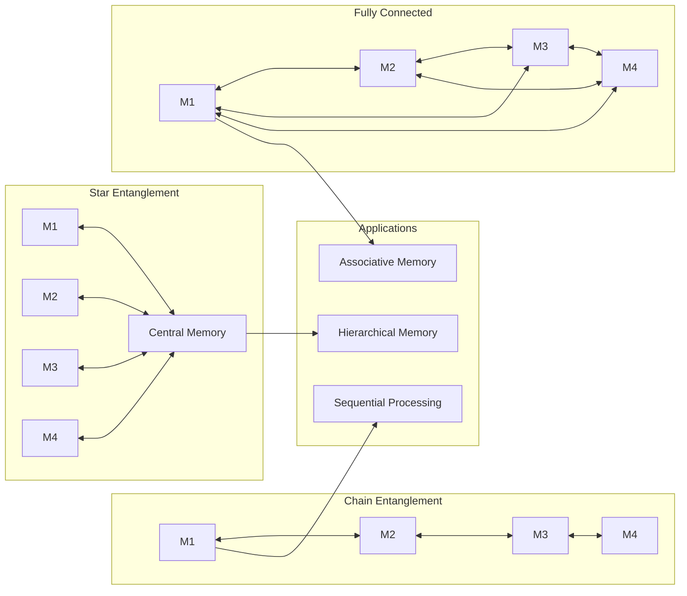

## 🤖 Multi-Agent Entanglement

### Entangled Agent Architecture

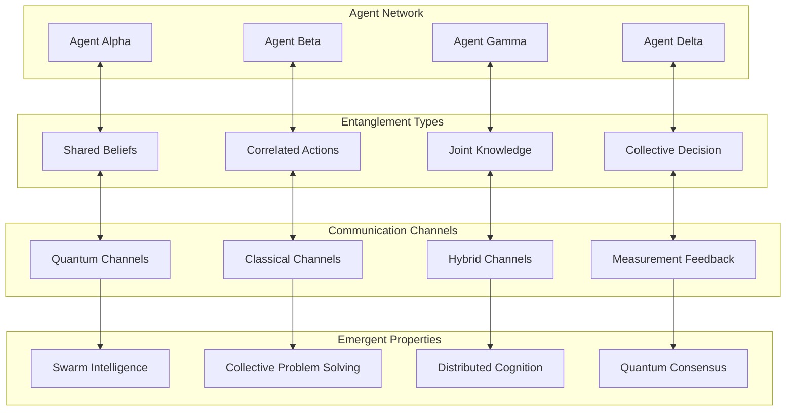

### Agent Coordination Protocols

```mermaid
graph LR
    subgraph "Initialization"
        A[Create Agent Pool]
        B[Establish Entanglement]
        C[Define Objectives]
        D[Set Communication Rules]
    end
    
    subgraph "Operation"
        E[Distributed Processing]
        F[Entangled Decision Making]
        G[Coherent Actions]
        H[Measurement Updates]
    end
    
    subgraph "Optimization"
        I[Entanglement Maintenance]
        J[Decoherence Mitigation]
        K[Performance Monitoring]
        L[Adaptive Restructuring]
    end
    
    A --> E
    B --> F
    C --> G
    D --> H
    
    E --> I
    F --> J
    G --> K
    H --> L
```

## 🌐 Distributed Quantum Intelligence

### Quantum Network Architecture

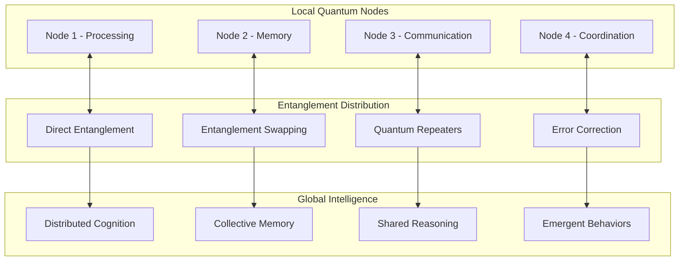

### Quantum Communication Protocols

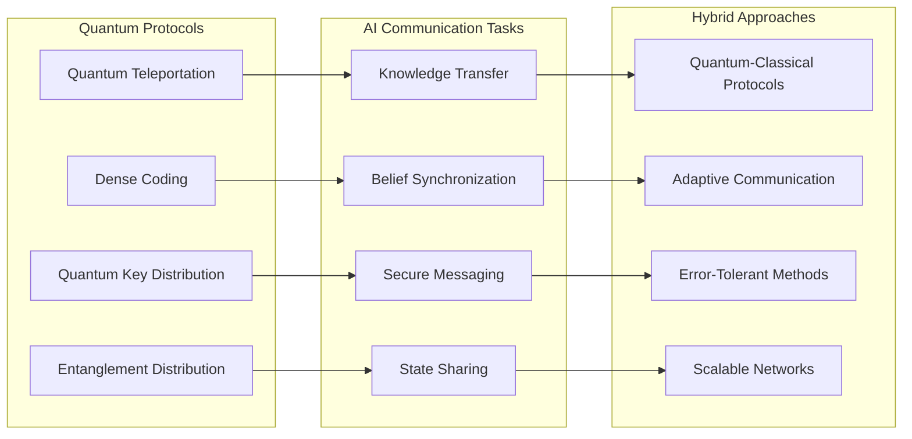

## 🔬 Applications in QuantumLangChain

### Entangled Reasoning Chains

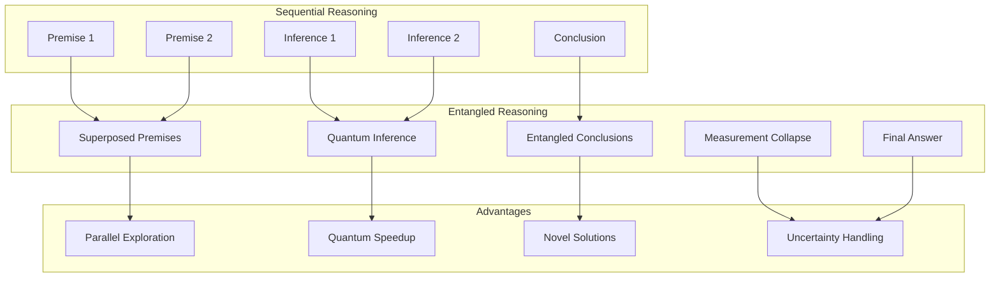

### Quantum-Enhanced Language Models

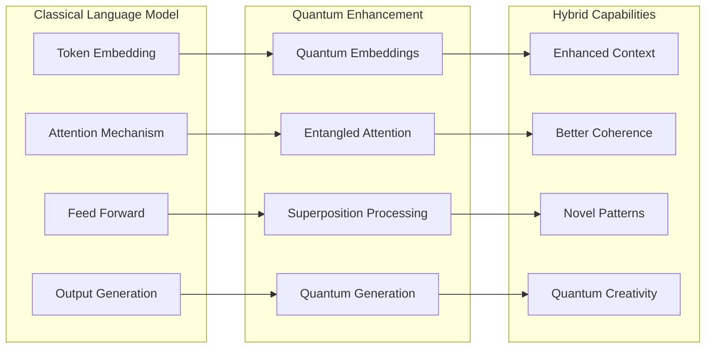

## 📊 Performance Metrics

### Entanglement Quality Measures

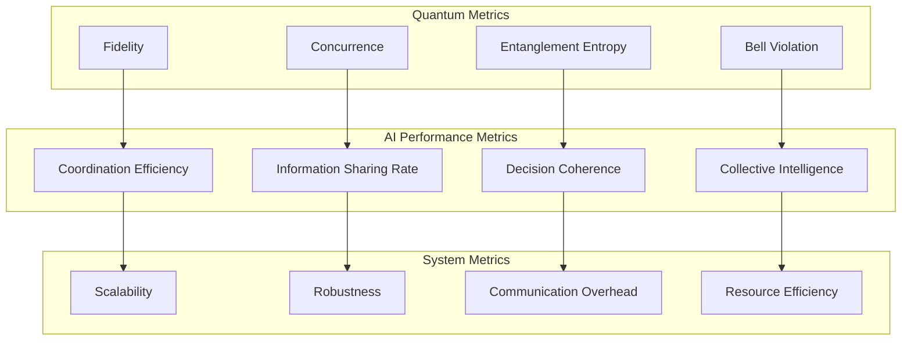

### Decoherence Impact

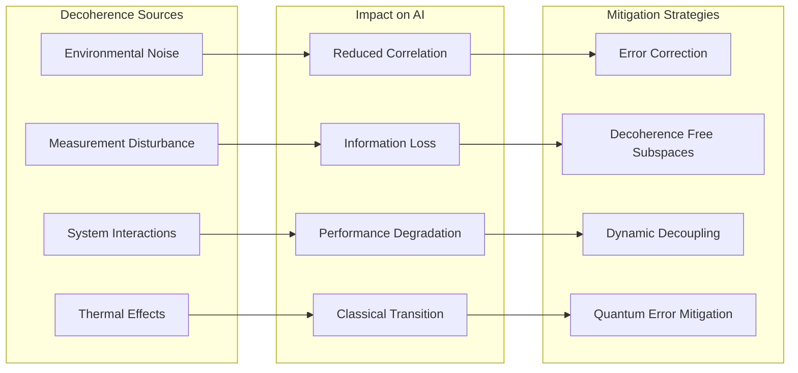

## 🛠️ Implementation Considerations

### Practical Challenges

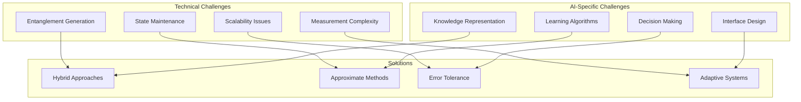

## 🎯 Future Directions

### Research Frontiers

- **Quantum Machine Learning with Entanglement**
- **Distributed Quantum AI Networks**
- **Entanglement-Enhanced Natural Language Processing**
- **Quantum Swarm Intelligence**
- **Quantum Collective Decision Making**

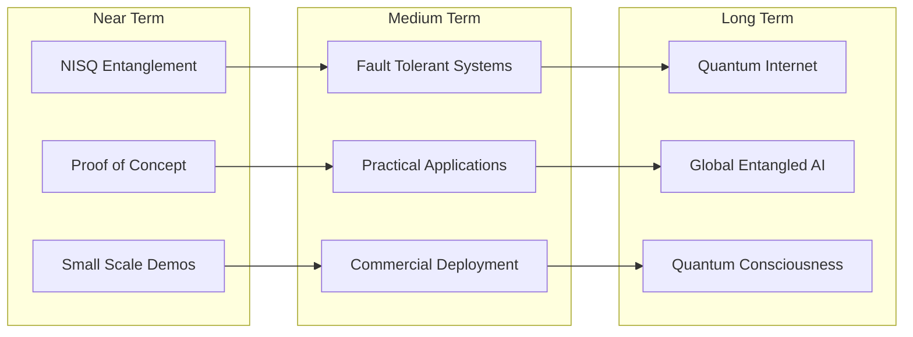

## 🔐 License Requirements

- **Basic Entanglement Concepts**: Basic license tier
- **Multi-Agent Entanglement**: Professional license tier
- **Distributed Quantum Networks**: Enterprise license tier
- **Research Applications**: Research license tier

Contact [bajpaikrishna715@gmail.com](mailto:bajpaikrishna715@gmail.com) for licensing.

Entanglement represents the most mysterious and powerful aspect of quantum mechanics, offering unprecedented opportunities for AI enhancement through QuantumLangChain.
