# 🔗 Quantum-Classical Hybrid Systems

🔐 **Licensed Component** - Contact: [bajpaikrishna715@gmail.com](mailto:bajpaikrishna715@gmail.com) for licensing

## Hybrid Architecture Overview

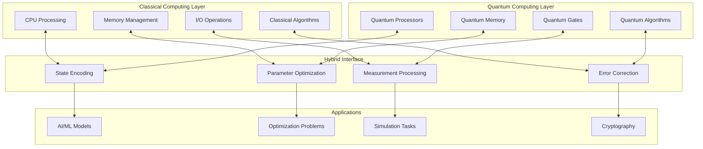

## 🌟 Hybrid Computing Paradigms

### Variational Quantum Algorithms

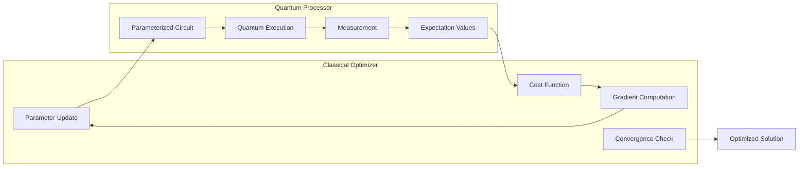

### Quantum-Classical Feedback Loop

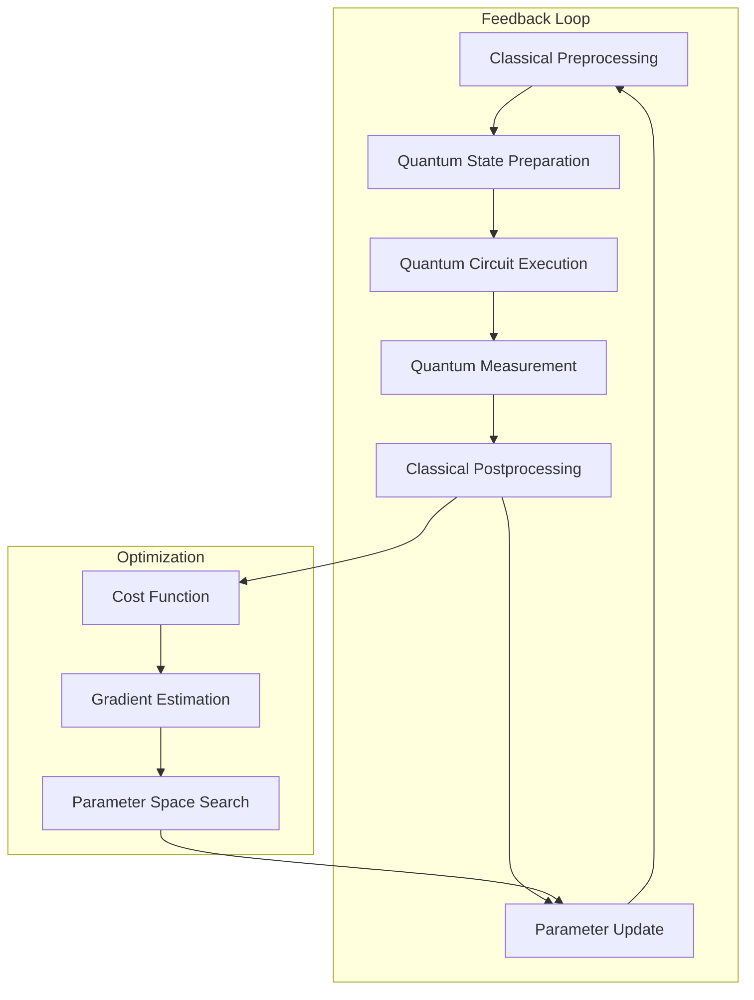

## ⚛️ Quantum Advantage in Hybrid Systems

### Computational Complexity Comparison

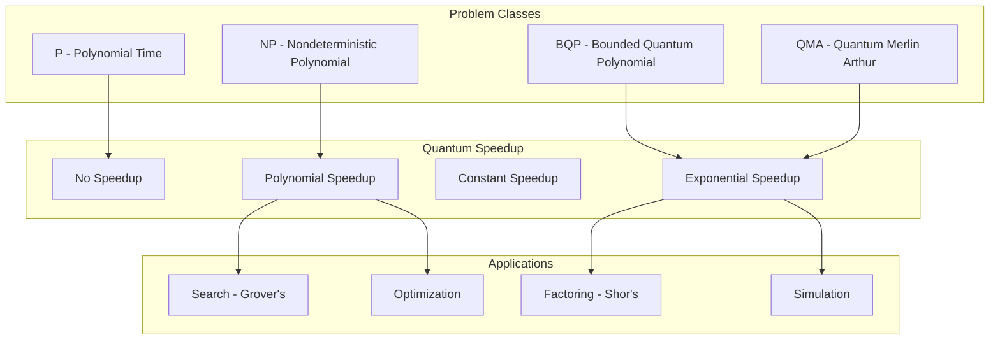

### Quantum Machine Learning Pipeline

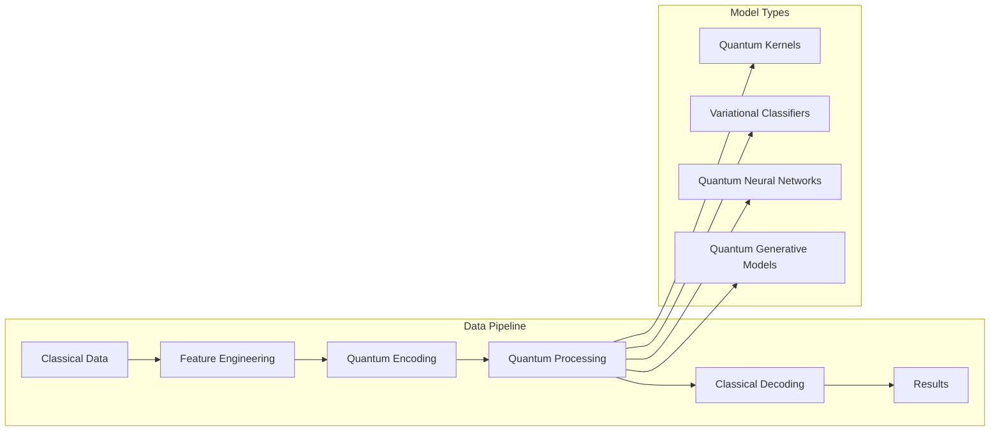

## 🔧 Implementation Strategies

### Near-Term Quantum Computing (NISQ)

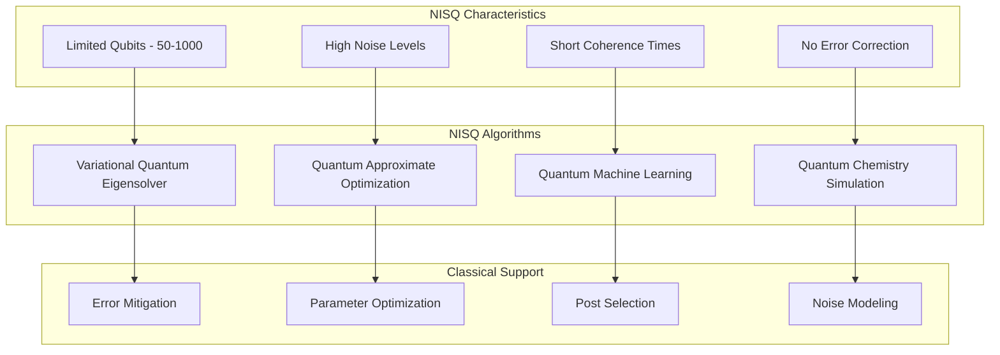

### Quantum-Enhanced AI Architecture

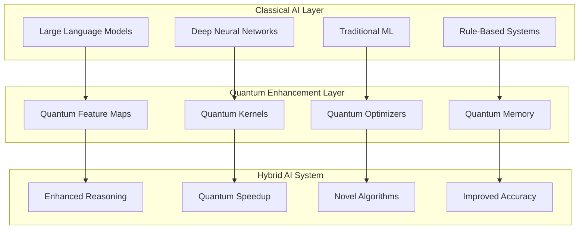

## 🌐 Quantum-Classical Interfaces

### State Transfer Mechanisms

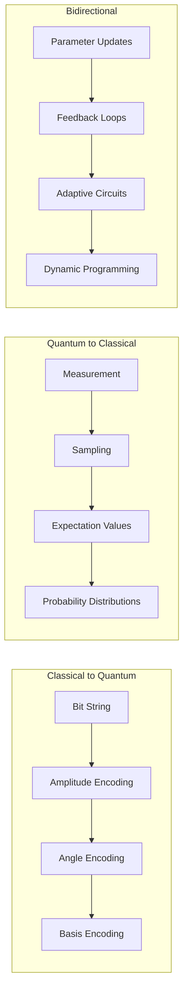

### Communication Protocols

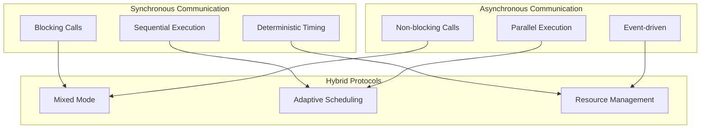

## 🛠️ Development Frameworks

### Quantum Software Stack

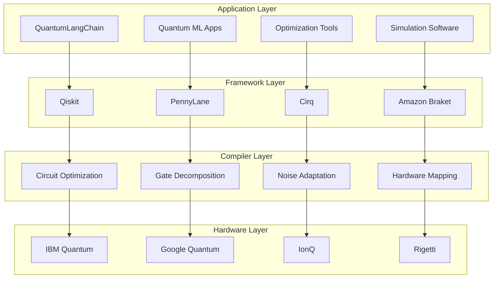

## 📊 Performance Characteristics

### Quantum vs Classical Performance

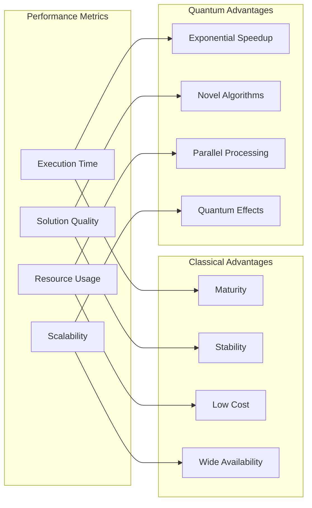

### Hybrid System Optimization

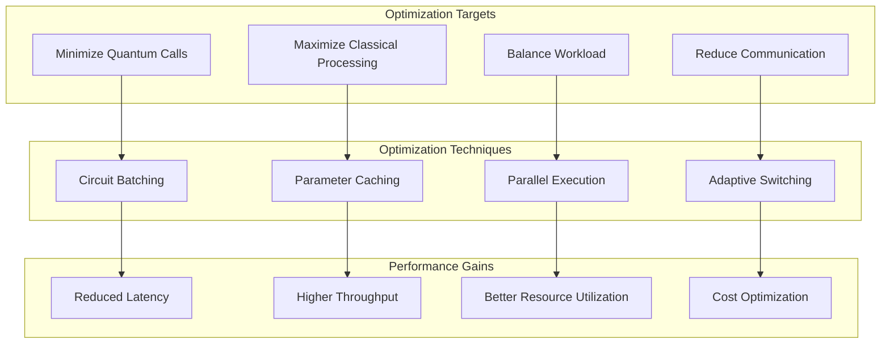

## 🎯 Applications in QuantumLangChain

### Quantum-Enhanced Language Processing

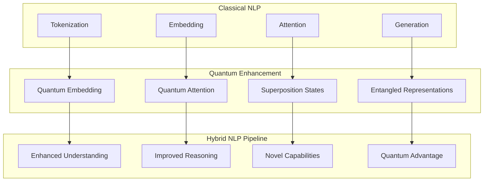

### Memory and Knowledge Systems

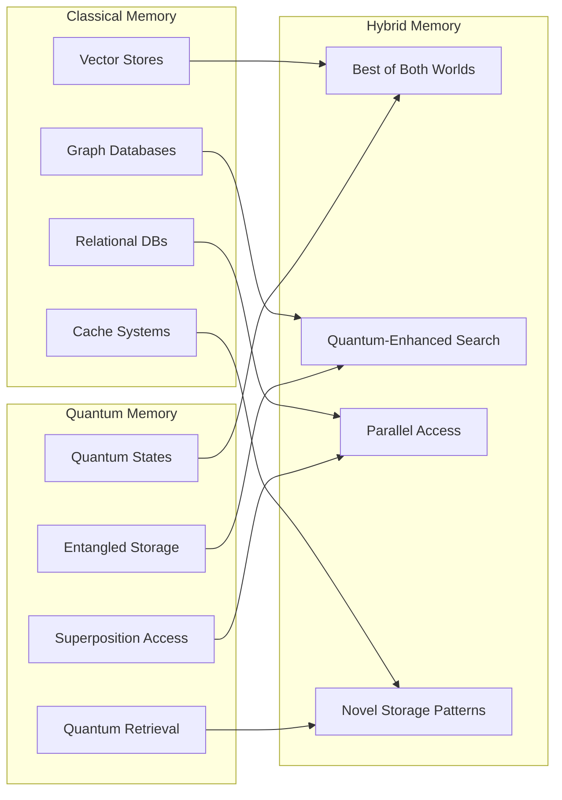

## 🔐 License Requirements

- **Basic Hybrid Concepts**: Basic license tier
- **Advanced Implementations**: Professional license tier
- **Custom Hybrid Systems**: Enterprise license tier
- **Research Applications**: Research license tier

Contact [bajpaikrishna715@gmail.com](mailto:bajpaikrishna715@gmail.com) for licensing.

## 🚀 Future Developments

The future of quantum-classical hybrid systems promises:

- **Fault-tolerant quantum computing**
- **Advanced error correction**
- **Seamless integration**
- **Quantum internet connectivity**
- **AI-quantum convergence**

QuantumLangChain positions itself at the forefront of this hybrid revolution.
