# 🧠 Quantum Memory Models

🔐 **Licensed Component** - Contact: [bajpaikrishna715@gmail.com](mailto:bajpaikrishna715@gmail.com) for licensing

## Quantum Memory Architecture

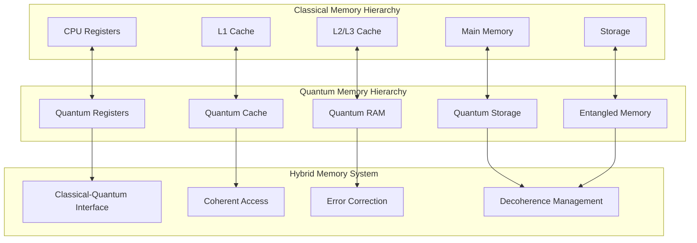

## 🌟 Quantum Memory Types

### Quantum Random Access Memory (QRAM)

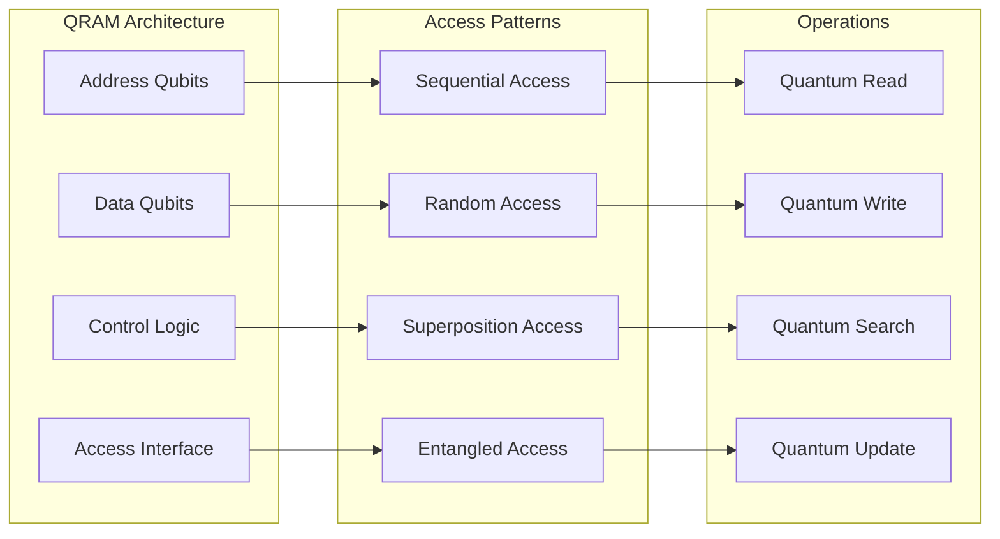

### Quantum Associative Memory

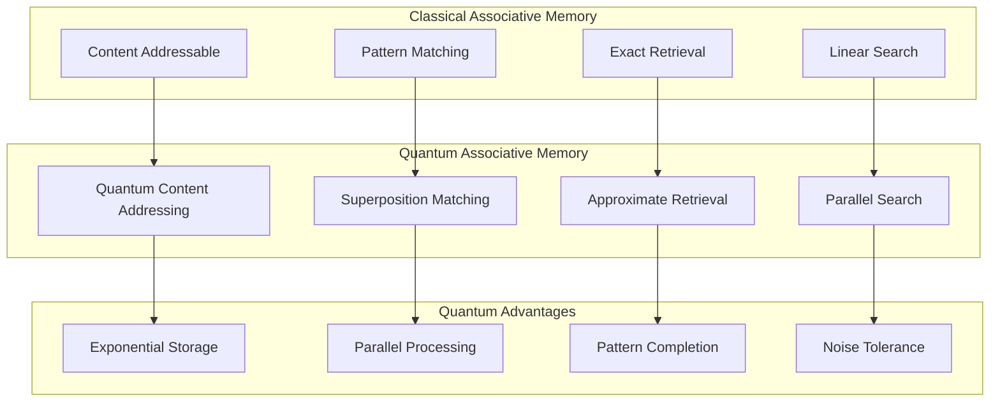

## 🔗 Entangled Memory Systems

### Multi-Qubit Entangled States

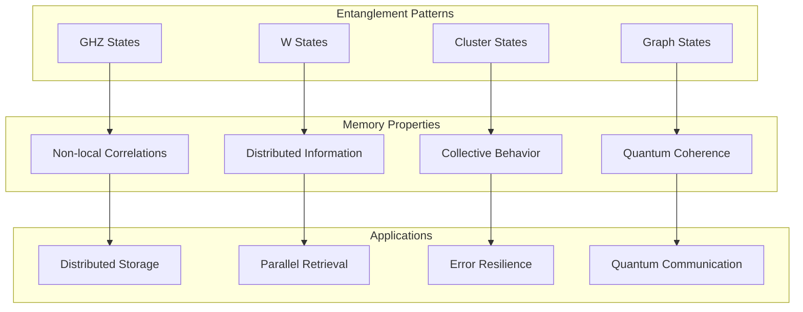

### Memory Entanglement Networks

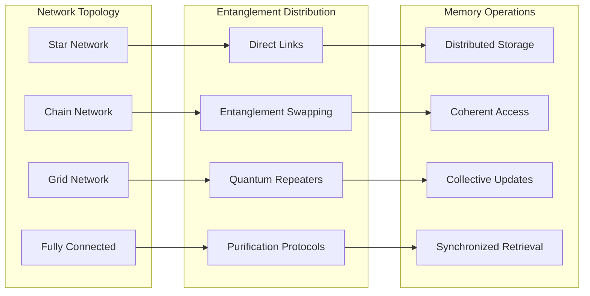

## 🧮 Quantum Memory Algorithms

### Quantum Search in Memory

```mermaid
graph TB
    subgraph "Grover Search in QRAM"
        A[Initialize Superposition]
        B[Apply Oracle]
        C[Diffusion Operator]
        D[Amplitude Amplification]
        E[Measure Result]
    end
    
    subgraph "Quantum Walks"
        F[Graph Structure]
        G[Walker Evolution]
        H[Hitting Time]
        I[Mixing Time]
    end
    
    subgraph "Quantum Machine Learning"
        J[Quantum k-NN]
        K[Quantum SVM]
        L[Quantum PCA]
        M[Quantum Clustering]
    end
    
    A --> B
    B --> C
    C --> D
    D --> E
    
    F --> G
    G --> H
    H --> I
    
    J --> K
    K --> L
    L --> M
```

### Quantum Data Structures

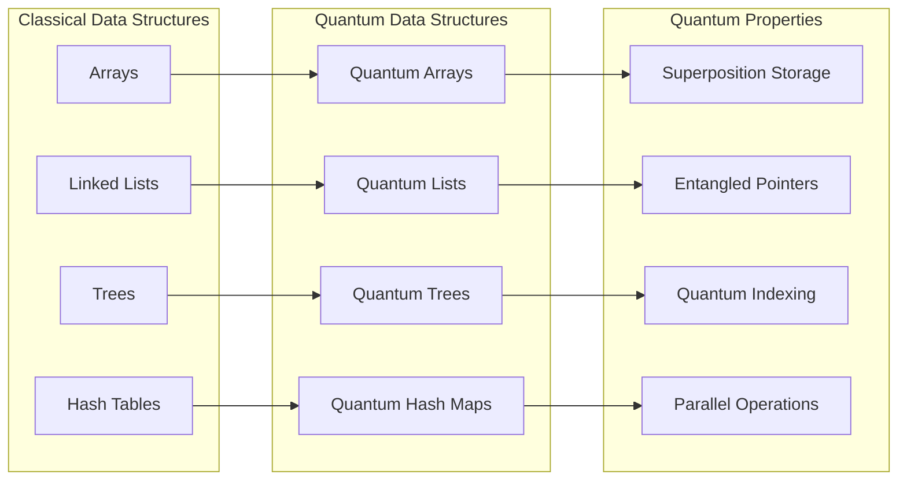

## 🎯 Memory Models in AI

### Quantum-Enhanced Neural Memory

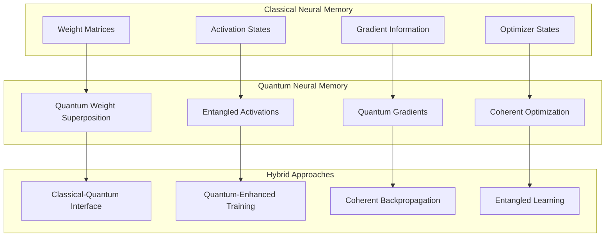

### Quantum Working Memory

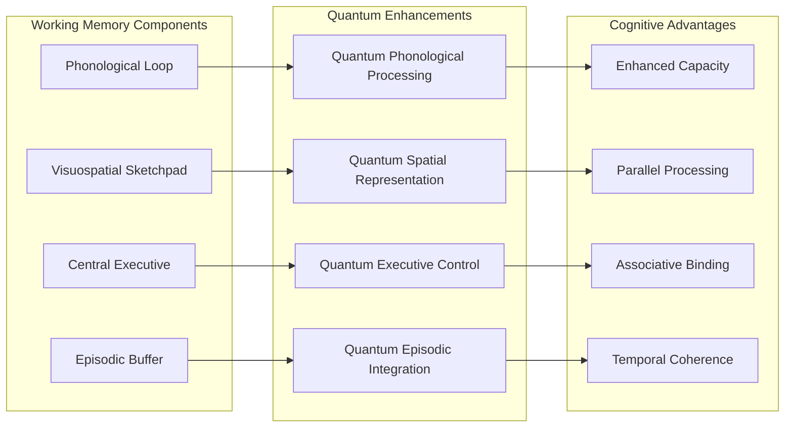

## 🔧 Implementation Strategies

### Quantum Memory Hardware

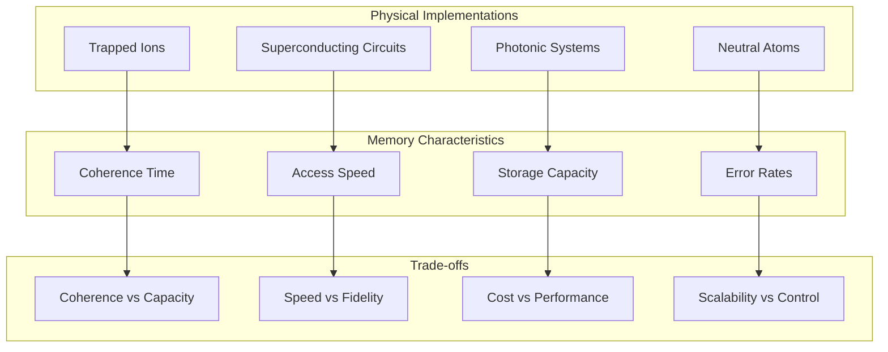

### Error Correction for Quantum Memory

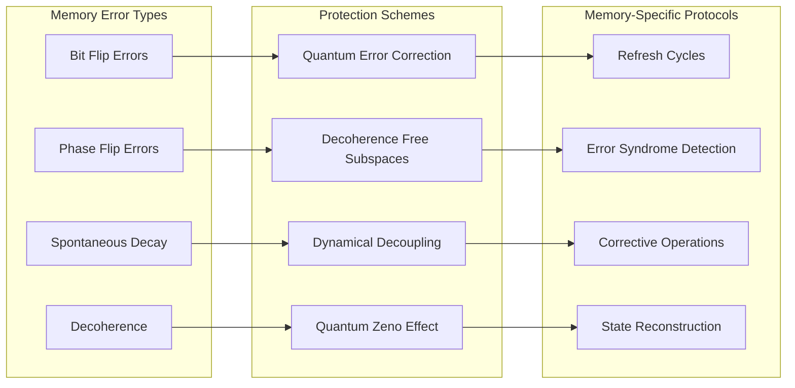

## 📊 Performance Analysis

### Memory Access Patterns

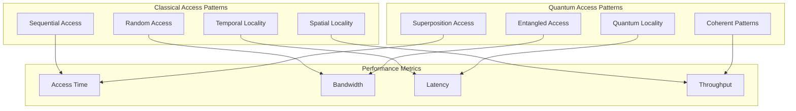

### Quantum Memory Benchmarks

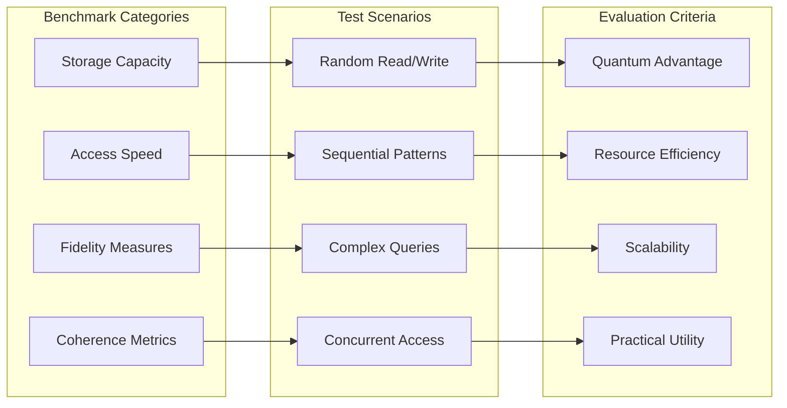

## 🚀 Applications in QuantumLangChain

### Quantum-Enhanced Vector Stores

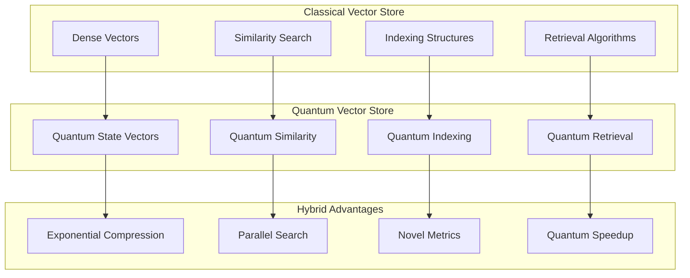

### Quantum Knowledge Graphs

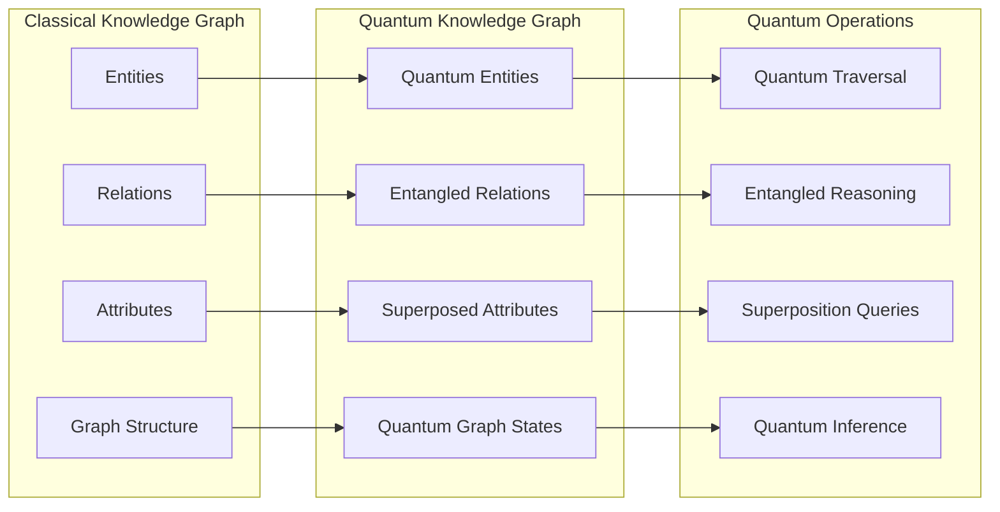

## 🔮 Future Directions

### Quantum Memory Technologies

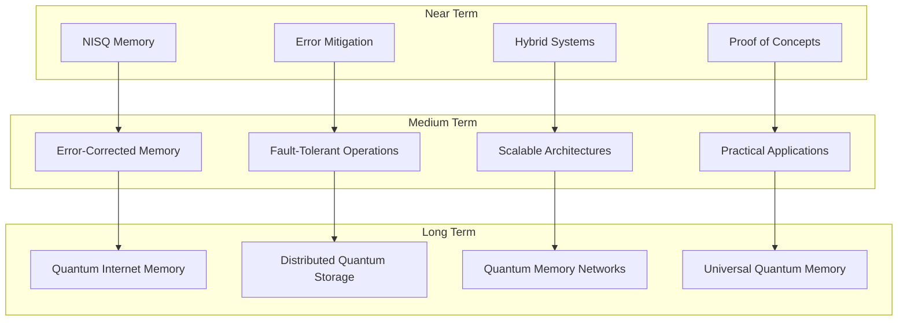

### Research Frontiers

- **Quantum Associative Memory Models**
- **Entangled Memory Networks**
- **Quantum-Enhanced Database Systems**
- **Topological Quantum Memory**
- **Quantum Memory for AI Applications**

## 📈 Theoretical Foundations

### Quantum Information Theory

```text
Memory Capacity: S = max I(X;Y)
Quantum Channel Capacity: C = max I(X;Y)_quantum
Holevo Bound: χ ≤ S(ρ) - ∑ᵢ pᵢS(ρᵢ)
```

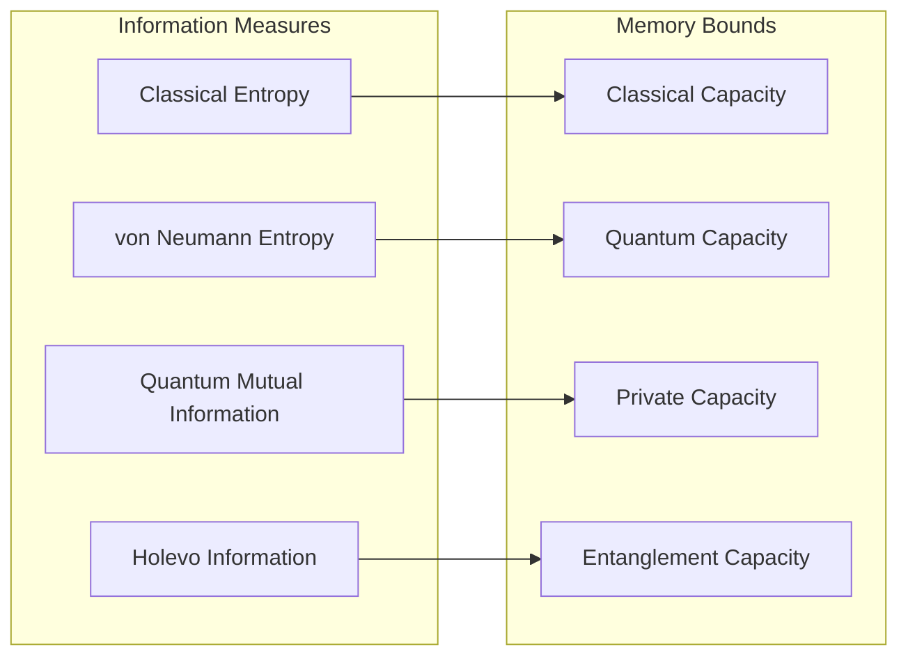

## 🔐 License Requirements

- **Basic Memory Models**: Basic license tier
- **Advanced Quantum Memory**: Professional license tier
- **Distributed Memory Systems**: Enterprise license tier
- **Research Applications**: Research license tier

Contact [bajpaikrishna715@gmail.com](mailto:bajpaikrishna715@gmail.com) for licensing.

Quantum memory models represent the foundation for next-generation AI systems with unprecedented storage and processing capabilities.
