# 🧠 Quantum Computing Basics

🔐 **Licensed Component** - Contact: bajpaikrishna715@gmail.com for licensing

## Quantum Computing Architecture

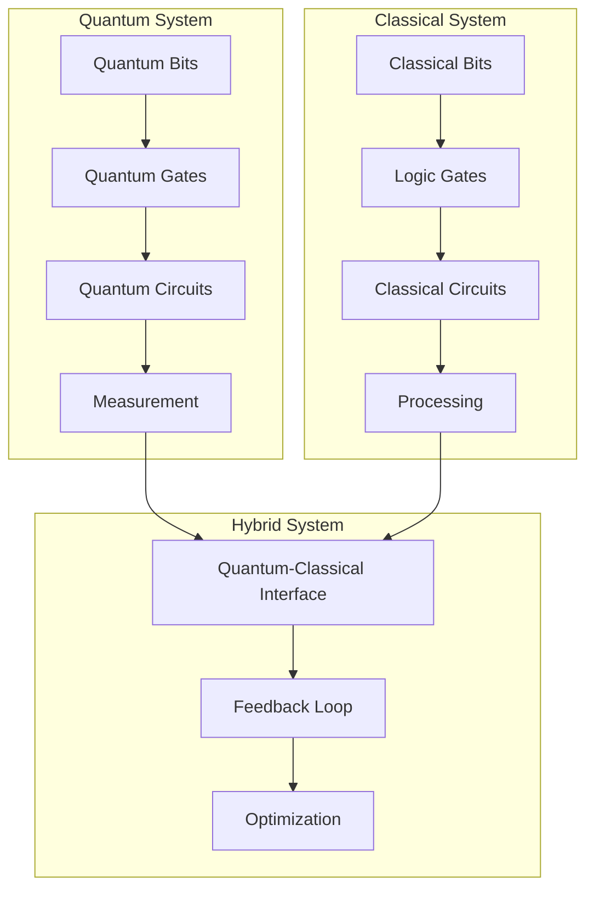

## 🌟 Core Quantum Principles

### Superposition

Quantum bits (qubits) can exist in multiple states simultaneously:

```
|ψ⟩ = α|0⟩ + β|1⟩
where |α|² + |β|² = 1
```

```mermaid
graph LR
    subgraph "Classical Bit"
        A[0] 
        B[1]
    end
    
    subgraph "Quantum Bit"
        C[|0⟩]
        D[|1⟩]
        E[α|0⟩ + β|1⟩]
    end
    
    A --> C
    B --> D
    C --> E
    D --> E
```

### Entanglement

Quantum systems can be correlated in ways that classical systems cannot:

```
|Ψ⟩ = (|00⟩ + |11⟩)/√2
```

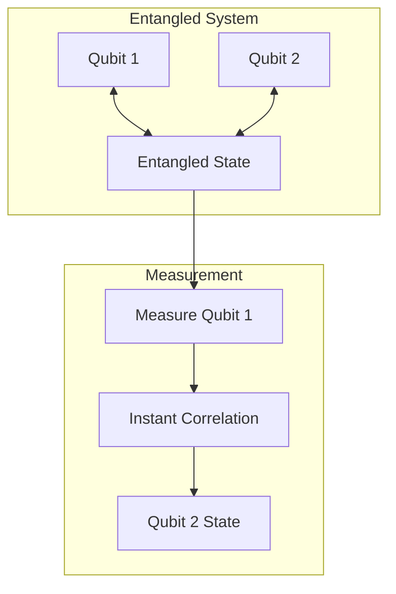

### Decoherence

Quantum systems lose their quantum properties over time:

```
ρ(t) = e^(-γt)ρ(0) + (1-e^(-γt))ρ_mixed
```

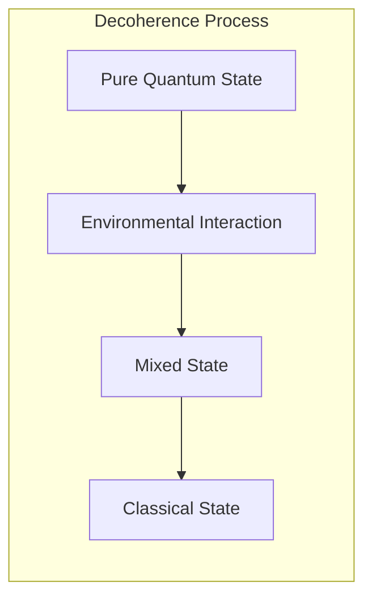

## ⚛️ Quantum Gates and Circuits

### Basic Quantum Gates

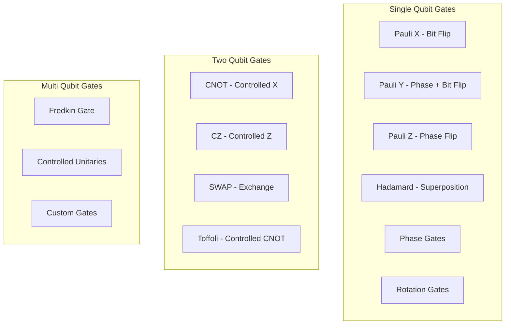

### Quantum Circuit Model

```mermaid
graph LR
    subgraph "Quantum Circuit"
        A[|0⟩] --> B[H]
        C[|0⟩] --> D[•]
        B --> E[•]
        D --> F[X]
        E --> G[M]
        F --> H[M]
    end
    
    subgraph "Classical Output"
        I[Classical Bits]
        J[Processing]
        K[Results]
    end
    
    G --> I
    H --> I
    I --> J
    J --> K
```

## 🔧 Quantum Algorithms

### Quantum Algorithm Categories

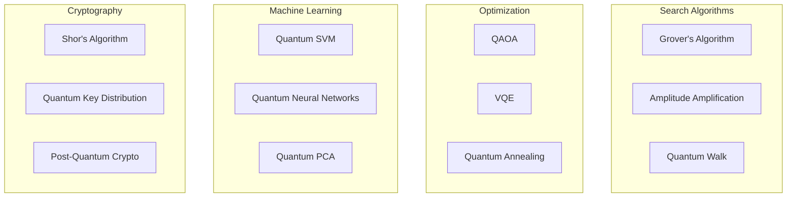

### Grover's Search Algorithm

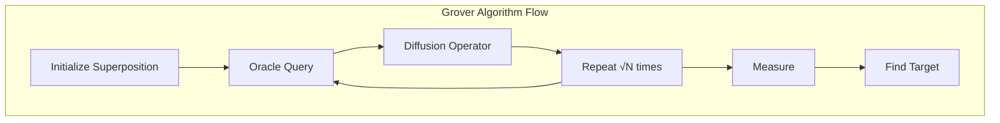

## 🌐 Quantum Computing in AI

### Quantum Machine Learning

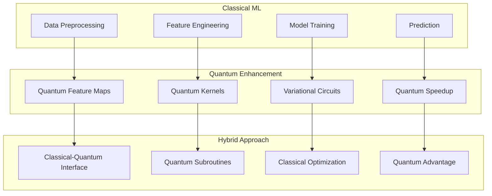

## 🔮 Quantum Supremacy vs Quantum Advantage

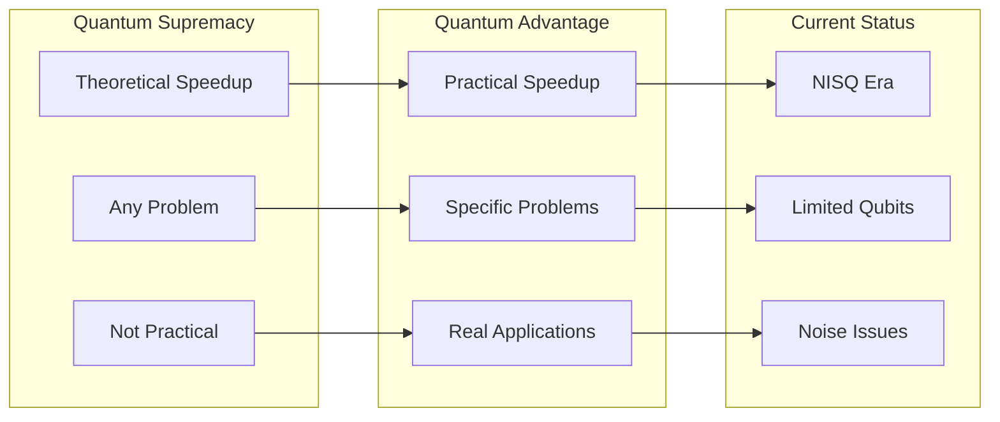

## 🏗️ Quantum Hardware Architectures

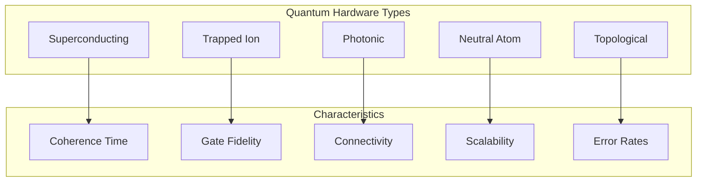

## 📊 Quantum Error Correction

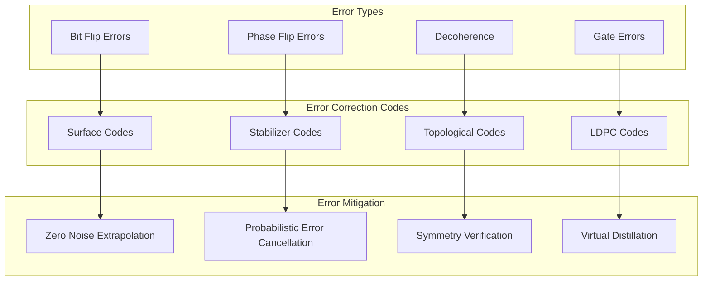

## 🎯 Applications in QuantumLangChain

### Quantum-Enhanced Reasoning

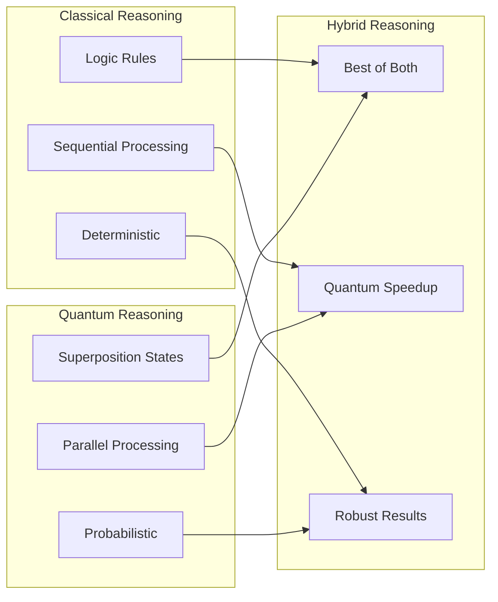

This foundational knowledge enables understanding of how QuantumLangChain leverages quantum principles for enhanced AI capabilities.

## 🔐 License Requirements

- **Basic Concepts**: Free with 24-hour trial
- **Advanced Topics**: Professional license required
- **Research Applications**: Research license required

Contact [bajpaikrishna715@gmail.com](mailto:bajpaikrishna715@gmail.com) for licensing.
