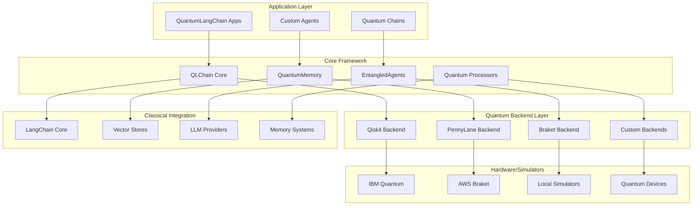
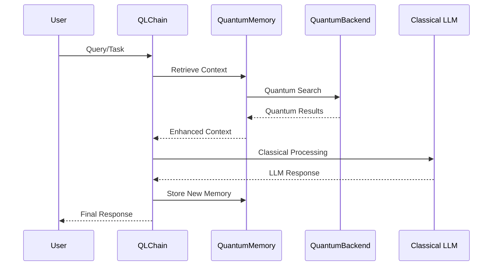

# 🏗️ QuantumLangChain Architecture

🔐 **Licensed Component** - Contact: [bajpaikrishna715@gmail.com](mailto:bajpaikrishna715@gmail.com) for licensing

## 🌌 System Overview

QuantumLangChain combines classical language processing with quantum computing capabilities to create next-generation AI applications.

## 🏛️ Core Architecture

## 🔧 Component Architecture

### Core Components

#### QLChain Core
- **Purpose**: Main orchestration layer
- **Responsibilities**: 
  - Quantum-classical workflow coordination
  - State management
  - Error handling and recovery
- **Interfaces**: Abstract base classes for extensibility

#### QuantumMemory
- **Purpose**: Quantum-enhanced memory systems
- **Features**:
  - Superposition-based storage
  - Entangled memory networks
  - Quantum associative recall
- **Types**: Episodic, Semantic, Working memory

#### EntangledAgents
- **Purpose**: Multi-agent quantum coordination
- **Capabilities**:
  - Quantum communication protocols
  - Distributed quantum processing
  - Swarm intelligence algorithms

## 🔄 Data Flow Architecture

## 🏭 Processing Pipeline

### Quantum Processing Pipeline

1. **Input Encoding**
   - Convert classical data to quantum states
   - Apply quantum feature maps
   - Initialize quantum circuits

2. **Quantum Computation**
   - Execute quantum algorithms
   - Apply quantum gates and operations
   - Measure quantum states

3. **Output Decoding**
   - Convert quantum results to classical
   - Apply post-processing
   - Error correction and validation

### Memory Integration Pipeline

1. **Memory Encoding**
   - Encode experiences as quantum states
   - Create entangled memory networks
   - Establish quantum correlations

2. **Memory Retrieval**
   - Quantum search algorithms
   - Superposition-based queries
   - Contextual associations

3. **Memory Update**
   - Quantum state evolution
   - Entanglement strengthening
   - Memory consolidation

## 🔗 Integration Patterns

### Backend Integration
- **Plugin Architecture**: Modular quantum backend support
- **Adapter Pattern**: Unified interface for different quantum systems
- **Factory Pattern**: Dynamic backend selection

### Classical Integration
- **Bridge Pattern**: Seamless LangChain integration
- **Decorator Pattern**: Quantum enhancement of classical components
- **Strategy Pattern**: Flexible algorithm selection

## 📊 Scalability Architecture

### Horizontal Scaling
- **Distributed Quantum Processing**: Multi-device coordination
- **Agent Networks**: Scalable multi-agent systems
- **Quantum Cloud Integration**: Elastic quantum resources

### Vertical Scaling
- **Quantum Circuit Optimization**: Efficient quantum algorithms
- **Memory Hierarchies**: Multi-level quantum memory
- **Hybrid Processing**: Optimal quantum-classical partitioning

## 🛡️ Security Architecture

### Quantum Security
- **Quantum Key Distribution**: Secure communication protocols
- **Quantum Cryptography**: Unbreakable encryption methods
- **Quantum Authentication**: Identity verification

### Classical Security
- **API Security**: Authentication and authorization
- **Data Encryption**: At-rest and in-transit protection
- **Access Controls**: Role-based permissions

## 🔍 Monitoring Architecture

### Quantum Metrics
- **Quantum Fidelity**: State quality measurements
- **Entanglement Measures**: Quantum correlation tracking
- **Circuit Depth**: Optimization metrics

### System Metrics
- **Performance Monitoring**: Latency and throughput
- **Resource Utilization**: Memory and compute usage
- **Error Tracking**: Quantum and classical errors

## 🔐 License Requirements

Architecture implementation requires Enterprise licensing. Contact [bajpaikrishna715@gmail.com](mailto:bajpaikrishna715@gmail.com) for licensing details.

---

🔐 **License Notice**: Advanced architectural features require appropriate licensing tiers. Contact [bajpaikrishna715@gmail.com](mailto:bajpaikrishna715@gmail.com) for access.
