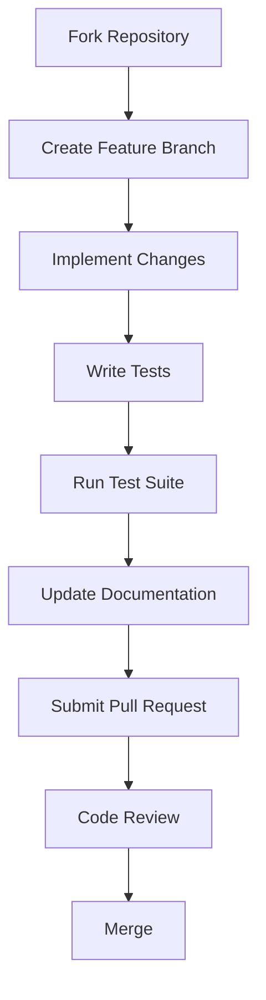

# 🛠️ Contributing to QuantumLangChain

🔐 **Licensed Component** - Contact: [bajpaikrishna715@gmail.com](mailto:bajpaikrishna715@gmail.com) for licensing

## 🚀 Getting Started

### Development Setup

1. **Clone Repository**
   ```bash
   git clone https://github.com/krishna715/quantum-langchain.git
   cd quantum-langchain
   ```

2. **Environment Setup**
   ```bash
   python -m venv quantum-env
   source quantum-env/bin/activate  # Linux/Mac
   quantum-env\Scripts\activate     # Windows
   ```

3. **Install Dependencies**
   ```bash
   pip install -e ".[dev]"
   ```

## 🏗️ Development Workflow

### Development Process



### Branch Naming
- `feature/quantum-memory-enhancement`
- `bugfix/entanglement-stability`
- `docs/api-reference-update`

## 🧪 Testing Guidelines

### Test Structure
```bash
tests/
├── unit/           # Unit tests
├── integration/    # Integration tests
├── quantum/        # Quantum-specific tests
└── performance/    # Performance benchmarks
```

### Running Tests
```bash
# Unit tests
pytest tests/unit/

# Integration tests
pytest tests/integration/

# Quantum tests (requires quantum backends)
pytest tests/quantum/

# All tests
pytest
```

## 📚 Documentation

### Documentation Standards
- All public APIs must have docstrings
- Include code examples
- Add type hints
- Update CHANGELOG.md

### Building Docs
```bash
mkdocs serve
```

## 🔐 Licensing Requirements

All contributions must comply with licensing terms. Contact [bajpaikrishna715@gmail.com](mailto:bajpaikrishna715@gmail.com) for contributor licensing agreements.

## 📋 Code Standards

### Python Style
- Follow PEP 8
- Use type hints
- Maximum line length: 88 characters
- Use black for formatting

### Quantum Code Standards
- Quantum circuits must be documented
- Include noise models for realistic testing
- Validate quantum algorithms theoretically

## 🐛 Bug Reports

Use GitHub issues with:
- Clear reproduction steps
- Environment details
- Expected vs actual behavior
- Minimal code example

## 💡 Feature Requests

Feature requests should include:
- Use case description
- Proposed API design
- Implementation considerations
- Quantum advantage justification

## 🤝 Community Guidelines

- Be respectful and inclusive
- Help newcomers to quantum computing
- Share knowledge and best practices
- Follow code of conduct

---

🔐 **License Notice**: Development contributions require appropriate licensing. Contact [bajpaikrishna715@gmail.com](mailto:bajpaikrishna715@gmail.com) for details.
