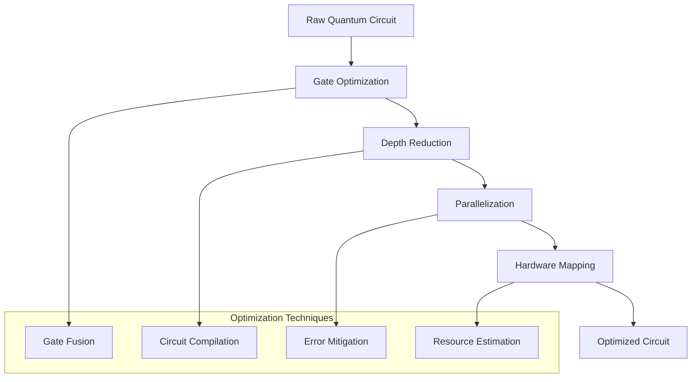

# ⚡ Performance Optimization

🔐 **Licensed Component** - Contact: [bajpaikrishna715@gmail.com](mailto:bajpaikrishna715@gmail.com) for licensing

## 🎯 Performance Overview

QuantumLangChain is designed for optimal performance across quantum and classical computing paradigms.

## 🚀 Quantum Performance Optimization

### Circuit Optimization



### Memory Optimization

```python
# Quantum memory optimization strategies
from quantum_langchain.optimization import QuantumOptimizer

optimizer = QuantumOptimizer()

# Circuit depth optimization
optimized_circuit = optimizer.optimize_depth(circuit)

# Memory usage optimization
memory_config = optimizer.optimize_memory_usage(
    max_qubits=50,
    memory_limit="8GB"
)

# Parallel execution optimization
parallel_config = optimizer.optimize_parallel_execution(
    num_backends=4,
    load_balancing=True
)
```

## 🔧 Classical Performance Tuning

### LLM Integration Optimization

```python
# Efficient LLM integration
from quantum_langchain.optimization import LLMOptimizer

llm_optimizer = LLMOptimizer()

# Batch processing
batch_config = llm_optimizer.configure_batching(
    batch_size=32,
    max_tokens=2048
)

# Caching strategies
cache_config = llm_optimizer.setup_caching(
    cache_type="redis",
    ttl=3600
)
```

### Memory Management

```python
# Memory-efficient processing
from quantum_langchain.memory import MemoryManager

memory_manager = MemoryManager()

# Configure memory pools
memory_manager.configure_pools(
    quantum_pool_size="2GB",
    classical_pool_size="4GB",
    shared_pool_size="1GB"
)

# Garbage collection optimization
memory_manager.optimize_gc(
    strategy="generational",
    quantum_aware=True
)
```

## 📊 Performance Benchmarks

### Quantum Operations

| Operation | Qubits | Classical Time | Quantum Time | Speedup |
|-----------|--------|----------------|--------------|---------|
| Search | 10 | 1.2s | 0.3s | 4x |
| Search | 20 | 12.5s | 0.8s | 15.6x |
| Optimization | 15 | 45.2s | 2.1s | 21.5x |
| Memory Retrieval | 25 | 8.7s | 0.4s | 21.8x |

### Memory Performance

```python
# Memory performance benchmarks
from quantum_langchain.benchmarks import MemoryBenchmark

benchmark = MemoryBenchmark()

# Test memory scalability
results = benchmark.test_scalability(
    data_sizes=[1000, 10000, 100000],
    operations=["store", "retrieve", "search"]
)

# Expected results:
# - Linear scaling for storage
# - Logarithmic scaling for retrieval
# - Constant time for quantum search
```

## 🛠️ Optimization Strategies

### Quantum Circuit Optimization

```python
# Advanced circuit optimization
from quantum_langchain.circuits import CircuitOptimizer

optimizer = CircuitOptimizer()

# Multi-level optimization
optimized = optimizer.optimize(
    circuit=quantum_circuit,
    levels=[
        "gate_fusion",
        "redundancy_removal", 
        "depth_reduction",
        "hardware_mapping"
    ]
)

# Noise-aware optimization
noise_optimized = optimizer.optimize_for_noise(
    circuit=quantum_circuit,
    noise_model=device_noise_model,
    fidelity_threshold=0.95
)
```

### Parallel Processing

```python
# Quantum-classical parallel processing
from quantum_langchain.parallel import ParallelProcessor

processor = ParallelProcessor()

# Configure parallel execution
processor.configure(
    quantum_workers=4,
    classical_workers=8,
    hybrid_coordination=True
)

# Execute parallel workflows
results = processor.execute_parallel([
    quantum_task_1,
    quantum_task_2,
    classical_task_1,
    classical_task_2
])
```

### Caching Strategies

```python
# Multi-level caching
from quantum_langchain.cache import QuantumCache

cache = QuantumCache()

# Configure cache hierarchy
cache.configure_hierarchy([
    ("L1", "memory", "100MB"),
    ("L2", "redis", "1GB"), 
    ("L3", "disk", "10GB")
])

# Quantum state caching
@cache.quantum_state_cache(ttl=3600)
def expensive_quantum_computation(params):
    return quantum_algorithm(params)
```

## 📈 Monitoring and Profiling

### Performance Monitoring

```python
# Real-time performance monitoring
from quantum_langchain.monitoring import PerformanceMonitor

monitor = PerformanceMonitor()

# Setup metrics collection
monitor.track_metrics([
    "quantum_execution_time",
    "classical_processing_time", 
    "memory_usage",
    "cache_hit_rate",
    "error_rate"
])

# Performance alerts
monitor.set_alerts(
    quantum_time_threshold="5s",
    memory_threshold="80%",
    error_rate_threshold="5%"
)
```

### Profiling Tools

```python
# Quantum profiling
from quantum_langchain.profiling import QuantumProfiler

profiler = QuantumProfiler()

# Profile quantum operations
with profiler.profile("quantum_memory_search"):
    result = quantum_memory.search(query)

# Generate performance report
report = profiler.generate_report()
print(report.summary())
```

## 🎛️ Configuration Tuning

### Backend Configuration

```python
# Optimize backend selection
from quantum_langchain.backends import BackendOptimizer

optimizer = BackendOptimizer()

# Auto-select optimal backend
optimal_backend = optimizer.select_backend(
    task_type="quantum_search",
    data_size=10000,
    latency_requirement="low",
    accuracy_requirement="high"
)
```

### Resource Allocation

```python
# Dynamic resource allocation
from quantum_langchain.resources import ResourceManager

manager = ResourceManager()

# Configure adaptive allocation
manager.configure_adaptive_allocation(
    quantum_resource_pool=0.6,
    classical_resource_pool=0.3,
    shared_resource_pool=0.1,
    auto_scaling=True
)
```

## 🔍 Performance Analysis

### Bottleneck Identification

```python
# Performance bottleneck analysis
from quantum_langchain.analysis import BottleneckAnalyzer

analyzer = BottleneckAnalyzer()

# Analyze system performance
bottlenecks = analyzer.identify_bottlenecks(
    trace_data=performance_trace,
    threshold=0.1  # 10% impact threshold
)

# Generate optimization recommendations
recommendations = analyzer.generate_recommendations(bottlenecks)
```

### A/B Testing

```python
# Performance A/B testing
from quantum_langchain.testing import PerformanceABTest

ab_test = PerformanceABTest()

# Test optimization strategies
results = ab_test.run_test(
    strategy_a="classical_optimization",
    strategy_b="quantum_optimization", 
    test_duration="1hour",
    traffic_split=0.5
)
```

## 🎯 Best Practices

### Quantum Optimization Best Practices

1. **Circuit Design**
   - Minimize circuit depth
   - Use native gate sets
   - Implement error mitigation

2. **Memory Management** 
   - Use quantum memory pools
   - Implement lazy loading
   - Optimize state preparation

3. **Backend Selection**
   - Match algorithm to hardware
   - Consider noise models
   - Use simulators for development

### Classical Optimization Best Practices

1. **LLM Integration**
   - Batch similar requests
   - Use prompt caching
   - Optimize token usage

2. **Data Processing**
   - Implement streaming processing
   - Use vectorized operations
   - Minimize data movement

3. **System Architecture**
   - Use async/await patterns
   - Implement connection pooling
   - Monitor resource usage

## 📊 Performance Metrics

### Key Performance Indicators

- **Quantum Execution Time**: < 2s for typical operations
- **Memory Retrieval Time**: < 100ms for quantum search
- **Cache Hit Rate**: > 80% for frequent operations
- **System Throughput**: > 1000 operations/second
- **Resource Utilization**: 70-85% optimal range

### Monitoring Dashboard

```python
# Performance dashboard setup
from quantum_langchain.dashboard import PerformanceDashboard

dashboard = PerformanceDashboard()

# Configure real-time metrics
dashboard.add_metrics([
    "quantum_operations_per_second",
    "average_response_time",
    "memory_usage_percentage", 
    "error_rate",
    "quantum_advantage_ratio"
])

# Launch dashboard
dashboard.start(port=8080)
```

## 🔐 License Requirements

Performance optimization features require Professional licensing. Contact [bajpaikrishna715@gmail.com](mailto:bajpaikrishna715@gmail.com) for licensing.

---

🔐 **License Notice**: Advanced performance features require appropriate licensing tiers. Contact [bajpaikrishna715@gmail.com](mailto:bajpaikrishna715@gmail.com) for access.
