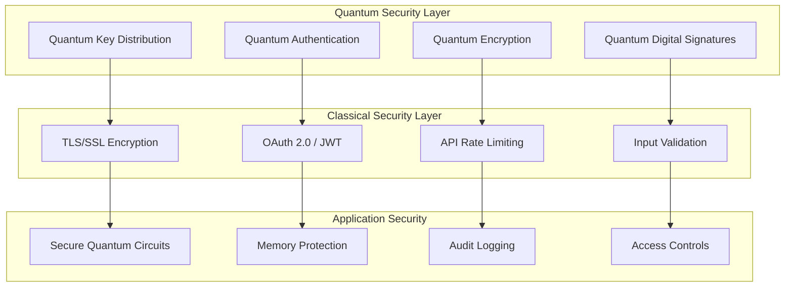

# 🛡️ Security Guidelines

🔐 **Licensed Component** - Contact: [bajpaikrishna715@gmail.com](mailto:bajpaikrishna715@gmail.com) for licensing

## 🔒 Security Overview

QuantumLangChain implements comprehensive security measures leveraging both classical cybersecurity and quantum cryptography.

## 🌌 Quantum Security Architecture



## 🔐 Quantum Cryptography

### Quantum Key Distribution (QKD)

```python
# Quantum key distribution implementation
from quantum_langchain.security import QuantumKeyDistribution

qkd = QuantumKeyDistribution()

# Generate quantum keys
quantum_key = qkd.generate_bb84_key(
    key_length=256,
    error_threshold=0.05
)

# Secure key exchange
secure_channel = qkd.establish_secure_channel(
    participant_a="alice",
    participant_b="bob",
    protocol="bb84"
)
```

### Quantum Authentication

```python
# Quantum authentication protocols
from quantum_langchain.security import QuantumAuthentication

auth = QuantumAuthentication()

# Create quantum identity
quantum_identity = auth.create_quantum_identity(
    user_id="user123",
    quantum_signature=quantum_key
)

# Verify quantum identity
is_authentic = auth.verify_quantum_identity(
    identity=quantum_identity,
    challenge=quantum_challenge
)
```

### Quantum Encryption

```python
# Quantum encryption for sensitive data
from quantum_langchain.security import QuantumEncryption

encryption = QuantumEncryption()

# Encrypt data with quantum methods
encrypted_data = encryption.quantum_encrypt(
    data="sensitive information",
    quantum_key=quantum_key,
    algorithm="quantum_otp"
)

# Decrypt with quantum verification
decrypted_data = encryption.quantum_decrypt(
    encrypted_data=encrypted_data,
    quantum_key=quantum_key,
    verify_integrity=True
)
```

## 🔒 Classical Security Measures

### API Security

```python
# Secure API configuration
from quantum_langchain.security import APISecurityManager

security_manager = APISecurityManager()

# Configure authentication
security_manager.configure_auth(
    method="jwt",
    secret_key=os.getenv("JWT_SECRET"),
    token_expiry=3600
)

# Setup rate limiting
security_manager.configure_rate_limiting(
    requests_per_minute=100,
    burst_limit=20
)

# Input validation
security_manager.configure_validation(
    max_payload_size="10MB",
    allowed_content_types=["application/json"],
    sanitization_rules=["xss", "sql_injection"]
)
```

### Data Protection

```python
# Data protection and encryption
from quantum_langchain.security import DataProtection

protection = DataProtection()

# Encrypt sensitive data at rest
protection.configure_encryption_at_rest(
    algorithm="AES-256-GCM",
    key_rotation_interval=30  # days
)

# Encrypt data in transit
protection.configure_encryption_in_transit(
    tls_version="1.3",
    cipher_suites=["ECDHE-RSA-AES256-GCM-SHA384"]
)

# Data anonymization
protection.configure_anonymization(
    pii_detection=True,
    anonymization_method="differential_privacy"
)
```

## 🛡️ Quantum Circuit Security

### Secure Circuit Design

```python
# Secure quantum circuit implementation
from quantum_langchain.security import SecureQuantumCircuits

secure_circuits = SecureQuantumCircuits()

# Create tamper-resistant circuits
secure_circuit = secure_circuits.create_secure_circuit(
    algorithm="quantum_search",
    protection_level="high",
    integrity_checks=True
)

# Verify circuit integrity
is_secure = secure_circuits.verify_circuit_integrity(
    circuit=secure_circuit,
    expected_hash="sha256_hash"
)
```

### Quantum State Protection

```python
# Protect quantum states from interference
from quantum_langchain.security import QuantumStateProtection

state_protection = QuantumStateProtection()

# Implement quantum error correction
protected_state = state_protection.apply_error_correction(
    quantum_state=vulnerable_state,
    code_type="surface_code"
)

# Monitor for decoherence attacks
state_protection.monitor_decoherence(
    state=protected_state,
    alert_threshold=0.95  # fidelity threshold
)
```

## 🔍 Security Monitoring

### Threat Detection

```python
# Security monitoring and threat detection
from quantum_langchain.security import ThreatDetector

detector = ThreatDetector()

# Configure anomaly detection
detector.configure_anomaly_detection(
    baseline_period="7days",
    sensitivity="medium",
    quantum_specific_threats=True
)

# Real-time monitoring
detector.start_monitoring([
    "quantum_state_tampering",
    "classical_injection_attacks",
    "unauthorized_access",
    "data_exfiltration"
])
```

### Audit Logging

```python
# Comprehensive audit logging
from quantum_langchain.security import AuditLogger

audit_logger = AuditLogger()

# Configure audit trail
audit_logger.configure(
    log_level="INFO",
    retention_period="1year",
    encryption=True,
    tamper_protection=True
)

# Log security events
@audit_logger.log_security_event
def sensitive_operation(user_id, operation):
    # Perform sensitive operation
    return result
```

## 🔐 Access Control

### Role-Based Access Control (RBAC)

```python
# Implement RBAC for quantum resources
from quantum_langchain.security import QuantumRBAC

rbac = QuantumRBAC()

# Define roles
rbac.define_role("quantum_researcher", permissions=[
    "read_quantum_memory",
    "execute_quantum_circuits",
    "view_quantum_results"
])

rbac.define_role("quantum_administrator", permissions=[
    "manage_quantum_backends",
    "configure_security",
    "access_all_resources"
])

# Assign roles to users
rbac.assign_role("user123", "quantum_researcher")
```

### Attribute-Based Access Control (ABAC)

```python
# Advanced ABAC for fine-grained control
from quantum_langchain.security import QuantumABAC

abac = QuantumABAC()

# Define access policies
abac.create_policy(
    name="quantum_memory_access",
    subject="user.role == 'researcher'",
    resource="quantum_memory",
    action="read",
    condition="time.hour >= 9 AND time.hour <= 17"
)
```

## 🚨 Incident Response

### Security Incident Handling

```python
# Automated incident response
from quantum_langchain.security import IncidentResponse

incident_response = IncidentResponse()

# Configure response procedures
incident_response.configure_procedures({
    "quantum_state_tampering": [
        "isolate_affected_qubits",
        "restore_from_backup",
        "notify_security_team"
    ],
    "unauthorized_access": [
        "revoke_access_tokens", 
        "audit_access_logs",
        "reset_quantum_keys"
    ]
})

# Automated response triggers
@incident_response.trigger_on("security_alert")
def handle_security_incident(alert):
    return incident_response.execute_procedure(alert.type)
```

## 🔧 Security Configuration

### Environment Security

```python
# Secure environment configuration
from quantum_langchain.security import EnvironmentSecurity

env_security = EnvironmentSecurity()

# Secure configuration management
env_security.configure_secrets_management(
    provider="hashicorp_vault",
    encryption="AES-256",
    rotation_policy="weekly"
)

# Environment isolation
env_security.configure_isolation(
    quantum_sandbox=True,
    classical_containers=True,
    network_segmentation=True
)
```

### Compliance Configuration

```python
# Compliance and regulatory requirements
from quantum_langchain.security import ComplianceManager

compliance = ComplianceManager()

# Configure compliance frameworks
compliance.configure_frameworks([
    "GDPR",
    "HIPAA", 
    "SOC2",
    "NIST_Quantum_Cryptography"
])

# Automated compliance monitoring
compliance.start_monitoring(
    audit_frequency="daily",
    reporting=True,
    alerts=True
)
```

## 🛡️ Security Best Practices

### Quantum Security Guidelines

1. **Quantum Key Management**
   - Regularly rotate quantum keys
   - Use quantum-safe algorithms
   - Implement key escrow for recovery

2. **Circuit Security**
   - Validate circuit integrity
   - Use secure compilation
   - Monitor for tampering

3. **State Protection**
   - Implement error correction
   - Monitor decoherence
   - Use secure quantum channels

### Classical Security Guidelines

1. **Authentication & Authorization**
   - Use multi-factor authentication
   - Implement least privilege access
   - Regular access reviews

2. **Data Protection**
   - Encrypt data at rest and in transit
   - Implement data loss prevention
   - Regular security assessments

3. **Network Security**
   - Use secure communication protocols
   - Implement network segmentation
   - Monitor network traffic

## 🚀 Security Testing

### Penetration Testing

```python
# Security testing framework
from quantum_langchain.security.testing import SecurityTester

tester = SecurityTester()

# Quantum-specific security tests
results = tester.run_quantum_security_tests([
    "quantum_state_injection",
    "entanglement_breaking",
    "measurement_attacks",
    "decoherence_exploits"
])

# Classical security tests
classical_results = tester.run_classical_security_tests([
    "sql_injection",
    "xss_attacks", 
    "authentication_bypass",
    "privilege_escalation"
])
```

## 📊 Security Metrics

### Security KPIs

- **Quantum Key Distribution Success Rate**: > 99.5%
- **Threat Detection Accuracy**: > 95%
- **Incident Response Time**: < 15 minutes
- **Security Audit Compliance**: 100%
- **Quantum State Integrity**: > 99.9%

### Security Dashboard

```python
# Security monitoring dashboard
from quantum_langchain.security import SecurityDashboard

dashboard = SecurityDashboard()

# Configure security metrics
dashboard.add_metrics([
    "active_threats",
    "quantum_key_status",
    "authentication_failures",
    "data_encryption_status",
    "compliance_score"
])

# Real-time security monitoring
dashboard.start_monitoring(port=8443, ssl=True)
```

## 🔐 License Requirements

Security features require Enterprise licensing for full quantum cryptography capabilities. Contact [bajpaikrishna715@gmail.com](mailto:bajpaikrishna715@gmail.com) for licensing.

---

🔐 **License Notice**: Advanced security features require appropriate licensing tiers. Contact [bajpaikrishna715@gmail.com](mailto:bajpaikrishna715@gmail.com) for access.
