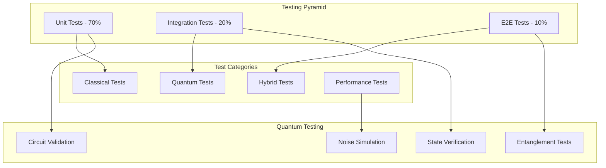

# 🧪 Testing QuantumLangChain

🔐 **Licensed Component** - Contact: [bajpaikrishna715@gmail.com](mailto:bajpaikrishna715@gmail.com) for licensing

## 🚀 Testing Overview

QuantumLangChain employs comprehensive testing strategies covering both classical and quantum components.

## 🏗️ Test Structure



## 🔧 Test Environment Setup

### Prerequisites

```bash
# Install test dependencies
pip install -e ".[test]"

# Install quantum simulators
pip install qiskit-aer pennylane-lightning

# Optional: Real quantum access
pip install qiskit-ibm-provider amazon-braket-sdk
```

### Environment Configuration

```python
# conftest.py
import pytest
from quantum_langchain.testing import QuantumTestHarness

@pytest.fixture
def quantum_simulator():
    """Quantum simulator fixture."""
    return QuantumTestHarness.create_simulator()

@pytest.fixture  
def mock_quantum_backend():
    """Mock quantum backend for fast tests."""
    return QuantumTestHarness.create_mock_backend()
```

## 🧪 Unit Testing

### Classical Component Tests

```python
# tests/unit/test_qlchain.py
import pytest
from quantum_langchain import QLChain

class TestQLChain:
    def test_initialization(self):
        """Test QLChain initialization."""
        chain = QLChain()
        assert chain.is_initialized
        
    def test_classical_processing(self):
        """Test classical LLM integration."""
        chain = QLChain(llm="mock")
        result = chain.invoke("test query")
        assert result is not None
```

### Quantum Component Tests

```python
# tests/unit/test_quantum_memory.py
import pytest
from quantum_langchain.memory import QuantumMemory

class TestQuantumMemory:
    def test_quantum_state_creation(self, quantum_simulator):
        """Test quantum state initialization."""
        memory = QuantumMemory(backend=quantum_simulator)
        state = memory.create_quantum_state("test data")
        assert memory.verify_quantum_state(state)
        
    def test_superposition_storage(self, quantum_simulator):
        """Test superposition-based storage."""
        memory = QuantumMemory(backend=quantum_simulator)
        memory.store_in_superposition(["data1", "data2", "data3"])
        retrieved = memory.quantum_retrieve("data2")
        assert "data2" in retrieved
```

## 🔗 Integration Testing

### Backend Integration Tests

```python
# tests/integration/test_backends.py
import pytest
from quantum_langchain.backends import QiskitBackend, PennyLaneBackend

class TestQuantumBackends:
    @pytest.mark.parametrize("backend_class", [
        QiskitBackend,
        PennyLaneBackend
    ])
    def test_backend_initialization(self, backend_class):
        """Test backend initialization."""
        backend = backend_class()
        assert backend.is_available()
        
    def test_circuit_execution(self, quantum_simulator):
        """Test quantum circuit execution."""
        backend = QiskitBackend(simulator=quantum_simulator)
        circuit = backend.create_test_circuit()
        result = backend.execute(circuit)
        assert result.success
```

### Memory Integration Tests

```python
# tests/integration/test_memory_integration.py
from quantum_langchain import QLChain
from quantum_langchain.memory import QuantumMemory

class TestMemoryIntegration:
    def test_memory_chain_integration(self, quantum_simulator):
        """Test memory integration with chains."""
        memory = QuantumMemory(backend=quantum_simulator)
        chain = QLChain(memory=memory)
        
        # Store and retrieve
        chain.invoke("Remember: quantum is powerful")
        response = chain.invoke("What did I tell you about quantum?")
        assert "powerful" in response.lower()
```

## 🌐 End-to-End Testing

### Full Workflow Tests

```python
# tests/e2e/test_quantum_rag.py
from quantum_langchain.chains import QuantumRAGChain
from quantum_langchain.vectorstores import QuantumChromaDB

class TestQuantumRAG:
    def test_complete_rag_workflow(self, quantum_simulator):
        """Test complete RAG workflow."""
        # Setup
        vectorstore = QuantumChromaDB(backend=quantum_simulator)
        rag_chain = QuantumRAGChain(
            vectorstore=vectorstore,
            llm="mock"
        )
        
        # Add documents
        docs = ["Quantum computing is revolutionary",
                "LangChain enables AI applications"]
        rag_chain.add_documents(docs)
        
        # Query
        result = rag_chain.invoke("Tell me about quantum computing")
        assert "revolutionary" in result.lower()
```

## ⚡ Performance Testing

### Quantum Performance Tests

```python
# tests/performance/test_quantum_performance.py
import time
import pytest
from quantum_langchain.memory import QuantumMemory

class TestQuantumPerformance:
    def test_quantum_memory_scalability(self, quantum_simulator):
        """Test memory performance with scale."""
        memory = QuantumMemory(backend=quantum_simulator)
        
        # Test with increasing data sizes
        for size in [10, 100, 1000]:
            start_time = time.time()
            
            # Store data
            data = [f"item_{i}" for i in range(size)]
            memory.bulk_store(data)
            
            # Retrieve data
            retrieved = memory.quantum_search("item_500")
            
            execution_time = time.time() - start_time
            assert execution_time < size * 0.1  # Linear scaling test
```

### Benchmark Tests

```python
# tests/performance/test_benchmarks.py
from quantum_langchain.benchmarks import QuantumBenchmark

class TestBenchmarks:
    def test_quantum_advantage_benchmark(self):
        """Test quantum advantage measurement."""
        benchmark = QuantumBenchmark()
        
        classical_time = benchmark.run_classical_search(1000)
        quantum_time = benchmark.run_quantum_search(1000)
        
        # Expect quantum advantage for large datasets
        if benchmark.has_quantum_advantage():
            assert quantum_time < classical_time
```

## 🐛 Error Testing

### Quantum Error Testing

```python
# tests/error/test_quantum_errors.py
from quantum_langchain.errors import QuantumError
from quantum_langchain.backends import QiskitBackend

class TestQuantumErrors:
    def test_quantum_error_handling(self, quantum_simulator):
        """Test quantum error recovery."""
        backend = QiskitBackend(simulator=quantum_simulator)
        
        # Introduce noise
        backend.add_noise_model("depolarizing", 0.1)
        
        # Test error correction
        with pytest.raises(QuantumError):
            backend.execute_unreliable_circuit()
            
    def test_error_recovery(self, quantum_simulator):
        """Test automatic error recovery."""
        backend = QiskitBackend(
            simulator=quantum_simulator,
            error_correction=True
        )
        
        result = backend.execute_with_recovery()
        assert result.success
```

## 🎯 Test Execution

### Running Tests

```bash
# All tests
pytest

# Unit tests only
pytest tests/unit/

# Integration tests
pytest tests/integration/

# E2E tests
pytest tests/e2e/

# Performance tests
pytest tests/performance/

# With coverage
pytest --cov=quantum_langchain

# Quantum-specific tests
pytest -m quantum

# Skip slow tests
pytest -m "not slow"
```

### Test Configuration

```ini
# pytest.ini
[tool:pytest]
testpaths = tests
python_files = test_*.py
python_classes = Test*
python_functions = test_*
markers =
    quantum: quantum computing tests
    slow: slow running tests
    integration: integration tests
    unit: unit tests
    performance: performance tests
addopts = 
    --strict-markers
    --strict-config
    --tb=short
```

## 📊 Test Metrics

### Coverage Requirements
- **Unit Tests**: > 90% coverage
- **Integration Tests**: > 80% coverage  
- **Quantum Components**: > 85% coverage
- **Critical Paths**: 100% coverage

### Performance Benchmarks
- **Unit Test Runtime**: < 2 minutes
- **Integration Tests**: < 10 minutes
- **E2E Tests**: < 30 minutes
- **Memory Usage**: < 1GB per test

## 🔐 License Requirements

Testing framework requires Professional licensing for quantum test harness. Contact [bajpaikrishna715@gmail.com](mailto:bajpaikrishna715@gmail.com) for licensing.

---

🔐 **License Notice**: Advanced testing features require appropriate licensing tiers. Contact [bajpaikrishna715@gmail.com](mailto:bajpaikrishna715@gmail.com) for access.
