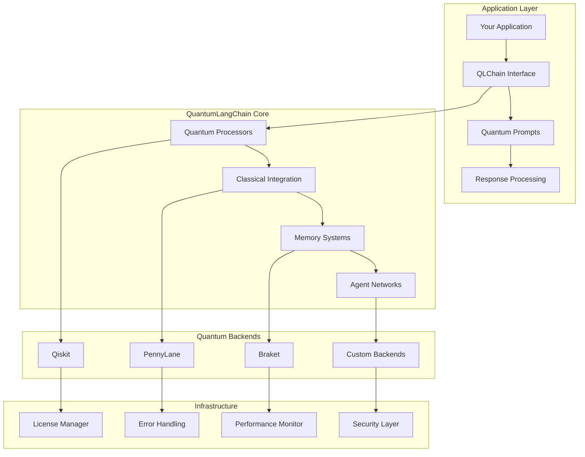
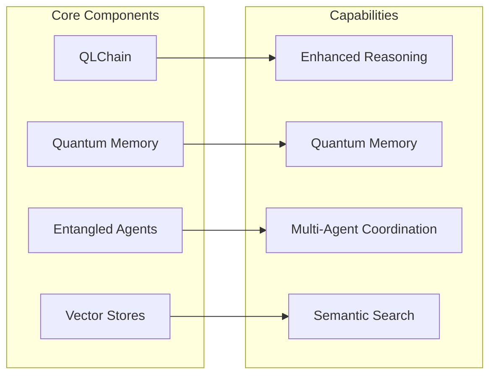

# 🚀 Getting Started with QuantumLangChain

🔐 **Licensed Component** - Contact: [bajpaikrishna715@gmail.com](mailto:bajpaikrishna715@gmail.com) for licensing

## Quick Start Guide

Welcome to QuantumLangChain! This guide will help you get started with quantum-enhanced AI applications in just a few minutes.

### 📋 Prerequisites

Before you begin, ensure you have:

- Python 3.8 or higher
- Valid QuantumLangChain license
- Quantum backend (Qiskit, PennyLane, or Braket)
- Basic understanding of quantum computing concepts

### 🛠️ Installation

```bash
# Install QuantumLangChain
pip install quantumlangchain

# Install quantum backends
pip install qiskit qiskit-aer
pip install pennylane
pip install amazon-braket-sdk

# Optional: Install additional dependencies
pip install numpy scipy matplotlib
```

### 🔑 License Setup

Before using QuantumLangChain, you need to set up your license:

```python
from quantumlangchain.licensing import setup_license

# Setup license (one-time configuration)
setup_license(
    license_key="your-license-key-here",
    contact_email="bajpaikrishna715@gmail.com"
)
```

If you don't have a license, the system will provide a 24-hour grace period. Contact [bajpaikrishna715@gmail.com](mailto:bajpaikrishna715@gmail.com) with your machine ID to obtain a license.

## 🎯 Your First Quantum Chain

Let's create your first quantum-enhanced AI application:

### Basic Example

```python
import asyncio
from quantumlangchain import QLChain

async def basic_example():
    # Initialize quantum chain
    chain = QLChain(
        backend="qiskit",
        quantum_dim=4,
        classical_dim=512,
        temperature=0.7
    )
    
    # Ask a question
    response = await chain.arun(
        "Explain quantum superposition in simple terms"
    )
    
    print(response)

# Run the example
asyncio.run(basic_example())
```

### Enhanced Example with Memory

```python
from quantumlangchain import QLChain
from quantumlangchain.memory import QuantumMemory

async def memory_example():
    # Create quantum memory
    memory = QuantumMemory(
        classical_dim=1024,
        quantum_dim=8,
        decoherence_rate=0.01
    )
    
    # Initialize chain with memory
    chain = QLChain(
        backend="qiskit",
        quantum_dim=8,
        classical_dim=1024,
        memory=memory,
        entanglement_strength=0.8
    )
    
    # Multi-turn conversation
    response1 = await chain.arun("What is quantum entanglement?")
    print("Q1:", response1)
    
    response2 = await chain.arun("How is it used in quantum computing?")
    print("Q2:", response2)
    
    response3 = await chain.arun("Can you give me a practical example?")
    print("Q3:", response3)

asyncio.run(memory_example())
```

## 🏗️ Architecture Overview



## 📚 Core Concepts

### Quantum-Enhanced Reasoning

QuantumLangChain uses quantum computing principles to enhance AI reasoning:

- **Superposition**: Process multiple reasoning paths simultaneously
- **Entanglement**: Create non-local correlations between concepts
- **Interference**: Amplify correct solutions and cancel incorrect ones
- **Measurement**: Extract final answers from quantum states

### Key Components



## 🎨 Common Use Cases

### 1. Enhanced Question Answering

```python
from quantumlangchain import QLChain

async def qa_system():
    chain = QLChain(
        backend="qiskit",
        quantum_dim=6,
        reasoning_depth=3
    )
    
    # Complex reasoning question
    question = """
    Given the uncertainty principle and quantum tunneling,
    how might quantum effects influence consciousness?
    """
    
    answer = await chain.arun(question)
    return answer
```

### 2. Creative Content Generation

```python
from quantumlangchain import QLChain

async def creative_writing():
    chain = QLChain(
        backend="pennylane",
        quantum_dim=8,
        creativity_boost=0.9,
        temperature=0.8
    )
    
    prompt = "Write a story about quantum computers achieving consciousness"
    story = await chain.arun(prompt)
    return story
```

### 3. Multi-Agent Problem Solving

```python
from quantumlangchain.agents import EntangledAgent, AgentNetwork

async def multi_agent_research():
    # Create specialized agents
    physicist = EntangledAgent(
        role="physicist",
        specialization="quantum_mechanics"
    )
    
    computer_scientist = EntangledAgent(
        role="computer_scientist",
        specialization="quantum_computing"
    )
    
    # Create entangled network
    network = AgentNetwork([physicist, computer_scientist])
    await network.entangle_agents()
    
    # Collaborative problem solving
    problem = "Design a quantum algorithm for protein folding"
    solution = await network.collaborative_solve(problem)
    return solution
```

### 4. Retrieval-Augmented Generation

```python
from quantumlangchain.chains import RAGQuantumChain
from quantumlangchain.vectorstores import QuantumVectorStore

async def rag_system():
    # Setup quantum vector store
    vectorstore = QuantumVectorStore(
        quantum_search=True,
        dimension=768
    )
    
    # Add knowledge base
    documents = [
        "Quantum computing principles and applications",
        "Machine learning and artificial intelligence",
        # ... more documents
    ]
    await vectorstore.aadd_texts(documents)
    
    # Create RAG chain
    rag_chain = RAGQuantumChain(vectorstore=vectorstore)
    
    # Enhanced Q&A with retrieval
    answer = await rag_chain.arun(
        "How can quantum computing accelerate machine learning?"
    )
    return answer
```

## ⚙️ Configuration Guide

### Backend Configuration

```python
# Qiskit Configuration
qiskit_config = {
    "backend": "qiskit",
    "backend_name": "qasm_simulator",
    "shots": 1024,
    "optimization_level": 2,
    "noise_model": None
}

# PennyLane Configuration
pennylane_config = {
    "backend": "pennylane",
    "device": "default.qubit",
    "shots": 1000,
    "interface": "autograd"
}

# Braket Configuration
braket_config = {
    "backend": "braket",
    "device": "arn:aws:braket::device/quantum-simulator/amazon/sv1",
    "s3_folder": ("amazon-braket-bucket", "folder")
}
```

### Memory Configuration

```python
memory_configs = {
    "basic": {
        "classical_dim": 512,
        "quantum_dim": 4,
        "decoherence_rate": 0.1
    },
    "advanced": {
        "classical_dim": 1024,
        "quantum_dim": 8,
        "decoherence_rate": 0.01,
        "error_correction": True
    }
}
```

## 🚦 Best Practices

### 1. Start Simple

Begin with basic quantum dimensions (4-8 qubits) and gradually increase complexity:

```python
# Good: Start simple
chain = QLChain(quantum_dim=4)

# Better: Gradually increase
chain = QLChain(quantum_dim=8, error_correction=True)
```

### 2. Handle Errors Gracefully

Always implement proper error handling:

```python
from quantumlangchain.exceptions import QuantumError, LicenseError

try:
    chain = QLChain(quantum_dim=16)
    result = await chain.arun("Your question")
except LicenseError as e:
    print(f"License issue: {e}")
    print("Contact: bajpaikrishna715@gmail.com")
except QuantumError as e:
    print(f"Quantum processing error: {e}")
```

### 3. Optimize Performance

Use appropriate configurations for your use case:

```python
# For fast responses
fast_chain = QLChain(
    quantum_dim=4,
    optimization_level=0,
    shots=256
)

# For high accuracy
accurate_chain = QLChain(
    quantum_dim=8,
    optimization_level=3,
    shots=2048,
    error_correction=True
)
```

### 4. Monitor Resource Usage

```python
from quantumlangchain.monitoring import PerformanceMonitor

monitor = PerformanceMonitor()

async def monitored_execution():
    with monitor.track("quantum_reasoning"):
        result = await chain.arun("Complex question")
    
    # Check performance metrics
    metrics = monitor.get_metrics()
    print(f"Execution time: {metrics['execution_time']}")
    print(f"Quantum operations: {metrics['quantum_ops']}")
```

## 🔧 Troubleshooting

### Common Issues

#### License Errors
```python
# Error: License not found or expired
# Solution: Contact bajpaikrishna715@gmail.com with your machine ID

from quantumlangchain.licensing import get_machine_id
print(f"Machine ID: {get_machine_id()}")
```

#### Backend Errors
```python
# Error: Quantum backend not available
# Solution: Install required backend

# For Qiskit
pip install qiskit qiskit-aer

# For PennyLane
pip install pennylane

# For Braket
pip install amazon-braket-sdk
```

#### Memory Errors
```python
# Error: Insufficient quantum memory
# Solution: Reduce quantum dimensions or upgrade license

chain = QLChain(
    quantum_dim=4,  # Reduce from higher value
    memory_optimization=True
)
```

### Debug Mode

Enable debug mode for detailed information:

```python
import logging
logging.basicConfig(level=logging.DEBUG)

from quantumlangchain import QLChain
chain = QLChain(debug=True)
```

## 📖 Next Steps

Now that you've completed the getting started guide, explore these areas:

1. **[Core Concepts](concepts/quantum-basics.md)** - Deepen your understanding
2. **[Theory & Architecture](theory-architecture.md)** - Learn advanced concepts
3. **[API Reference](api/overview.md)** - Explore all available features
4. **[Core Modules](modules/qlchain.md)** - See real-world applications

## 🆘 Support

Need help? Here are your options:

- **Documentation**: Check our comprehensive docs
- **Examples**: Browse example applications
- **Community**: Join our community discussions
- **License Issues**: Contact [bajpaikrishna715@gmail.com](mailto:bajpaikrishna715@gmail.com)

## 🔐 License Information

QuantumLangChain requires a valid license for operation. Features are gated based on license tier:

- **Basic**: Up to 4 qubits, basic features
- **Professional**: Up to 8 qubits, advanced features
- **Enterprise**: 16+ qubits, enterprise features
- **Research**: Unlimited, experimental features

Grace period: 24 hours when license not found.
Contact: [bajpaikrishna715@gmail.com](mailto:bajpaikrishna715@gmail.com)

Welcome to the future of AI with QuantumLangChain! 🚀
