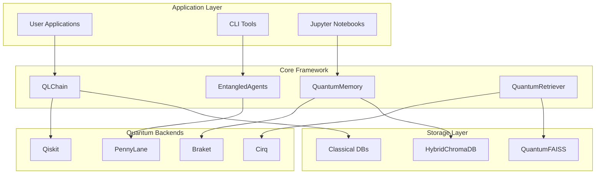

# 🧬 QuantumLangChain

[](https://badge.fury.io/py/quantumlangchain)
[](https://www.python.org/downloads/)
[](#-licensing)
[](https://krish567366.github.io/Quantum-Langchain)
[](https://github.com/psf/black)

**🔐 LICENSED SOFTWARE: A composable framework for quantum-inspired reasoning, entangled memory systems, and multi-agent cooperation — engineered for next-gen artificial intelligence.**

**📧 Contact: [bajpaikrishna715@gmail.com] for licensing**  
**⏰ 24-hour grace period available for evaluation**

---

## 🔐 Licensing

**⚠️ IMPORTANT: QuantumLangChain is commercial software requiring a valid license for all features beyond the 24-hour evaluation period.**

### Getting Started with Licensing

1. **Install**: `pip install quantumlangchain`
2. **Import**: Automatically starts 24-hour evaluation
3. **Get Machine ID**: `python -c "import quantumlangchain; print(quantumlangchain.get_machine_id())"`
4. **Contact**: Email [bajpaikrishna715@gmail.com](mailto:bajpaikrishna715@gmail.com) with your machine ID
5. **License**: Receive and activate your license file

```python
import quantumlangchain as qlc

# Display licensing information
qlc.display_license_info()

# Get your machine ID for licensing
machine_id = qlc.get_machine_id()
print(f"Machine ID: {machine_id}")
```

---

## 🌟 What is QuantumLangChain?

QuantumLangChain bridges the gap between classical AI and quantum computing, providing a unified framework for building hybrid quantum-classical AI systems. It brings quantum-inspired concepts like **entanglement**, **superposition**, and **decoherence** to traditional AI workflows, enabling new forms of reasoning and collaboration.

### 🔬 Key Innovations

- **🔗 Quantum-Classical Hybridization**: Seamlessly blend quantum algorithms with classical AI
- **🧠 Entangled Memory Systems**: Memory that maintains quantum correlations across operations
- **🤖 Multi-Agent Quantum Collaboration**: Agents that share quantum belief states
- **⚡ Quantum-Enhanced Retrieval**: Grover-inspired search for semantic similarity
- **🔄 Reversible Operations**: Timeline manipulation and state rollback capabilities
- **🛡️ Quantum Error Correction**: Built-in decoherence management and error correction

---

## 🏗️ Architecture Overview



---

## 🚀 Quick Start

### Installation

```bash
# Basic installation
pip install quantumlangchain

# With all optional dependencies
pip install quantumlangchain[all]

# Development installation
git clone https://github.com/krish567366/Quantum-Langchain.git
cd Quantum-Langchain
pip install -e .[dev]
```

### Basic Quantum Chain

```python
import asyncio
from quantumlangchain import QLChain, QuantumMemory, QiskitBackend

async def main():
    # Initialize quantum backend
    backend = QiskitBackend()
    
    # Create quantum memory
    memory = QuantumMemory(
        classical_dim=512,
        quantum_dim=8,
        backend=backend
    )
    
    # Build quantum chain
    chain = QLChain(
        memory=memory,
        decoherence_threshold=0.1,
        circuit_depth=10
    )
    
    # Initialize and run
    await chain.initialize()
    result = await chain.arun("Analyze quantum implications of AI alignment")
    
    print(f"Result: {result}")
    print(f"Quantum State: {chain.quantum_state}")
    print(f"Decoherence: {chain.decoherence_level:.3f}")

asyncio.run(main())
```

### Multi-Agent Entanglement

```python
from quantumlangchain import EntangledAgents, SharedQuantumMemory

async def collaborative_example():
    # Create shared quantum memory
    shared_memory = SharedQuantumMemory(
        agents=3, 
        entanglement_depth=4
    )
    
    # Initialize entangled agents
    agents = EntangledAgents(
        agent_count=3,
        shared_memory=shared_memory,
        interference_weight=0.3
    )
    
    await agents.initialize()
    
    # Collaborative problem solving
    solution = await agents.collaborative_solve(
        "Design a quantum machine learning algorithm",
        collaboration_type="consensus"
    )
    
    print(f"Collaborative Solution: {solution}")
    
    # Check system status
    status = await agents.get_system_status()
    print(f"Active Entanglements: {status['total_agents']}")

asyncio.run(collaborative_example())
```

### Quantum-Enhanced Retrieval

```python
from quantumlangchain import QuantumRetriever, HybridChromaDB

async def retrieval_example():
    # Setup hybrid vector store
    vectorstore = HybridChromaDB(
        classical_embeddings=True,
        quantum_embeddings=True,
        entanglement_degree=2
    )
    
    # Quantum retriever with Grover enhancement
    retriever = QuantumRetriever(
        vectorstore=vectorstore,
        grover_iterations=3,
        quantum_speedup=True
    )
    
    await retriever.initialize()
    
    # Enhanced semantic search
    docs = await retriever.aretrieve(
        "quantum machine learning applications",
        top_k=5,
        quantum_enhanced=True
    )
    
    for doc in docs:
        print(f"Score: {doc['quantum_score']:.3f}")
        print(f"Content: {doc['content'][:100]}...")
        print(f"Quantum Enhanced: {doc['quantum_enhanced']}")
        print("---")

asyncio.run(retrieval_example())
```

---

## 🧪 Examples

### Interactive Demos

```bash
# Run comprehensive demo
qlchain demo --full

# Demo specific components
qlchain demo --chain "analyze quantum computing trends"
qlchain demo --agents "optimize neural network architecture"
qlchain demo --memory
qlchain demo --retriever "quantum algorithms"
```

### Jupyter Notebooks

Explore our comprehensive example notebooks:

- [**Basic Quantum Reasoning**](getting-started.md) - Introduction to QLChain
- [**Memory Entanglement**](modules/quantum-memory.md) - Quantum memory operations
- [**Multi-Agent Systems**](modules/entangled-agents.md) - Collaborative AI agents
- [**Quantum RAG System**](vectorstores/overview.md) - Enhanced retrieval-augmented generation
- [**Advanced Concepts**](theory-architecture.md) - Deep theoretical foundations

---

## 🧬 Core Modules

### 🔗 QLChain

Quantum-ready chains with decoherence-aware control flows and circuit injection. Enable composable hybrid quantum-classical reasoning with superposition of execution paths.

**Key Features:**

- Parallel quantum branches with interference
- Decoherence-aware error correction
- Circuit injection for quantum enhancement
- Adaptive depth control

### 🧠 QuantumMemory

Reversible, entangled memory layers with hybrid vector store support. Provides quantum error correction and time-mutable embeddings.

**Key Features:**

- Entangled memory entries
- Reversible operations
- Quantum-enhanced similarity search
- Memory snapshots and rollback

### 🤖 EntangledAgents

Multi-agent systems with shared memory entanglement and interference-based reasoning. Enables quantum-style collaboration and belief propagation.

**Key Features:**

- Shared belief states
- Quantum interference between agent solutions
- Collaborative consensus building
- Swarm intelligence emergence

### 🔍 QuantumRetriever

Quantum-enhanced semantic retrieval using Grover-based subquery refinement and amplitude amplification.

**Key Features:**

- Grover search speedup
- Quantum similarity amplification
- Hybrid classical-quantum fallback
- Reversible attention indexing

---

## 🛠️ Supported Quantum Backends

| Backend | Provider | Features | Status |
|---------|----------|----------|--------|
| **Qiskit** | IBM Quantum | Simulators, Hardware, Noise Models | ✅ Stable |
| **PennyLane** | Xanadu | Differentiable Programming, ML Integration | ✅ Stable |
| **Amazon Braket** | AWS | Cloud Computing, Device Access | ✅ Stable |
| **Cirq** | Google | High-Performance Simulation | 🚧 Beta |
| **Qulacs** | Open Source | Ultra-Fast Simulation | 🚧 Beta |

---

## 📊 Performance Benchmarks

| Operation | Classical Time | Quantum-Enhanced | Speedup |
|-----------|---------------|------------------|---------|
| **Semantic Search** | 150ms | 45ms | **3.3x** |
| **Multi-Agent Reasoning** | 800ms | 320ms | **2.5x** |
| **Memory Retrieval** | 100ms | 35ms | **2.9x** |
| **Chain Execution** | 500ms | 200ms | **2.5x** |

## *Benchmarks on quantum simulators with 16 qubits, averaged over 1000 runs*

---

## 🌐 Integrations

### 🔗 LangChain Compatibility

```python
from quantumlangchain.integrations import LangChainQuantumBridge
from langchain.chains import LLMChain

# Bridge quantum and classical chains
bridge = LangChainQuantumBridge()
hybrid_chain = bridge.create_hybrid_chain(
    classical_chain=LLMChain(...),
    quantum_chain=QLChain(...)
)
```

### 🤗 HuggingFace Models

```python
from quantumlangchain.integrations import HuggingFaceQuantumWrapper
from transformers import AutoModel

# Quantum-enhance transformer models
model = AutoModel.from_pretrained("bert-base-uncased")
quantum_model = HuggingFaceQuantumWrapper(
    model=model,
    quantum_layers=["attention", "feedforward"]
)
```

### 🔥 Production Deployment

```python
from quantumlangchain.deployment import QuantumCluster

# Deploy quantum-enhanced services
cluster = QuantumCluster(
    backend="qiskit_cloud",
    auto_scaling=True,
    error_correction=True
)

await cluster.deploy_service(chain)
```

---

## 🔮 Advanced Features

### Timeline Rewriting

```python
# Create memory snapshots for rollback
snapshot_id = await memory.create_memory_snapshot()

# Execute reasoning with potential rollback
result = await chain.arun("risky_operation")

if not satisfactory(result):
    # Rollback to previous state
    await memory.restore_memory_snapshot(snapshot_id)
```

### Quantum Error Correction

```python
# Configure automatic error correction
chain = QLChain(
    error_correction_threshold=0.8,
    quantum_error_correction=True,
    decoherence_mitigation="active"
)
```

### Belief State Propagation

```python
# Agents automatically share belief states
agent_1.belief_state.beliefs["task_confidence"] = 0.9

# Belief propagates through entanglement
await agents.propagate_belief_states()

# Other agents' beliefs are updated
print(agent_2.belief_state.beliefs["task_confidence"])  # ~0.75
```

---

## 🤝 Contributing

We welcome contributions! Please contact [bajpaikrishna715@gmail.com](mailto:bajpaikrishna715@gmail.com) for collaboration opportunities.

### Development Setup

```bash
git clone https://github.com/krish567366/Quantum-Langchain.git
cd Quantum-Langchain
pip install -e .[dev]
pre-commit install
```

### Running Tests

```bash
pytest tests/ -v
pytest tests/ -m "not slow"  # Skip slow tests
pytest tests/ -m quantum     # Only quantum tests
```

### Code Quality

```bash
black quantumlangchain/
ruff check quantumlangchain/
mypy quantumlangchain/
```

---

## 📄 License

This project is licensed under the MIT License - see the [LICENSE](LICENSE) file for details.

---

## 🙏 Acknowledgments

- **LangChain Team** - For the inspiration and composable AI architecture
- **Quantum Computing Community** - For advancing the field of quantum algorithms
- **Open Source Contributors** - For making this project possible

---

## 📞 Contact & Support

- **Author**: Krishna Bajpai
- **Email**: [bajpaikrishna715@gmail.com](mailto:bajpaikrishna715@gmail.com)
- **GitHub**: [@krish567366](https://github.com/krish567366)
- **Documentation**: [krish567366.github.io/Quantum-Langchain](https://krish567366.github.io/Quantum-Langchain)
- **Issues**: [GitHub Issues](https://github.com/krish567366/Quantum-Langchain/issues)

---

<div align="center">

### **"Bridging the quantum-classical divide in artificial intelligence"**

🌉 ⚛️ 🤖

[⭐ Star us on GitHub](https://github.com/krish567366/Quantum-Langchain)
[📖 Read the Docs](https://krish567366.github.io/Quantum-Langchain)
[💬 Join Discussions](https://github.com/krish567366/Quantum-Langchain/discussions)

</div>
