# QuantumLangChain License Integration Guide

## 📋 Table of Contents

1. [License Overview](#-license-overview)
2. [Architecture with License Enforcement](#-architecture-with-license-enforcement)
3. [Installation and Activation](#-installation-and-activation)
4. [Basic Integration Patterns](#-basic-integration-patterns)
5. [Advanced License Features](#-advanced-license-features)
6. [Component-Level Licensing](#-component-level-licensing)
7. [Error Handling and Grace Period](#-error-handling-and-grace-period)
8. [Development and Testing](#-development-and-testing)
9. [Production Deployment](#-production-deployment)
10. [Troubleshooting](#-troubleshooting)

---

## 🔐 License Overview

**QuantumLangChain is a fully licensed software framework** with comprehensive license enforcement at every entry point. No functionality is accessible without a valid license or during the 24-hour grace period.

### Key Licensing Features

- **🔒 Complete Protection**: Every component requires license validation
- **⏰ 24-Hour Grace Period**: Evaluation period with limited features
- **🎯 Feature-Based Licensing**: Granular control over feature access
- **📧 Clear Contact Information**: bajpaikrishna715@gmail.com for all licensing
- **🔧 Hardware Fingerprinting**: Unique machine ID for license binding
- **📊 Usage Tracking**: Monitor and limit feature usage per tier

### License Tiers

```mermaid
graph TB
    subgraph "License Tiers & Pricing"
        A["🆓 Evaluation Tier<br/>24 hours<br/>1,000 operations"]
        B["💼 Basic Tier<br/>$29/month<br/>10,000 operations"]
        C["🚀 Professional Tier<br/>$99/month<br/>100,000 operations"]
        D["🏢 Enterprise Tier<br/>$299/month<br/>Unlimited operations"]
        E["🎓 Research Tier<br/>$49/month<br/>50,000 operations"]
    end
    
    subgraph "Feature Access Matrix"
        F["Core Features"]
        G["Basic Chains"]
        H["Quantum Memory"]
        I["Multi-Agent Systems"]
        J["Advanced Backends"]
        K["Enterprise Features"]
        L["Research Tools"]
    end
    
    A --> F
    B --> F
    B --> G
    B --> H
    C --> F
    C --> G
    C --> H
    C --> I
    C --> J
    D --> F
    D --> G
    D --> H
    D --> I
    D --> J
    D --> K
    E --> F
    E --> L
```



---

## 🏗️ Architecture with License Enforcement

### Complete System Architecture


### License Validation Flow


---

## 📦 Installation and Activation

### Installation Process

```bash
# Install QuantumLangChain
pip install quantumlangchain

# First import automatically starts grace period
python -c "import quantumlangchain; quantumlangchain.display_license_info()"
```

### Getting Your Machine ID

```python
import quantumlangchain as qlc

# Display comprehensive license information
qlc.display_license_info()

# Get machine ID for licensing
machine_id = qlc.get_machine_id()
print(f"Machine ID: {machine_id}")

# Contact information will be displayed
# Email: bajpaikrishna715@gmail.com with your machine ID
```

### License Activation (Future Implementation)

```python
# License activation (when license file is provided)
from quantumlangchain import LicenseManager

license_manager = LicenseManager()

# Activate license
try:
    license_manager.activate_license("path/to/license.qkey")
    print("✅ License activated successfully!")
except Exception as e:
    print(f"❌ License activation failed: {e}")
    print(f"📧 Contact: bajpaikrishna715@gmail.com")
```

---

## 🔧 Basic Integration Patterns

### Package-Level Integration

Every import of QuantumLangChain automatically validates licensing:

```python
# This import triggers license validation
import quantumlangchain as qlc

# If no license, 24-hour grace period starts automatically
# Machine ID and contact information displayed

# Check current license status
status = qlc.get_license_status()
print(f"License Status: {status}")
```

### Function-Level Decoration

All core functions are protected with license decorators:

```python
from quantumlangchain import QLChain, requires_license

# Core components automatically check licenses
chain = QLChain()  # Requires basic license + core features

# Custom functions can use license decorators
@requires_license(features=["custom_feature"], tier="professional")
async def my_quantum_function():
    """Custom function requiring professional license."""
    # Function implementation
    pass
```

### Class-Level Licensing

All components inherit from `LicensedComponent`:

```python
from quantumlangchain import LicensedComponent

class MyQuantumComponent(LicensedComponent):
    """Custom component with license protection."""
    
    def __init__(self):
        super().__init__(
            required_features=["core", "custom"],
            required_tier="professional",
            package="quantumlangchain"
        )
    
    def my_method(self):
        # Check specific feature access
        if self._check_feature_access("advanced_feature"):
            return "Advanced functionality"
        else:
            return "Basic functionality only"
```

---

## 🚀 Advanced License Features

### Context Manager for License Scope

```python
from quantumlangchain.licensing import licensed_context

# Use context manager for specific operations
async with licensed_context("quantumlangchain", ["quantum_simulation"]):
    # Perform quantum simulations
    result = await run_quantum_simulation()
    print(f"Simulation result: {result}")
```

### Lazy License Validation

```python
from quantumlangchain import QLChain

class SmartQuantumChain:
    """Chain with lazy license validation."""
    
    def __init__(self):
        self._license_checked = {}
        self._chain = None
    
    def _ensure_license(self, feature_set="core"):
        """Validate license only when needed."""
        if feature_set not in self._license_checked:
            try:
                validate_license("quantumlangchain", [feature_set])
                self._license_checked[feature_set] = True
            except QuantumLicenseError:
                self._license_checked[feature_set] = False
                raise
    
    async def basic_operation(self):
        """Basic operation requiring core license."""
        self._ensure_license("core")
        if not self._chain:
            self._chain = QLChain()
        return await self._chain.arun("basic query")
    
    async def advanced_operation(self):
        """Advanced operation requiring professional license."""
        self._ensure_license("advanced")
        # Advanced operations
        pass
```

### Feature Detection and Graceful Degradation

```python
from quantumlangchain import get_license_status

class AdaptiveQuantumApp:
    """Application that adapts to license tier."""
    
    def __init__(self):
        self.status = get_license_status()
        self.available_features = self.status.get("features_available", [])
    
    async def analyze_data(self, data):
        """Analysis with feature-based adaptation."""
        
        if "advanced_analytics" in self.available_features:
            return await self._advanced_analysis(data)
        elif "basic_analytics" in self.available_features:
            return await self._basic_analysis(data)
        else:
            return self._display_license_info()
    
    def _display_license_info(self):
        """Display licensing information to user."""
        return {
            "error": "Feature not licensed",
            "message": "Analytics features require a valid license",
            "contact": "bajpaikrishna715@gmail.com",
            "machine_id": self.status["machine_id"],
            "available_tiers": {
                "Basic": "$29/month - Basic analytics",
                "Professional": "$99/month - Advanced analytics",
                "Enterprise": "$299/month - All features"
            }
        }
```

---

## 🧩 Component-Level Licensing

### QLChain Licensing

```python
from quantumlangchain import QLChain

# QLChain requires basic license
try:
    chain = QLChain()  # Validates: core, basic_chains
    result = await chain.arun("query")  # Validates each execution
except FeatureNotLicensedError as e:
    print(f"License required: {e}")
    print("📧 Contact: bajpaikrishna715@gmail.com")
```

### Quantum Memory Licensing

```python
from quantumlangchain import QuantumMemory

# Quantum Memory requires basic license
try:
    memory = QuantumMemory(
        classical_dim=512,
        quantum_dim=8
    )  # Validates: core, quantum_memory
except FeatureNotLicensedError as e:
    print(f"Quantum Memory requires license: {e}")
```

### Multi-Agent Systems Licensing

```python
from quantumlangchain import EntangledAgents

# Multi-agent systems require professional license
try:
    agents = EntangledAgents(agent_count=3)  # Validates: multi_agent
except FeatureNotLicensedError as e:
    print(f"Multi-agent features require Professional license: {e}")
    print("💼 Upgrade to Professional: $99/month")
```

### Enterprise Features Licensing

```python
from quantumlangchain.enterprise import DistributedQuantumSystem

# Enterprise features require enterprise license
try:
    distributed_system = DistributedQuantumSystem()  # Validates: enterprise
except FeatureNotLicensedError as e:
    print(f"Enterprise features require Enterprise license: {e}")
    print("🏢 Upgrade to Enterprise: $299/month")
```

---

## ⚠️ Error Handling and Grace Period

### Comprehensive Error Handling

```python
from quantumlangchain import (
    QLChain,
    LicenseExpiredError,
    FeatureNotLicensedError,
    GracePeriodExpiredError,
    LicenseNotFoundError,
    UsageLimitExceededError
)

async def robust_quantum_app():
    """Application with comprehensive error handling."""
    
    try:
        chain = QLChain()
        result = await chain.arun("quantum query")
        return result
        
    except LicenseExpiredError as e:
        return {
            "error": "license_expired",
            "message": str(e),
            "action": "renew_license",
            "contact": "bajpaikrishna715@gmail.com"
        }
    
    except FeatureNotLicensedError as e:
        return {
            "error": "feature_not_licensed",
            "message": str(e),
            "action": "upgrade_license",
            "pricing": {
                "Professional": "$99/month",
                "Enterprise": "$299/month"
            }
        }
    
    except GracePeriodExpiredError as e:
        return {
            "error": "grace_period_expired",
            "message": str(e),
            "action": "purchase_license",
            "contact": "bajpaikrishna715@gmail.com"
        }
    
    except UsageLimitExceededError as e:
        return {
            "error": "usage_limit_exceeded",
            "message": str(e),
            "action": "upgrade_tier_or_wait",
            "reset_time": "Next day (UTC)"
        }
    
    except LicenseNotFoundError as e:
        # This automatically starts grace period
        return {
            "info": "grace_period_started",
            "message": "24-hour evaluation period activated",
            "contact": "bajpaikrishna715@gmail.com",
            "machine_id": get_machine_id()
        }
```

### Grace Period Management

```python
from quantumlangchain import LicenseManager

def check_grace_period():
    """Check grace period status."""
    manager = LicenseManager()
    status = manager.get_license_status()
    
    if status["grace_active"]:
        hours_remaining = status["grace_remaining_hours"]
        print(f"⏰ Grace period: {hours_remaining:.1f} hours remaining")
        print(f"📊 Usage today: {status['usage_today']} operations")
        print(f"📧 Contact: {status['contact_email']}")
        print(f"🔧 Machine ID: {status['machine_id']}")
        
        if hours_remaining < 2:
            print("⚠️ Grace period ending soon!")
            print("📧 Contact bajpaikrishna715@gmail.com immediately")
    
    return status
```

---

## 🧪 Development and Testing

### Unit Testing with License Mocks

```python
import pytest
from unittest.mock import patch
from quantumlangchain import QLChain, LicenseExpiredError

@pytest.fixture
def mock_valid_license():
    """Mock valid license for testing."""
    with patch('quantumlangchain.licensing.validate_license', return_value=True):
        yield

@pytest.fixture
def mock_expired_license():
    """Mock expired license for testing."""
    with patch('quantumlangchain.licensing.validate_license', 
               side_effect=LicenseExpiredError("License expired", "TEST-MACHINE-ID")):
        yield

@pytest.fixture
def mock_grace_period():
    """Mock active grace period."""
    with patch('quantumlangchain.licensing.LicenseManager._is_grace_active', return_value=True):
        yield

def test_qlchain_with_valid_license(mock_valid_license):
    """Test QLChain with valid license."""
    chain = QLChain()
    assert chain is not None

def test_qlchain_without_license(mock_expired_license):
    """Test QLChain behavior without license."""
    with pytest.raises(LicenseExpiredError):
        QLChain()

def test_qlchain_grace_period(mock_grace_period):
    """Test QLChain during grace period."""
    # Should work with limited features
    chain = QLChain()
    assert chain is not None
```

### Development Mode

```python
import os
from quantumlangchain import LicenseManager

# Enable development mode for testing
os.environ["QUANTUMLANGCHAIN_DEV"] = "1"

def development_mode_check():
    """Check if development mode is active."""
    if os.getenv("QUANTUMLANGCHAIN_DEV"):
        print("🚧 Development mode active - license checks bypassed")
        return True
    return False

# Development-friendly license validation
def dev_validate_license(package, features=None, tier="basic"):
    """Development-friendly license validation."""
    if development_mode_check():
        return True
    return LicenseManager().validate_license(package, features, tier)
```

### CI/CD Integration

```yaml
# .github/workflows/test.yml
name: Test QuantumLangChain

on: [push, pull_request]

jobs:
  test:
    runs-on: ubuntu-latest
    
    steps:
    - uses: actions/checkout@v3
    
    - name: Set up Python
      uses: actions/setup-python@v4
      with:
        python-version: '3.9'
    
    - name: Install dependencies
      run: |
        pip install -e .
        pip install pytest pytest-asyncio
    
    - name: Run tests with development mode
      env:
        QUANTUMLANGCHAIN_DEV: "1"
      run: |
        pytest tests/ -v
    
    - name: Test license validation
      run: |
        python -c "
        import quantumlangchain as qlc
        status = qlc.get_license_status()
        print(f'License Status: {status}')
        "
```

---

## 🚀 Production Deployment

### Docker Integration

```dockerfile
FROM python:3.9-slim

# Install QuantumLangChain
RUN pip install quantumlangchain

# Copy application
COPY . /app
WORKDIR /app

# Set production environment
ENV QUANTUMLANGCHAIN_PROD=1

# Health check that includes license validation
HEALTHCHECK --interval=30s --timeout=10s --start-period=60s \
  CMD python -c "
import quantumlangchain as qlc
try:
    qlc.validate_license('quantumlangchain')
    print('License OK')
except Exception as e:
    print(f'License Error: {e}')
    exit(1)
"

CMD ["python", "app.py"]
```

### Kubernetes Deployment

```yaml
apiVersion: apps/v1
kind: Deployment
metadata:
  name: quantumlangchain-app
spec:
  replicas: 3
  selector:
    matchLabels:
      app: quantumlangchain-app
  template:
    metadata:
      labels:
        app: quantumlangchain-app
    spec:
      containers:
      - name: app
        image: quantumlangchain-app:latest
        env:
        - name: QUANTUMLANGCHAIN_PROD
          value: "1"
        # License file can be mounted as secret
        volumeMounts:
        - name: license-volume
          mountPath: "/app/.quantumlangchain"
          readOnly: true
        livenessProbe:
          exec:
            command:
            - python
            - -c
            - "import quantumlangchain; quantumlangchain.validate_license('quantumlangchain')"
          initialDelaySeconds: 30
          periodSeconds: 60
      volumes:
      - name: license-volume
        secret:
          secretName: quantumlangchain-license
```

### Production Monitoring

```python
import logging
from quantumlangchain import get_license_status, LicenseManager

class LicenseMonitor:
    """Monitor license status in production."""
    
    def __init__(self):
        self.logger = logging.getLogger(__name__)
        self.manager = LicenseManager()
    
    async def check_license_health(self):
        """Check license health for monitoring."""
        try:
            status = get_license_status()
            
            # Check expiration
            if status.get("license_valid") and status.get("expiry_date"):
                # Warn if expiring within 7 days
                from datetime import datetime, timedelta
                expiry = datetime.fromisoformat(status["expiry_date"])
                if expiry - datetime.now() < timedelta(days=7):
                    self.logger.warning("License expiring within 7 days")
            
            # Check usage
            usage = status.get("usage_today", 0)
            if usage > 8000:  # 80% of 10k limit
                self.logger.warning(f"High usage: {usage} operations today")
            
            return {
                "healthy": status.get("license_valid", False),
                "status": status
            }
            
        except Exception as e:
            self.logger.error(f"License health check failed: {e}")
            return {"healthy": False, "error": str(e)}
    
    def setup_alerts(self):
        """Setup monitoring alerts."""
        # Integration with monitoring systems
        pass
```

---

## 🔍 Troubleshooting

### Common Issues and Solutions

#### 1. License Not Found

```python
# Issue: LicenseNotFoundError on first use
# Solution: Grace period automatically starts

import quantumlangchain as qlc

try:
    chain = qlc.QLChain()
except qlc.LicenseNotFoundError as e:
    print("Grace period started automatically")
    print(f"Contact: bajpaikrishna715@gmail.com")
    print(f"Machine ID: {qlc.get_machine_id()}")
    
    # Try again - should work in grace period
    chain = qlc.QLChain()
```

#### 2. Feature Not Licensed

```python
# Issue: FeatureNotLicensedError for advanced features
# Solution: Check license tier and upgrade if needed

try:
    from quantumlangchain import EntangledAgents
    agents = EntangledAgents(agent_count=5)
except qlc.FeatureNotLicensedError as e:
    print("Multi-agent features require Professional license")
    print("Current tier: Basic")
    print("Upgrade to Professional: $99/month")
    print("Contact: bajpaikrishna715@gmail.com")
```

#### 3. Usage Limit Exceeded

```python
# Issue: UsageLimitExceededError
# Solution: Wait for reset or upgrade tier

try:
    result = await chain.arun("query")
except qlc.UsageLimitExceededError as e:
    print("Daily usage limit exceeded")
    print("Options:")
    print("1. Wait for reset at midnight UTC")
    print("2. Upgrade to higher tier")
    print("3. Contact: bajpaikrishna715@gmail.com")
```

#### 4. Grace Period Expired

```python
# Issue: GracePeriodExpiredError
# Solution: Purchase license

try:
    chain = qlc.QLChain()
except qlc.GracePeriodExpiredError as e:
    print("24-hour evaluation period has expired")
    print("Please purchase a license to continue")
    print("Contact: bajpaikrishna715@gmail.com")
    print(f"Machine ID: {qlc.get_machine_id()}")
```

### Debug License Status

```python
def debug_license_status():
    """Debug license status comprehensively."""
    import quantumlangchain as qlc
    
    print("\n" + "="*60)
    print("🔍 QuantumLangChain License Debug")
    print("="*60)
    
    # Display detailed status
    qlc.display_license_info()
    
    # Check specific components
    components = [
        ("QLChain", ["core", "basic_chains"]),
        ("QuantumMemory", ["core", "quantum_memory"]),
        ("EntangledAgents", ["multi_agent"]),
        ("Enterprise Features", ["enterprise"])
    ]
    
    for name, features in components:
        try:
            qlc.validate_license("quantumlangchain", features)
            print(f"✅ {name}: Licensed")
        except Exception as e:
            print(f"❌ {name}: {e.__class__.__name__}")
    
    print("="*60)

# Run debug
debug_license_status()
```

### Contact and Support

For all licensing issues:

- **📧 Email**: [bajpaikrishna715@gmail.com](mailto:bajpaikrishna715@gmail.com)
- **🔧 Include**: Your machine ID (from `get_machine_id()`)
- **📝 Describe**: What you're trying to do
- **⏰ Response**: Within 24 hours

---

## 📊 Usage Analytics

### Track License Usage

```python
from quantumlangchain import LicenseManager

def analyze_usage():
    """Analyze license usage patterns."""
    manager = LicenseManager()
    usage_data = manager.usage_data
    
    print(f"Daily Operations: {usage_data.get('daily_operations', 0)}")
    print(f"Monthly Operations: {usage_data.get('monthly_operations', 0)}")
    
    feature_usage = usage_data.get('feature_usage', {})
    print("\nFeature Usage:")
    for feature, count in feature_usage.items():
        print(f"  {feature}: {count}")
```

This comprehensive integration guide ensures that QuantumLangChain is completely protected by licensing while providing clear pathways for users to evaluate, purchase, and use the software effectively.
