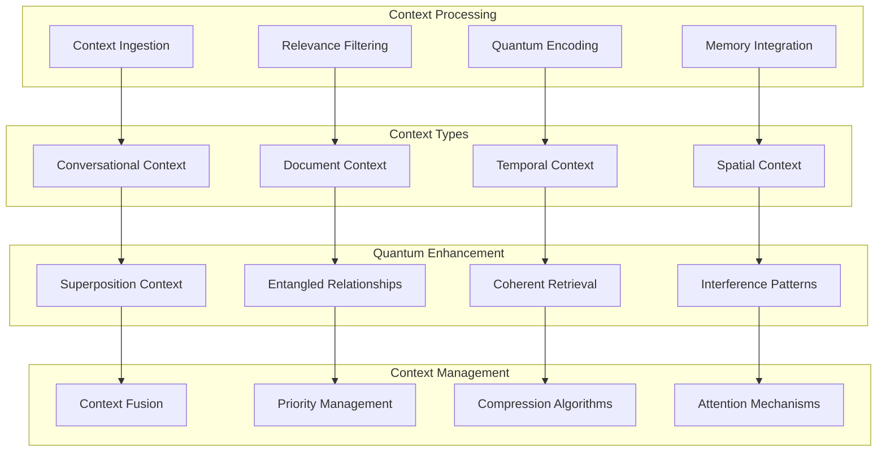
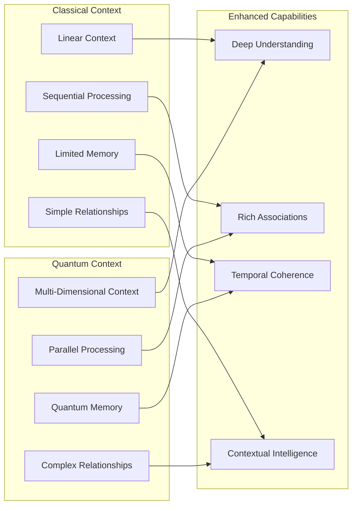
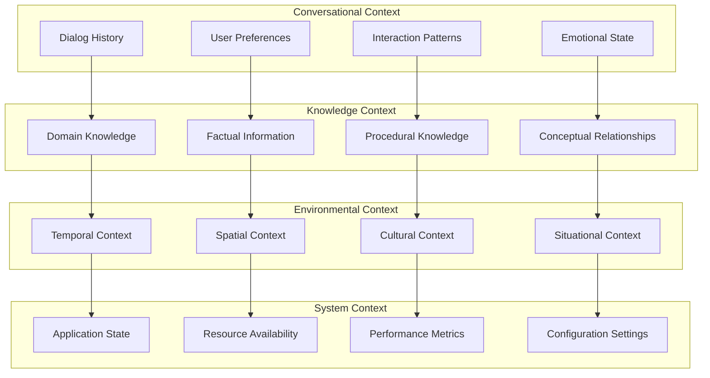
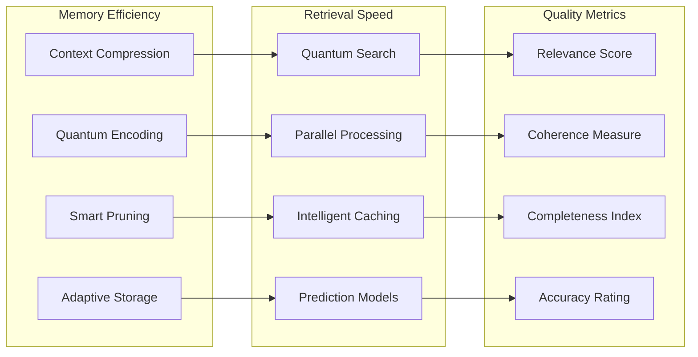
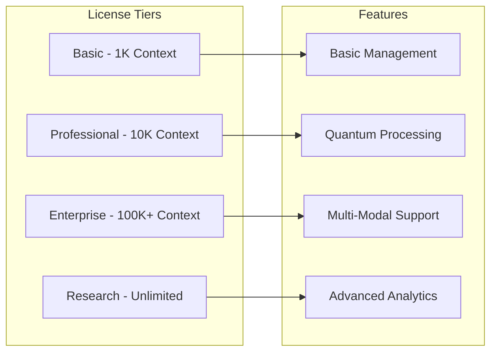
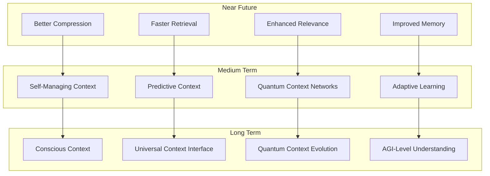

# 🧠 Context Manager Module

🔐 **Licensed Component** - Contact: [bajpaikrishna715@gmail.com](mailto:bajpaikrishna715@gmail.com) for licensing

## Context Manager Architecture



## 🌟 Core Features

### Quantum Context Understanding



## 🔧 Implementation

### Basic Context Manager

```python
from quantumlangchain.context import QuantumContextManager

# Initialize context manager
context_manager = QuantumContextManager(
    max_context_length=8192,
    quantum_compression=True,
    entanglement_strength=0.8,
    temporal_awareness=True
)

# Add context information
await context_manager.add_context(
    "The user is interested in quantum computing applications",
    context_type="user_interest",
    importance=0.9
)

await context_manager.add_context(
    "Previous conversation covered machine learning basics",
    context_type="conversation_history",
    importance=0.7
)

# Retrieve relevant context for a query
relevant_context = await context_manager.get_relevant_context(
    "How does quantum computing help with AI?",
    max_items=5,
    quantum_retrieval=True
)
```

### Advanced Multi-Modal Context Manager

```python
from quantumlangchain.context import MultiModalContextManager

class AdvancedContextSystem:
    def __init__(self):
        self.context_manager = MultiModalContextManager(
            text_dim=1024,
            image_dim=768,
            audio_dim=512,
            quantum_dim=16,
            cross_modal_entanglement=True
        )
        
        # Context processors for different modalities
        self.text_processor = TextContextProcessor()
        self.image_processor = ImageContextProcessor()
        self.audio_processor = AudioContextProcessor()
        self.temporal_processor = TemporalContextProcessor()
        
    async def process_multimodal_context(self, inputs):
        """Process and integrate multi-modal context."""
        contexts = []
        
        # Process each modality
        if "text" in inputs:
            text_context = await self.text_processor.process(
                inputs["text"]
            )
            contexts.append(text_context)
        
        if "image" in inputs:
            image_context = await self.image_processor.process(
                inputs["image"]
            )
            contexts.append(image_context)
        
        if "audio" in inputs:
            audio_context = await self.audio_processor.process(
                inputs["audio"]
            )
            contexts.append(audio_context)
        
        # Quantum fusion of contexts
        fused_context = await self.context_manager.quantum_fusion(
            contexts
        )
        
        # Add temporal relationships
        temporal_context = await self.temporal_processor.add_temporal_info(
            fused_context
        )
        
        return temporal_context
    
    async def adaptive_context_management(self, query, session_info):
        """Adaptively manage context based on query and session."""
        # Analyze query requirements
        context_requirements = await self.analyze_context_needs(query)
        
        # Retrieve context based on requirements
        if context_requirements["depth"] > 0.8:
            # Deep context retrieval
            context = await self.context_manager.deep_context_retrieval(
                query, session_info
            )
        elif context_requirements["breadth"] > 0.8:
            # Broad context retrieval
            context = await self.context_manager.broad_context_retrieval(
                query, session_info
            )
        else:
            # Standard context retrieval
            context = await self.context_manager.standard_context_retrieval(
                query, session_info
            )
        
        return context
```

### Temporal Context Management

```python
class TemporalContextManager:
    def __init__(self):
        self.temporal_memory = TemporalQuantumMemory()
        self.event_tracker = EventTracker()
        self.causality_analyzer = CausalityAnalyzer()
        
    async def manage_temporal_context(self, event, timestamp):
        """Manage context with temporal awareness."""
        # Record event with timestamp
        await self.event_tracker.record_event(event, timestamp)
        
        # Analyze temporal relationships
        temporal_relations = await self.causality_analyzer.analyze_causality(
            event, self.event_tracker.get_recent_events()
        )
        
        # Update temporal memory
        await self.temporal_memory.update_with_temporal_info(
            event, temporal_relations
        )
        
        # Maintain temporal coherence
        await self.maintain_temporal_coherence()
    
    async def retrieve_temporal_context(self, query, time_window=None):
        """Retrieve context with temporal constraints."""
        # Determine relevant time window
        if time_window is None:
            time_window = await self.determine_optimal_time_window(query)
        
        # Retrieve events in time window
        relevant_events = await self.event_tracker.get_events_in_window(
            time_window
        )
        
        # Quantum temporal processing
        temporal_context = await self.temporal_memory.quantum_temporal_search(
            query, relevant_events
        )
        
        return temporal_context
```

## 🎯 Context Types

### Context Categories



### Context Processing Pipeline

```python
class ContextProcessingPipeline:
    def __init__(self):
        self.stages = [
            ContextExtractionStage(),
            RelevanceFilteringStage(),
            QuantumEncodingStage(),
            RelationshipMappingStage(),
            PriorityAssignmentStage(),
            CompressionStage()
        ]
        
    async def process_context(self, raw_context):
        """Process context through all pipeline stages."""
        processed_context = raw_context
        
        for stage in self.stages:
            processed_context = await stage.process(processed_context)
            
            # Quality check after each stage
            quality_score = await stage.assess_quality(processed_context)
            if quality_score < 0.7:
                # Retry with different parameters
                processed_context = await stage.retry_with_adjustment(
                    processed_context
                )
        
        return processed_context
    
    async def adaptive_processing(self, context, requirements):
        """Adapt processing based on specific requirements."""
        # Select relevant stages based on requirements
        selected_stages = await self.select_stages(requirements)
        
        # Configure stages for optimal performance
        for stage in selected_stages:
            await stage.configure_for_requirements(requirements)
        
        # Process with selected and configured stages
        result = context
        for stage in selected_stages:
            result = await stage.process(result)
        
        return result
```

## 📊 Performance Optimization

### Context Efficiency Metrics



### Context Optimization

```python
class ContextOptimizer:
    def __init__(self, context_manager):
        self.context_manager = context_manager
        self.optimization_algorithms = {
            "compression": QuantumCompressionOptimizer(),
            "retrieval": RetrievalOptimizer(),
            "relevance": RelevanceOptimizer(),
            "memory": MemoryOptimizer()
        }
        
    async def optimize_context_system(self):
        """Comprehensive context system optimization."""
        optimizations = {}
        
        # Optimize each component
        for component, optimizer in self.optimization_algorithms.items():
            optimization_result = await optimizer.optimize(
                self.context_manager
            )
            optimizations[component] = optimization_result
        
        # Apply optimizations
        await self.apply_optimizations(optimizations)
        
        # Measure improvement
        improvement_metrics = await self.measure_improvements()
        
        return improvement_metrics
    
    async def real_time_optimization(self):
        """Continuous real-time optimization."""
        while True:
            # Monitor performance
            current_metrics = await self.context_manager.get_performance_metrics()
            
            # Identify optimization opportunities
            opportunities = await self.identify_optimization_opportunities(
                current_metrics
            )
            
            # Apply micro-optimizations
            for opportunity in opportunities:
                await self.apply_micro_optimization(opportunity)
            
            # Wait before next optimization cycle
            await asyncio.sleep(30)  # 30-second intervals
```

## 🔒 License Integration

### Context Management Restrictions



### License Enforcement

```python
from quantumlangchain.licensing import requires_license

class QuantumContextManager(LicensedComponent):
    @requires_license(tier="basic")
    def __init__(self, **kwargs):
        """Initialize with license validation."""
        super().__init__(
            required_features=["context_management"],
            required_tier="basic"
        )
        
        # Validate context limits
        max_context = self._get_max_context_size()
        requested_context = kwargs.get("max_context_length", 1000)
        
        if requested_context > max_context:
            raise LicenseError(
                f"Context limit exceeded. "
                f"License allows {max_context} tokens, "
                f"requested {requested_context}. "
                f"Contact: bajpaikrishna715@gmail.com"
            )
    
    @requires_license(tier="professional")
    def enable_quantum_processing(self):
        """Enable quantum context processing (Professional+ only)."""
        pass
    
    @requires_license(tier="enterprise")
    def enable_multimodal_context(self):
        """Enable multi-modal context support (Enterprise+ only)."""
        pass
```

## 📚 API Reference

### Core Context Classes

```python
class QuantumContextManager:
    def __init__(self, max_context_length=1000, quantum_compression=True, **config):
        """Initialize quantum context manager."""
        
    async def add_context(self, content: str, context_type: str = "general", **metadata) -> None:
        """Add context information."""
        
    async def get_relevant_context(self, query: str, max_items: int = 5, **kwargs) -> List[Context]:
        """Retrieve relevant context for a query."""
        
    async def update_context(self, context_id: str, new_content: str) -> None:
        """Update existing context."""
        
    async def remove_context(self, context_id: str) -> None:
        """Remove context by ID."""
        
    def get_context_stats(self) -> Dict[str, Any]:
        """Get context management statistics."""

class Context:
    def __init__(self, content: str, context_type: str, importance: float = 0.5, **metadata):
        """Initialize context object."""
        
    def to_dict(self) -> Dict[str, Any]:
        """Convert context to dictionary."""
        
    @classmethod
    def from_dict(cls, data: Dict[str, Any]) -> 'Context':
        """Create context from dictionary."""
```

## 🔮 Future Enhancements

### Planned Context Features



## 🔐 License Requirements

- **Basic Context**: Basic license tier (up to 1K context tokens)
- **Professional Context**: Professional license tier (up to 10K context tokens)
- **Enterprise Context**: Enterprise license tier (100K+ context tokens)
- **Research Context**: Research license tier (unlimited context)

Contact [bajpaikrishna715@gmail.com](mailto:bajpaikrishna715@gmail.com) for licensing.

Context Manager provides quantum-enhanced context understanding and management capabilities for intelligent AI applications.
