# 🤝 Entangled Agents Module

🔐 **Licensed Component** - Contact: [bajpaikrishna715@gmail.com](mailto:bajpaikrishna715@gmail.com) for licensing

## Entangled Agents Architecture

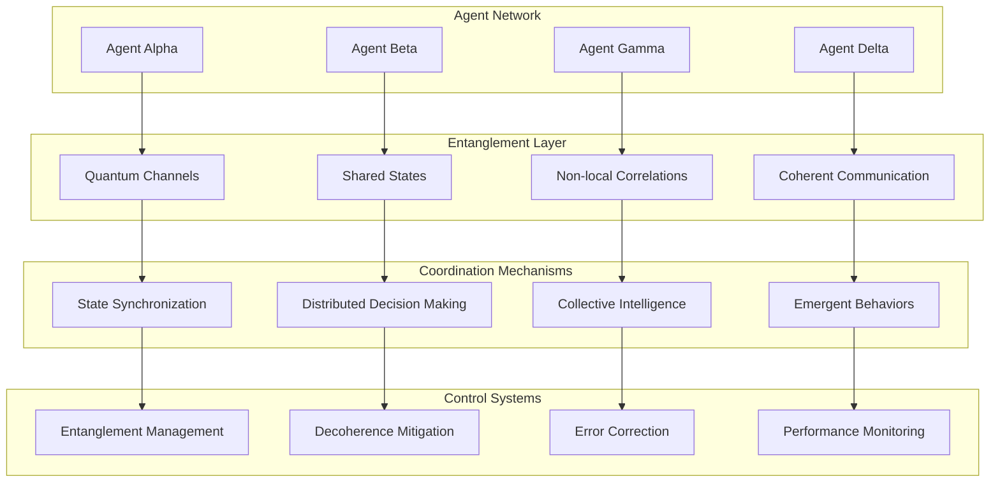

## 🌟 Core Capabilities

### Quantum Communication

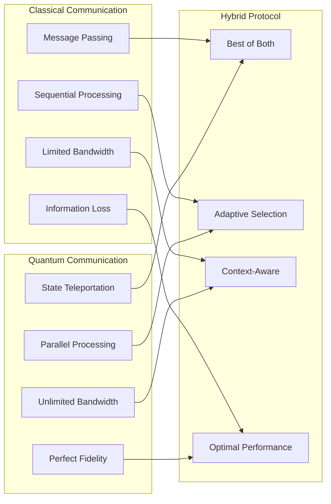

### Collective Intelligence

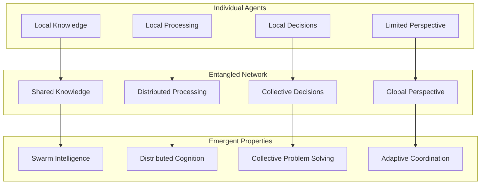

## 🔧 Implementation

### Basic Entangled Agent Network

```python
from quantumlangchain.agents import EntangledAgent, AgentNetwork

# Create individual agents
agent_a = EntangledAgent(
    name="alpha",
    role="coordinator",
    quantum_dim=8,
    specialization="task_planning"
)

agent_b = EntangledAgent(
    name="beta",
    role="executor",
    quantum_dim=8,
    specialization="data_processing"
)

agent_c = EntangledAgent(
    name="gamma",
    role="analyzer",
    quantum_dim=8,
    specialization="pattern_recognition"
)

# Create entangled network
network = AgentNetwork(
    agents=[agent_a, agent_b, agent_c],
    entanglement_strength=0.8,
    topology="fully_connected"
)

# Establish quantum entanglement
await network.entangle_agents()

# Collaborative task execution
task = "Analyze large dataset and generate insights"
result = await network.collaborative_solve(task)
```

### Advanced Multi-Agent System

```python
from quantumlangchain.agents import (
    EntangledAgent,
    AgentNetwork,
    QuantumOrchestrator
)

class AdvancedAgentSystem:
    def __init__(self):
        # Specialized agent roles
        self.coordinator = EntangledAgent(
            role="coordinator",
            capabilities=["planning", "resource_allocation"],
            quantum_dim=12
        )
        
        self.researchers = [
            EntangledAgent(
                role="researcher",
                specialization=field,
                quantum_dim=8
            ) for field in ["physics", "chemistry", "biology", "cs"]
        ]
        
        self.analyzers = [
            EntangledAgent(
                role="analyzer",
                specialization=analysis_type,
                quantum_dim=8
            ) for analysis_type in ["statistical", "pattern", "semantic"]
        ]
        
        self.synthesizer = EntangledAgent(
            role="synthesizer",
            capabilities=["integration", "conclusion"],
            quantum_dim=12
        )
        
        # Create hierarchical network
        self.network = AgentNetwork(
            agents=([self.coordinator] + 
                   self.researchers + 
                   self.analyzers + 
                   [self.synthesizer]),
            topology="hierarchical",
            entanglement_strength=0.9
        )
        
        # Quantum orchestrator for coordination
        self.orchestrator = QuantumOrchestrator(
            network=self.network,
            coordination_strategy="quantum_consensus"
        )
    
    async def solve_complex_problem(self, problem):
        """Solve complex problem using entangled agents."""
        # Quantum planning phase
        plan = await self.coordinator.create_quantum_plan(problem)
        
        # Distributed research phase
        research_tasks = plan.decompose_into_research_tasks()
        research_results = await self.parallel_research(research_tasks)
        
        # Quantum analysis phase
        analysis_results = await self.quantum_analysis(research_results)
        
        # Synthesis and conclusion
        final_result = await self.synthesizer.synthesize_results(
            research_results, analysis_results
        )
        
        return final_result
    
    async def parallel_research(self, tasks):
        """Execute research tasks in parallel using entangled agents."""
        # Assign tasks to specialized researchers
        assignments = await self.orchestrator.assign_tasks(
            tasks, self.researchers
        )
        
        # Execute tasks with quantum acceleration
        results = []
        for agent, task in assignments:
            result = await agent.execute_with_entanglement(task)
            results.append(result)
        
        # Quantum consensus on results
        consensus_results = await self.orchestrator.quantum_consensus(
            results
        )
        
        return consensus_results
```

### Quantum Swarm Intelligence

```python
from quantumlangchain.agents import QuantumSwarm

class QuantumSwarmSystem:
    def __init__(self, swarm_size=50):
        # Create quantum swarm
        self.swarm = QuantumSwarm(
            size=swarm_size,
            quantum_dim=4,  # Each agent has 4 qubits
            entanglement_pattern="small_world",
            communication_protocol="quantum_gossip"
        )
        
        # Initialize swarm intelligence parameters
        self.pheromone_strength = 0.8
        self.exploration_rate = 0.3
        self.convergence_threshold = 0.95
    
    async def solve_optimization_problem(self, problem):
        """Solve optimization using quantum swarm intelligence."""
        # Initialize swarm with problem
        await self.swarm.initialize_problem(problem)
        
        # Quantum swarm optimization loop
        for iteration in range(self.max_iterations):
            # Each agent explores solution space
            await self.swarm.parallel_exploration()
            
            # Quantum communication between agents
            await self.swarm.quantum_information_sharing()
            
            # Update global best solution
            await self.swarm.update_global_optimum()
            
            # Check convergence
            if await self.swarm.check_convergence():
                break
        
        return await self.swarm.get_best_solution()
    
    async def adaptive_problem_solving(self, dynamic_problem):
        """Solve dynamic problems with adaptive swarm."""
        # Monitor problem changes
        while not dynamic_problem.is_solved():
            # Detect environment changes
            changes = await dynamic_problem.detect_changes()
            
            if changes:
                # Adapt swarm configuration
                await self.swarm.adapt_to_changes(changes)
            
            # Continue optimization
            await self.quantum_optimization_step()
            
            # Yield control for other tasks
            await asyncio.sleep(0.01)
```

## 🎯 Agent Types and Roles

### Specialized Agent Architectures

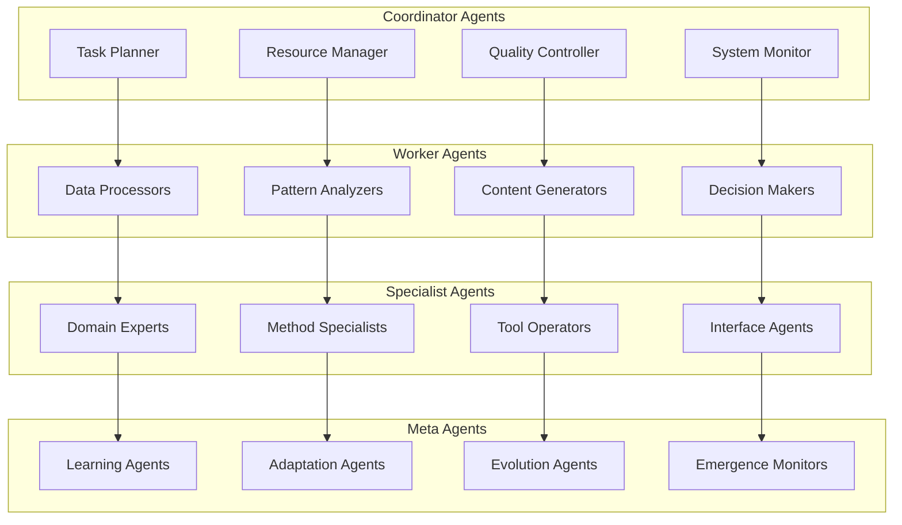

### Agent Communication Protocols

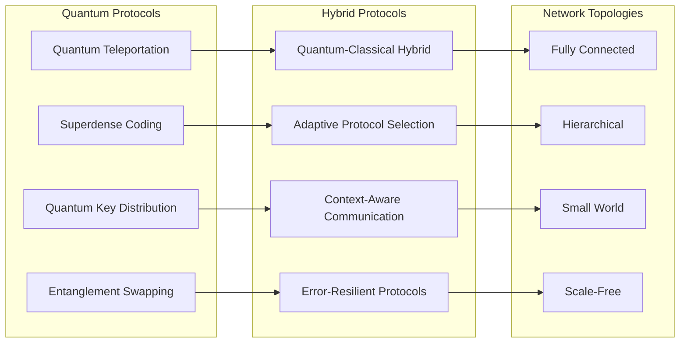

## 📊 Performance Characteristics

### Scaling Properties

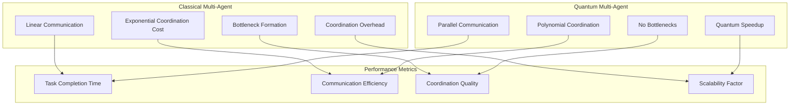

### Entanglement Quality Metrics

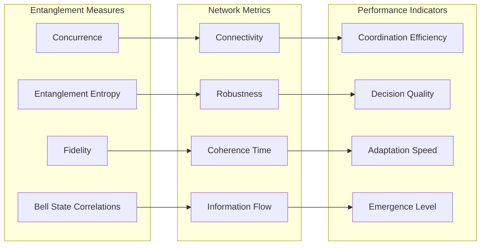

## 🛠️ Configuration and Management

### Network Configuration

```python
# Agent network configuration templates
NETWORK_CONFIGS = {
    "research_team": {
        "size": 5,
        "topology": "hierarchical",
        "roles": ["coordinator", "researcher", "analyzer", "critic", "synthesizer"],
        "entanglement_strength": 0.8,
        "specializations": {
            "researcher": ["literature_review", "data_collection"],
            "analyzer": ["statistical_analysis", "pattern_recognition"],
            "critic": ["quality_assessment", "peer_review"]
        }
    },
    
    "optimization_swarm": {
        "size": 100,
        "topology": "small_world",
        "roles": ["explorer", "exploiter", "messenger"],
        "entanglement_strength": 0.6,
        "parameters": {
            "exploration_rate": 0.3,
            "exploitation_rate": 0.7,
            "communication_frequency": 0.1
        }
    },
    
    "creative_collective": {
        "size": 8,
        "topology": "fully_connected",
        "roles": ["ideator", "evaluator", "refiner", "integrator"],
        "entanglement_strength": 0.9,
        "creativity_parameters": {
            "divergence_factor": 0.8,
            "convergence_factor": 0.6,
            "novelty_threshold": 0.7
        }
    }
}
```

### Entanglement Management

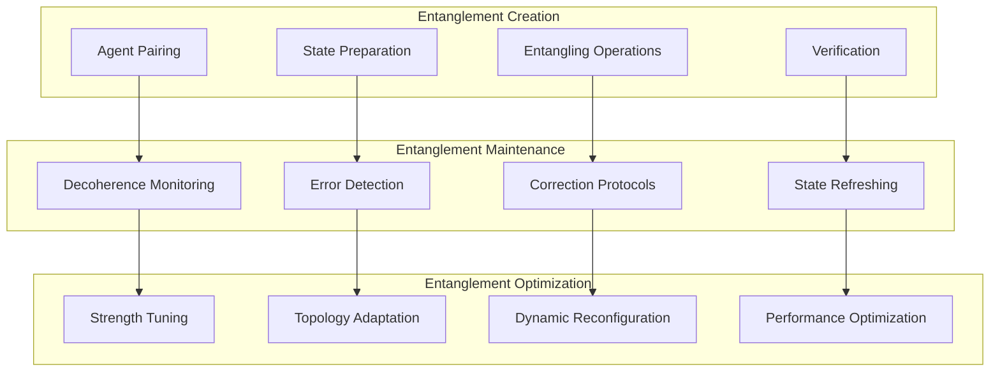

## 🔒 License Integration

### Agent Network Restrictions

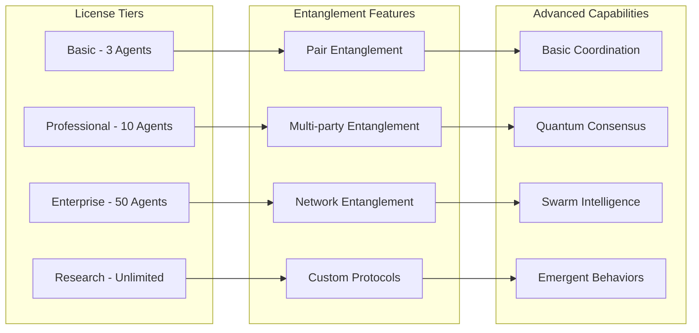

### License Enforcement

```python
from quantumlangchain.licensing import requires_license

class EntangledAgent(LicensedComponent):
    @requires_license(tier="basic")
    def __init__(self, name, role, **kwargs):
        """Initialize entangled agent with license validation."""
        super().__init__(
            required_features=["entangled_agents"],
            required_tier="basic"
        )
        
        self.name = name
        self.role = role
        self._validate_configuration(kwargs)
    
    def _validate_configuration(self, config):
        """Validate configuration against license limits."""
        max_agents = self._get_max_agents()
        
        if len(AgentNetwork.get_all_agents()) >= max_agents:
            raise LicenseError(
                f"Agent limit exceeded. "
                f"License allows {max_agents} agents maximum. "
                f"Contact: bajpaikrishna715@gmail.com "
                f"Machine ID: {self.get_machine_id()}"
            )

class AgentNetwork(LicensedComponent):
    @requires_license(tier="professional")
    def enable_quantum_consensus(self):
        """Enable quantum consensus (Professional+ only)."""
        pass
    
    @requires_license(tier="enterprise")
    def enable_swarm_intelligence(self):
        """Enable swarm intelligence (Enterprise+ only)."""
        pass
    
    @requires_license(tier="research")
    def enable_emergent_behaviors(self):
        """Enable emergent behavior research (Research only)."""
        pass
```

## 🎯 Use Cases and Applications

### Scientific Research

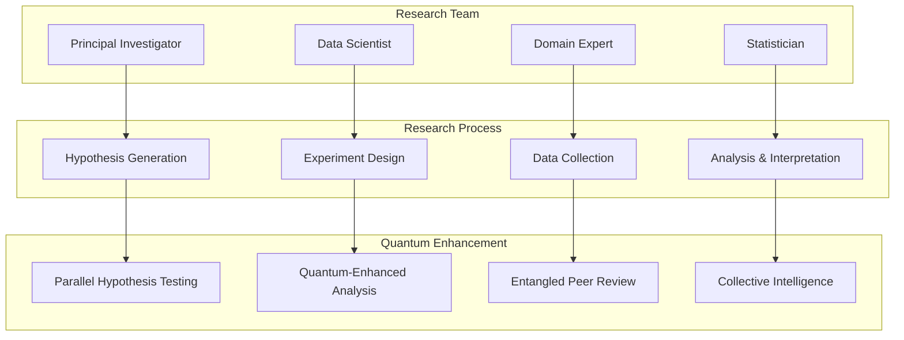

### Business Applications

```python
# Business intelligence multi-agent system
class BusinessIntelligenceSystem:
    def __init__(self):
        # Market analysis agents
        self.market_analysts = [
            EntangledAgent(
                role="market_analyst",
                specialization=market,
                quantum_dim=6
            ) for market in ["stocks", "bonds", "commodities", "crypto"]
        ]
        
        # Risk assessment agents
        self.risk_assessors = [
            EntangledAgent(
                role="risk_assessor",
                specialization=risk_type,
                quantum_dim=6
            ) for risk_type in ["credit", "market", "operational", "liquidity"]
        ]
        
        # Strategy agents
        self.strategists = [
            EntangledAgent(
                role="strategist",
                specialization="portfolio_optimization",
                quantum_dim=8
            )
        ]
        
        # Create entangled network
        self.network = AgentNetwork(
            agents=(self.market_analysts + 
                   self.risk_assessors + 
                   self.strategists),
            topology="hierarchical",
            entanglement_strength=0.85
        )
    
    async def generate_investment_strategy(self, portfolio, constraints):
        """Generate optimal investment strategy."""
        # Parallel market analysis
        market_analysis = await self.parallel_market_analysis()
        
        # Quantum risk assessment
        risk_profile = await self.quantum_risk_assessment(portfolio)
        
        # Entangled strategy optimization
        strategy = await self.optimize_strategy(
            market_analysis, risk_profile, constraints
        )
        
        return strategy
```

### Creative Applications

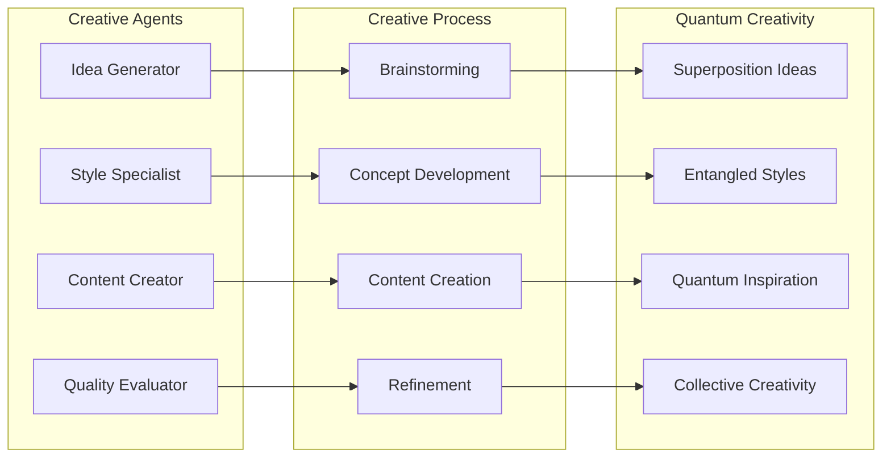

## 📚 API Reference

### Core Agent Classes

```python
class EntangledAgent:
    def __init__(self, name: str, role: str, **config):
        """Initialize entangled agent."""
        
    async def entangle_with(self, other_agent: 'EntangledAgent') -> bool:
        """Establish quantum entanglement with another agent."""
        
    async def communicate(self, message: Any, target: str = None) -> Any:
        """Quantum communication with entangled agents."""
        
    async def collaborate(self, task: Task, partners: List['EntangledAgent']) -> Result:
        """Collaborate with other agents on a task."""
        
    def get_entanglement_state(self) -> QuantumState:
        """Get current entanglement state."""

class AgentNetwork:
    def __init__(self, agents: List[EntangledAgent], **config):
        """Initialize agent network."""
        
    async def entangle_all(self) -> bool:
        """Establish entanglement across the network."""
        
    async def broadcast(self, message: Any, sender: str) -> None:
        """Broadcast message to all agents."""
        
    async def consensus(self, question: str) -> ConsensusResult:
        """Reach quantum consensus on a question."""
        
    def get_network_state(self) -> NetworkState:
        """Get current network state."""
```

### Specialized Network Types

```python
class QuantumSwarm(AgentNetwork):
    async def swarm_optimization(self, objective: Callable) -> Solution:
        """Perform swarm optimization."""
        
    async def adaptive_behavior(self, environment: Environment) -> Behavior:
        """Adapt behavior to environment changes."""

class HierarchicalNetwork(AgentNetwork):
    async def hierarchical_processing(self, task: Task) -> Result:
        """Process task through hierarchy."""
        
    def get_hierarchy_structure(self) -> HierarchyTree:
        """Get current hierarchy structure."""

class CreativeCollective(AgentNetwork):
    async def creative_synthesis(self, prompt: str) -> CreativeOutput:
        """Generate creative output collaboratively."""
        
    async def style_transfer(self, content: Any, style: Style) -> Any:
        """Transfer style using collective intelligence."""
```

## 🔮 Future Developments

### Planned Enhancements

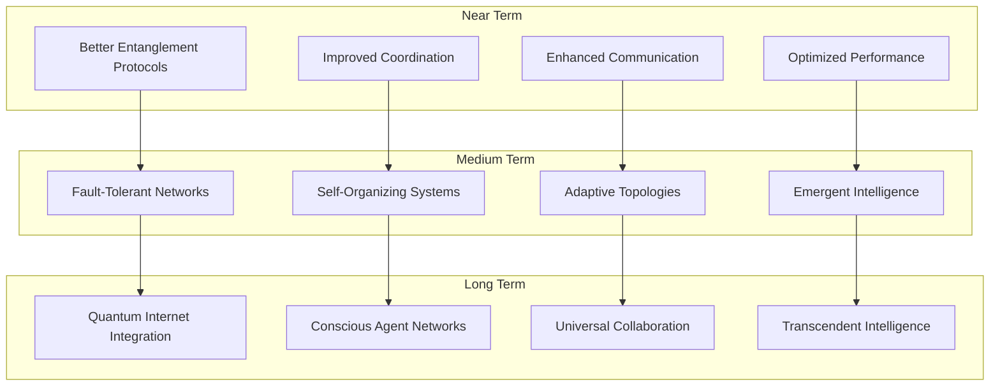

## 🔐 License Requirements

- **Basic Agents**: Basic license tier (up to 3 agents)
- **Professional Agents**: Professional license tier (up to 10 agents)
- **Enterprise Agents**: Enterprise license tier (up to 50 agents)
- **Research Agents**: Research license tier (unlimited agents)

Contact [bajpaikrishna715@gmail.com](mailto:bajpaikrishna715@gmail.com) for licensing.

Entangled Agents represent the pinnacle of multi-agent AI systems, leveraging quantum entanglement for unprecedented coordination and collective intelligence capabilities.
