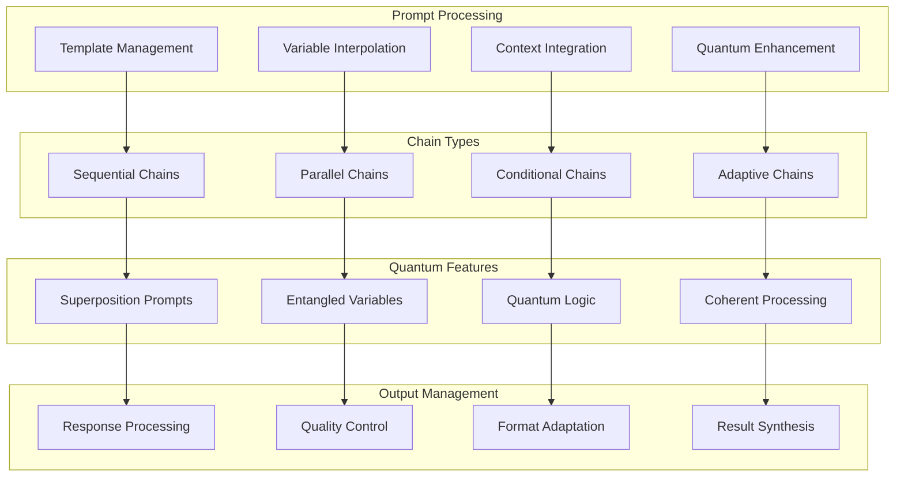
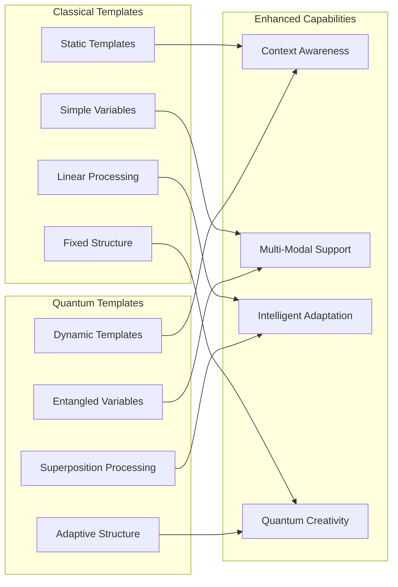
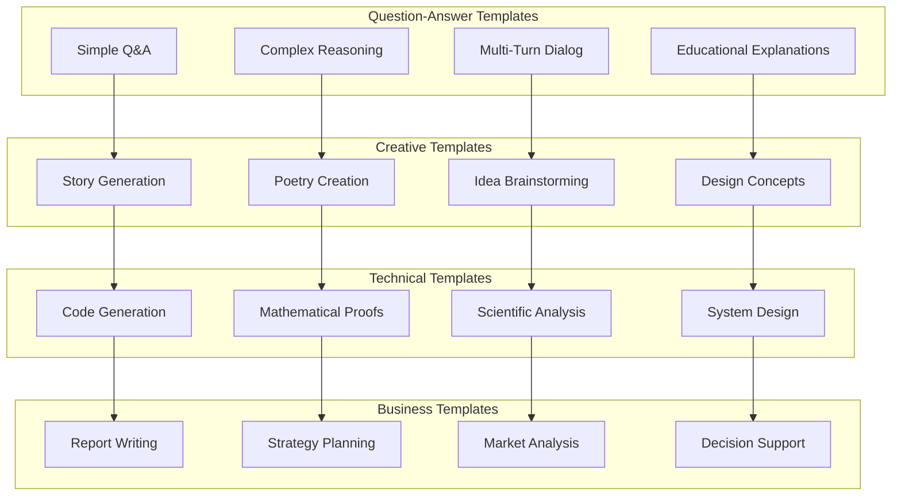
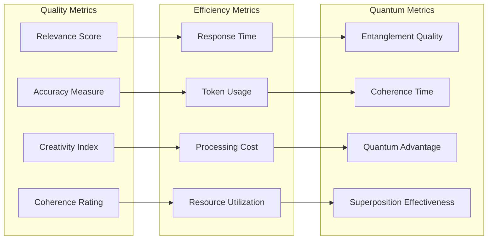
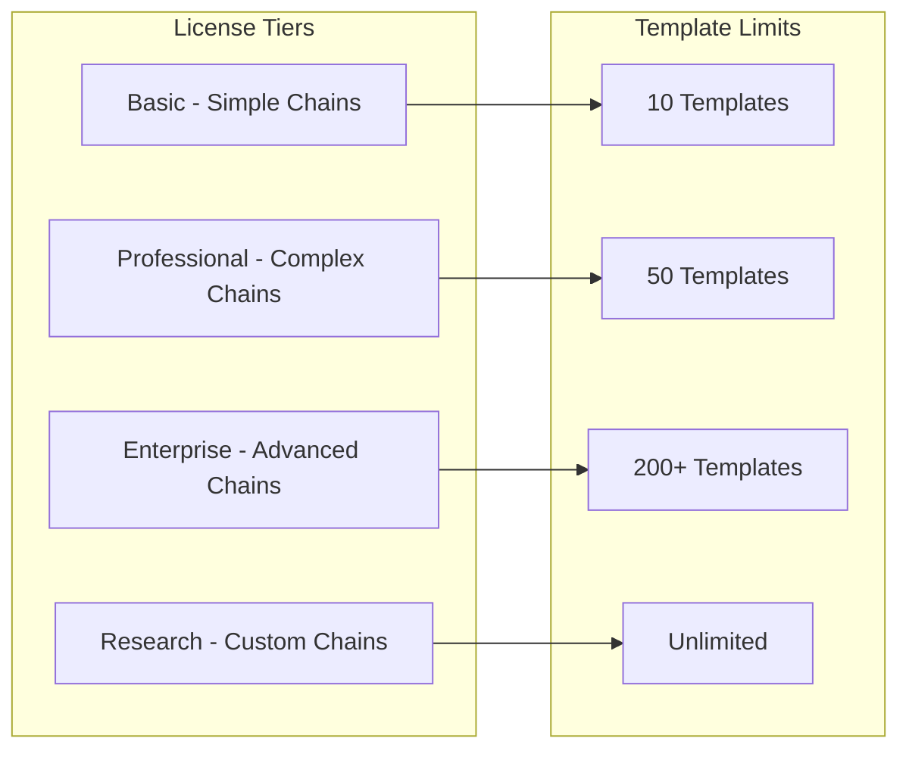
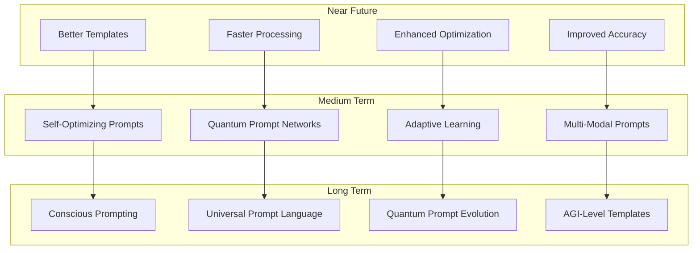

# 📝 Prompt Chain Module

🔐 **Licensed Component** - Contact: [bajpaikrishna715@gmail.com](mailto:bajpaikrishna715@gmail.com) for licensing

## Prompt Chain Architecture



## 🌟 Core Features

### Quantum Prompt Templates



## 🔧 Implementation

### Basic Prompt Chain

```python
from quantumlangchain.prompts import QuantumPromptTemplate, PromptChain

# Create quantum prompt template
template = QuantumPromptTemplate(
    template="""
    Quantum Context: {quantum_context}
    Classical Context: {classical_context}
    
    Question: {question}
    
    Please provide a comprehensive answer considering both quantum 
    and classical perspectives.
    """,
    quantum_variables=["quantum_context"],
    classical_variables=["classical_context", "question"],
    entanglement_strength=0.8
)

# Create prompt chain
chain = PromptChain(
    prompt=template,
    quantum_enhancement=True,
    adaptive_formatting=True
)

# Execute with quantum enhancement
result = await chain.arun({
    "quantum_context": "superposition and entanglement principles",
    "classical_context": "machine learning optimization",
    "question": "How can quantum computing improve ML training?"
})
```

### Advanced Multi-Step Prompt Chain

```python
from quantumlangchain.prompts import MultiStepPromptChain

class AdvancedPromptSystem:
    def __init__(self):
        # Step 1: Analysis prompt
        self.analysis_prompt = QuantumPromptTemplate(
            template="Analyze the following problem: {problem}",
            quantum_variables=["problem"],
            analysis_depth=3
        )
        
        # Step 2: Solution generation prompt
        self.solution_prompt = QuantumPromptTemplate(
            template="""
            Based on the analysis: {analysis}
            Generate potential solutions for: {original_problem}
            """,
            quantum_variables=["analysis"],
            classical_variables=["original_problem"],
            creativity_boost=0.8
        )
        
        # Step 3: Validation prompt
        self.validation_prompt = QuantumPromptTemplate(
            template="""
            Validate the following solution: {solution}
            For problem: {problem}
            Consider: {validation_criteria}
            """,
            quantum_variables=["solution"],
            classical_variables=["problem", "validation_criteria"]
        )
        
        # Create multi-step chain
        self.chain = MultiStepPromptChain([
            self.analysis_prompt,
            self.solution_prompt,
            self.validation_prompt
        ])
    
    async def solve_complex_problem(self, problem):
        """Solve complex problems using multi-step quantum prompting."""
        # Execute chain with quantum coordination
        result = await self.chain.arun({
            "problem": problem,
            "validation_criteria": "accuracy, feasibility, innovation"
        })
        
        return result
```

### Conditional Prompt Chain

```python
class ConditionalPromptChain:
    def __init__(self):
        # Technical prompt for technical queries
        self.technical_prompt = QuantumPromptTemplate(
            template="""
            Technical Analysis Required:
            Query: {query}
            
            Provide detailed technical explanation with:
            - Scientific principles
            - Mathematical foundations
            - Implementation details
            """,
            technical_depth=5,
            quantum_precision=True
        )
        
        # Creative prompt for creative queries
        self.creative_prompt = QuantumPromptTemplate(
            template="""
            Creative Exploration:
            Topic: {query}
            
            Think creatively and provide:
            - Novel perspectives
            - Innovative ideas
            - Imaginative solutions
            """,
            creativity_boost=0.9,
            quantum_inspiration=True
        )
        
        # General prompt for other queries
        self.general_prompt = QuantumPromptTemplate(
            template="""
            General Response:
            Question: {query}
            
            Provide a balanced, informative response.
            """,
            balance_factor=0.7
        )
    
    async def adaptive_prompting(self, query):
        """Select appropriate prompt based on query characteristics."""
        # Analyze query type
        query_type = await self.analyze_query_type(query)
        
        if query_type == "technical":
            prompt = self.technical_prompt
        elif query_type == "creative":
            prompt = self.creative_prompt
        else:
            prompt = self.general_prompt
        
        # Execute with selected prompt
        result = await prompt.aformat_and_run({"query": query})
        return result
```

## 🎯 Prompt Types

### Template Categories



### Advanced Prompt Engineering

```python
class QuantumPromptEngineer:
    def __init__(self):
        self.prompt_optimizer = QuantumPromptOptimizer()
        self.template_generator = TemplateGenerator()
        
    async def optimize_prompt_template(self, template, examples):
        """Optimize prompt template using quantum algorithms."""
        # Analyze prompt performance
        performance_metrics = await self.analyze_performance(
            template, examples
        )
        
        # Generate quantum-optimized variations
        variations = await self.prompt_optimizer.generate_variations(
            template
        )
        
        # Test variations in quantum superposition
        optimal_template = await self.quantum_template_testing(
            variations, examples
        )
        
        return optimal_template
    
    async def auto_generate_templates(self, domain, requirements):
        """Auto-generate templates for specific domains."""
        # Analyze domain characteristics
        domain_analysis = await self.analyze_domain(domain)
        
        # Generate template candidates
        candidates = await self.template_generator.generate_candidates(
            domain_analysis, requirements
        )
        
        # Quantum selection of best templates
        best_templates = await self.quantum_template_selection(
            candidates
        )
        
        return best_templates
```

## 📊 Performance Optimization

### Prompt Performance Metrics



### Prompt Optimization

```python
class PromptOptimizer:
    def __init__(self):
        self.quantum_optimizer = QuantumOptimizer()
        self.classical_optimizer = ClassicalOptimizer()
        
    async def optimize_prompt_chain(self, chain, test_cases):
        """Optimize entire prompt chain performance."""
        # Analyze current performance
        baseline_metrics = await self.evaluate_chain(chain, test_cases)
        
        # Quantum optimization of prompt templates
        quantum_optimizations = await self.quantum_optimizer.optimize(
            chain.prompts
        )
        
        # Classical optimization of chain structure
        classical_optimizations = await self.classical_optimizer.optimize(
            chain.structure
        )
        
        # Combine optimizations
        optimized_chain = await self.combine_optimizations(
            chain, quantum_optimizations, classical_optimizations
        )
        
        # Validate improvements
        improved_metrics = await self.evaluate_chain(
            optimized_chain, test_cases
        )
        
        return {
            "optimized_chain": optimized_chain,
            "baseline_metrics": baseline_metrics,
            "improved_metrics": improved_metrics,
            "improvement_factor": improved_metrics / baseline_metrics
        }
```

## 🔒 License Integration

### Prompt Chain Restrictions



### License Enforcement

```python
from quantumlangchain.licensing import requires_license

class PromptChain(LicensedComponent):
    @requires_license(tier="basic")
    def __init__(self, **kwargs):
        """Initialize with license validation."""
        super().__init__(
            required_features=["prompt_chains"],
            required_tier="basic"
        )
        
        # Validate template limits
        max_templates = self._get_max_templates()
        template_count = len(kwargs.get("templates", []))
        
        if template_count > max_templates:
            raise LicenseError(
                f"Template limit exceeded. "
                f"License allows {max_templates} templates, "
                f"requested {template_count}. "
                f"Contact: bajpaikrishna715@gmail.com"
            )
    
    @requires_license(tier="professional")
    def enable_quantum_prompting(self):
        """Enable quantum prompting features (Professional+ only)."""
        pass
    
    @requires_license(tier="enterprise")
    def enable_advanced_chaining(self):
        """Enable advanced chaining features (Enterprise+ only)."""
        pass
```

## 📚 API Reference

### Core Prompt Classes

```python
class QuantumPromptTemplate:
    def __init__(self, template: str, quantum_variables: List[str] = None, **config):
        """Initialize quantum prompt template."""
        
    async def aformat(self, **kwargs) -> str:
        """Format template with quantum enhancement."""
        
    def format(self, **kwargs) -> str:
        """Format template synchronously."""
        
    async def aformat_and_run(self, variables: Dict[str, Any]) -> str:
        """Format and execute with quantum processing."""

class PromptChain:
    def __init__(self, prompts: List[QuantumPromptTemplate], **config):
        """Initialize prompt chain."""
        
    async def arun(self, inputs: Dict[str, Any]) -> Dict[str, Any]:
        """Execute prompt chain asynchronously."""
        
    def run(self, inputs: Dict[str, Any]) -> Dict[str, Any]:
        """Execute prompt chain synchronously."""
        
    async def optimize(self, test_cases: List[Dict]) -> None:
        """Optimize prompt chain performance."""
```

## 🔮 Future Enhancements

### Planned Prompt Features



## 🔐 License Requirements

- **Basic Prompts**: Basic license tier (up to 10 templates)
- **Professional Prompts**: Professional license tier (up to 50 templates)  
- **Enterprise Prompts**: Enterprise license tier (200+ templates)
- **Research Prompts**: Research license tier (unlimited templates)

Contact [bajpaikrishna715@gmail.com](mailto:bajpaikrishna715@gmail.com) for licensing.

Prompt Chain provides quantum-enhanced prompt engineering and management capabilities for next-generation AI applications.
