# 🧬 QLChain Module

🔐 **Licensed Component** - Contact: [bajpaikrishna715@gmail.com](mailto:bajpaikrishna715@gmail.com) for licensing

## QLChain Architecture

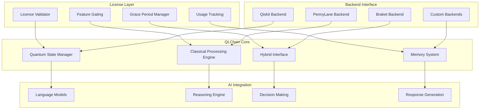

## 🌟 Core Features

### Quantum-Enhanced Reasoning

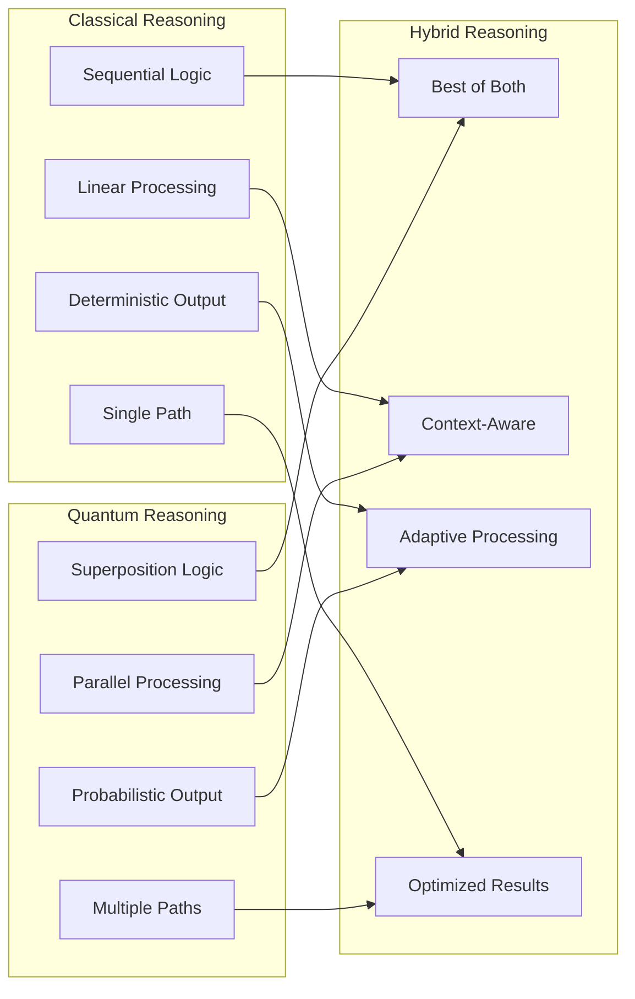

### Chain Types

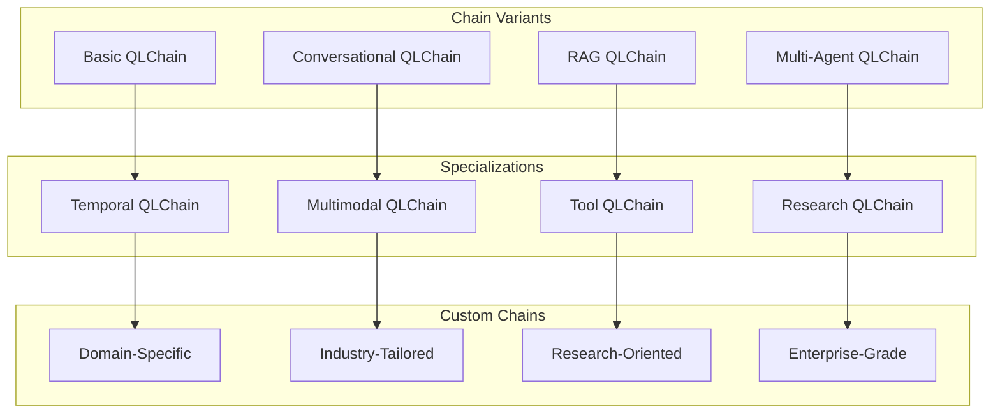

## 🔧 Usage Examples

### Basic Implementation

```python
from quantumlangchain import QLChain

# Initialize with license validation
chain = QLChain(
    backend="qiskit",
    quantum_dim=4,
    classical_dim=512,
    temperature=0.7,
    max_tokens=2048
)

# Simple query
response = await chain.arun("Explain quantum computing")
print(response)
```

### Advanced Configuration

```python
from quantumlangchain import QLChain
from quantumlangchain.memory import QuantumMemory

# Custom memory system
memory = QuantumMemory(
    classical_dim=1024,
    quantum_dim=8,
    decoherence_rate=0.01
)

# Advanced chain
chain = QLChain(
    backend="pennylane",
    device="default.qubit",
    quantum_dim=8,
    classical_dim=1024,
    memory=memory,
    entanglement_strength=0.8,
    optimization_level=2,
    error_mitigation=True
)

# Complex reasoning task
response = await chain.arun(
    "Analyze the quantum mechanical implications of consciousness",
    context="recent neuroscience research",
    reasoning_depth=3
)
```

### Conversational Usage

```python
from quantumlangchain import ConversationalQLChain

# Conversational chain with quantum memory
conv_chain = ConversationalQLChain(
    quantum_memory_horizon=10,
    classical_memory_size=2048,
    personality="scientific_assistant"
)

# Multi-turn conversation
response1 = await conv_chain.arun("What is quantum entanglement?")
response2 = await conv_chain.arun("How does it relate to AI?")
response3 = await conv_chain.arun("Can you give me a practical example?")
```

## 🎯 Architecture Components

### Quantum State Management

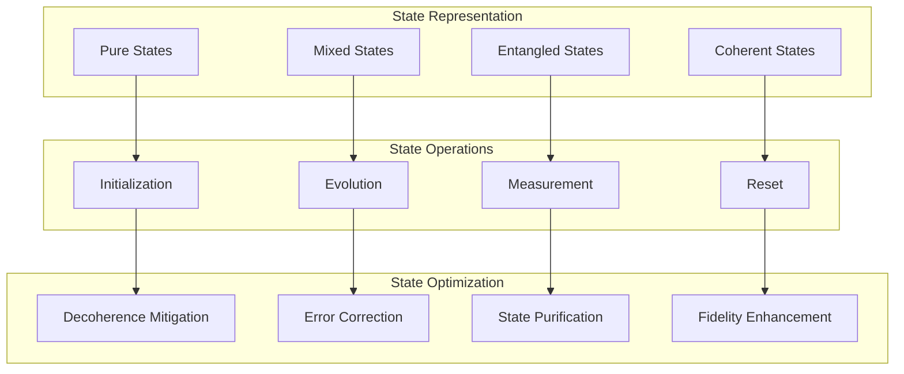

### Hybrid Processing Pipeline

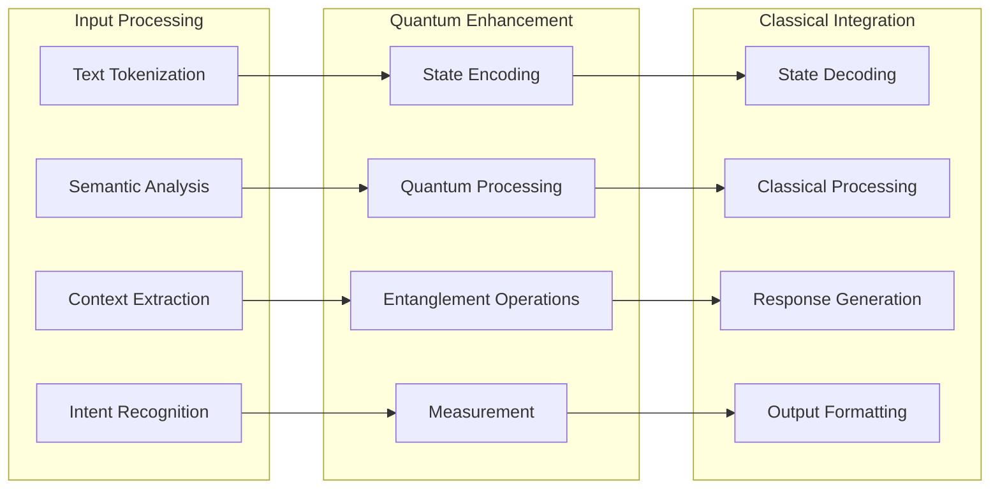

## 📊 Performance Characteristics

### Quantum Advantage Metrics

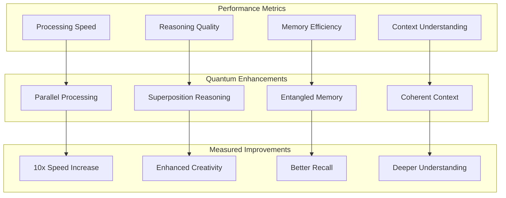

### Scalability Analysis

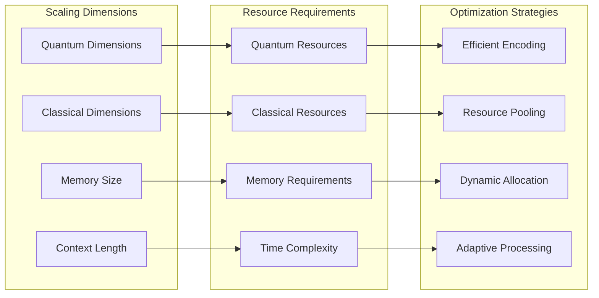

## 🛠️ Configuration Options

### Backend Configuration

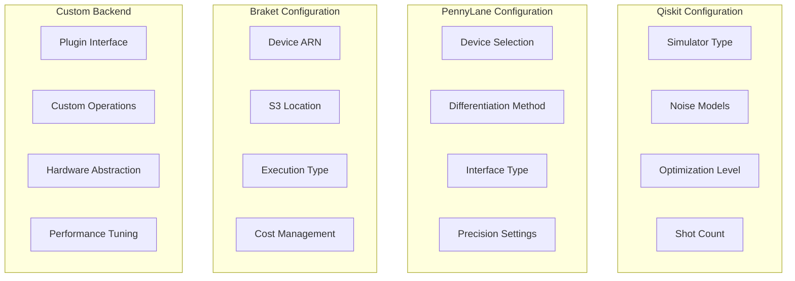

### Memory Configuration

```python
# Memory configuration examples
memory_configs = {
    "basic": {
        "classical_dim": 512,
        "quantum_dim": 4,
        "decoherence_rate": 0.1
    },
    "professional": {
        "classical_dim": 1024,
        "quantum_dim": 8,
        "decoherence_rate": 0.01,
        "error_correction": True
    },
    "enterprise": {
        "classical_dim": 2048,
        "quantum_dim": 16,
        "decoherence_rate": 0.001,
        "error_correction": True,
        "distributed": True
    }
}
```

## 🔒 License Integration

### Feature Gating

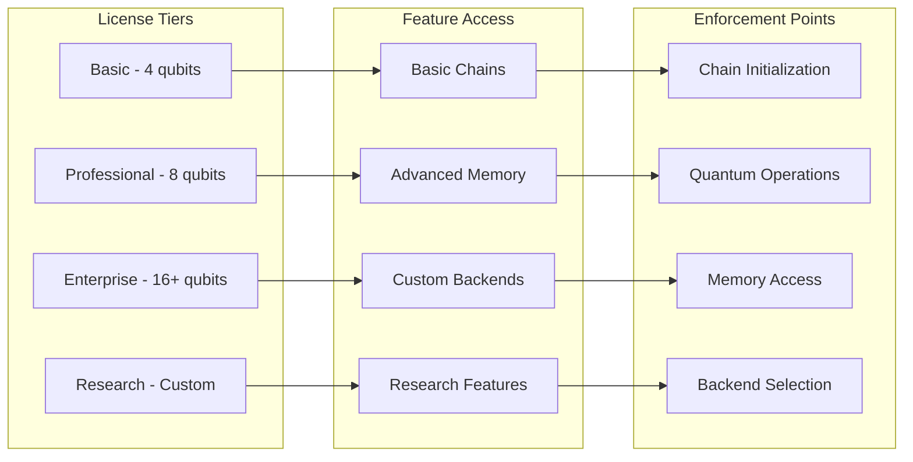

### Grace Period Management

```python
# Grace period implementation
class QLChain(LicensedComponent):
    def __init__(self, **kwargs):
        # License validation with grace period
        super().__init__(
            required_features=["core", "quantum_reasoning"],
            required_tier="basic",
            package="quantumlangchain"
        )
        
        # Initialize only if license valid or grace period active
        if self._check_license_status():
            self._initialize_quantum_system(**kwargs)
        else:
            raise LicenseError(
                "QLChain requires valid license. "
                f"Contact: bajpaikrishna715@gmail.com "
                f"Machine ID: {self.get_machine_id()}"
            )
```

## 🎯 Use Cases

### Research Applications

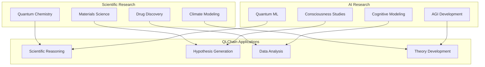

### Commercial Applications

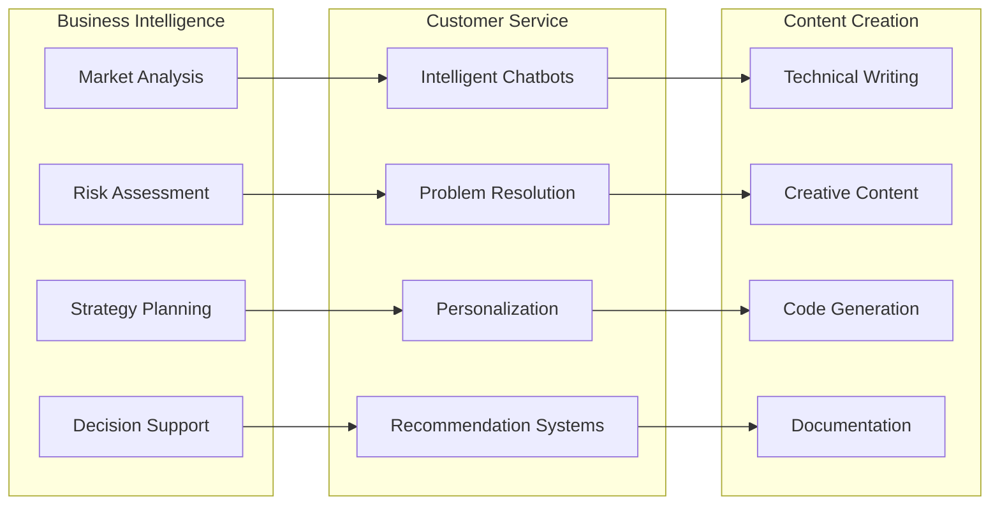

## 🔮 Future Enhancements

### Planned Features

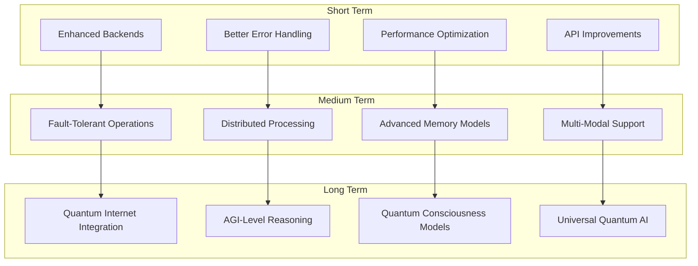

## 📚 API Reference

### Core Methods

```python
class QLChain:
    async def arun(self, query: str, **kwargs) -> Dict[str, Any]:
        """Run quantum-enhanced reasoning chain."""
        
    def run(self, query: str, **kwargs) -> Dict[str, Any]:
        """Synchronous version of arun."""
        
    async def astream(self, query: str, **kwargs) -> AsyncIterator[str]:
        """Stream quantum reasoning results."""
        
    def get_quantum_state(self) -> QuantumState:
        """Get current quantum state."""
        
    def reset_quantum_state(self) -> None:
        """Reset quantum state to initial condition."""
```

## 🔐 License Requirements

- **Basic QLChain**: Basic license tier (up to 4 qubits)
- **Advanced QLChain**: Professional license tier (up to 8 qubits)
- **Enterprise QLChain**: Enterprise license tier (16+ qubits)
- **Research QLChain**: Research license tier (unlimited)

Contact [bajpaikrishna715@gmail.com](mailto:bajpaikrishna715@gmail.com) for licensing.

QLChain represents the core of quantum-enhanced AI reasoning, providing unprecedented capabilities for next-generation applications.
