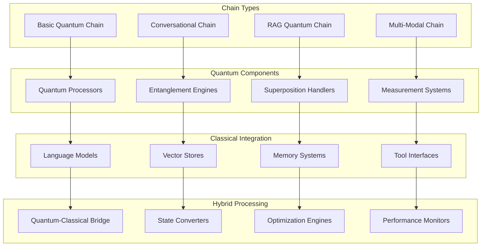
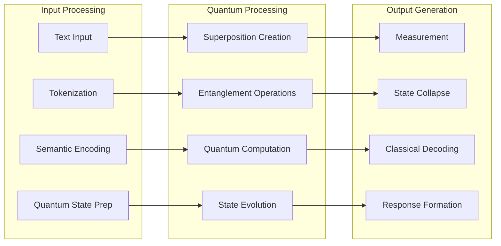
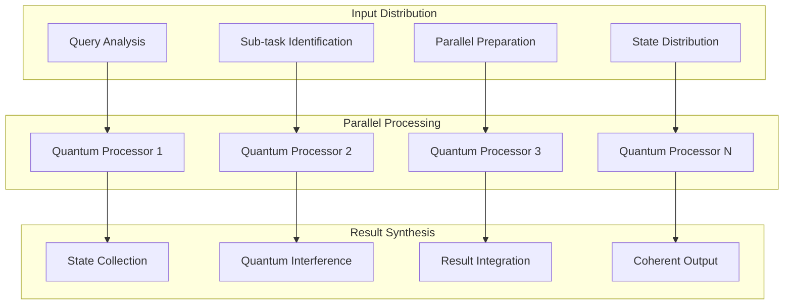
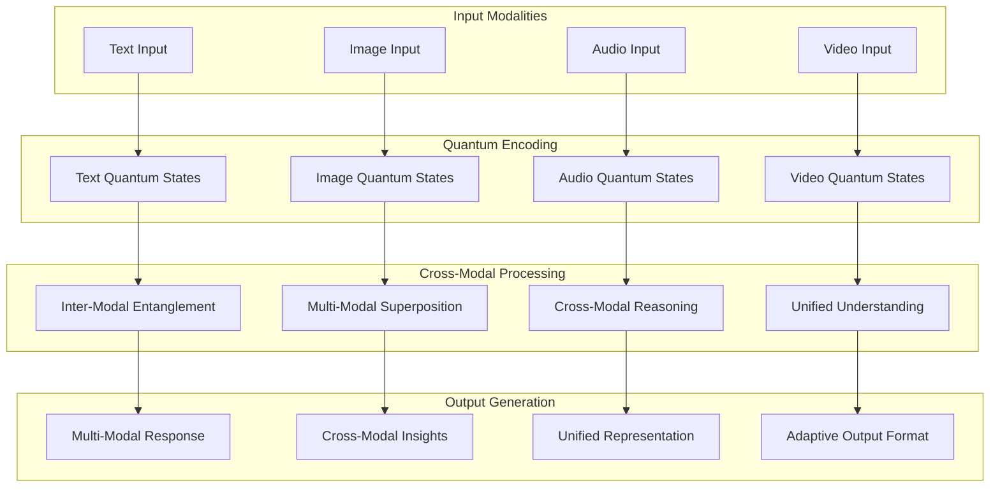
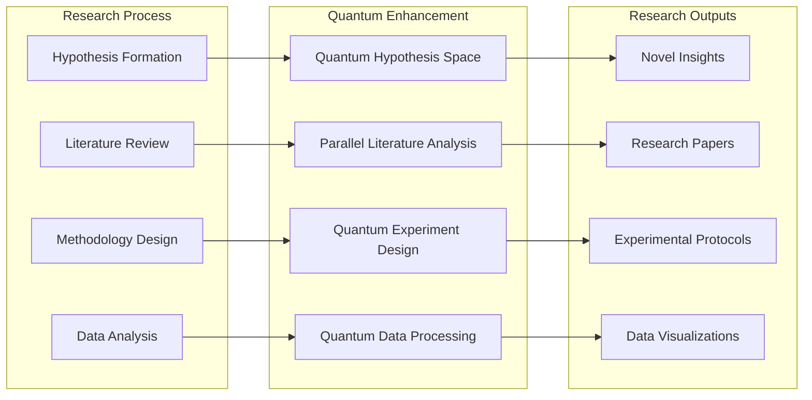
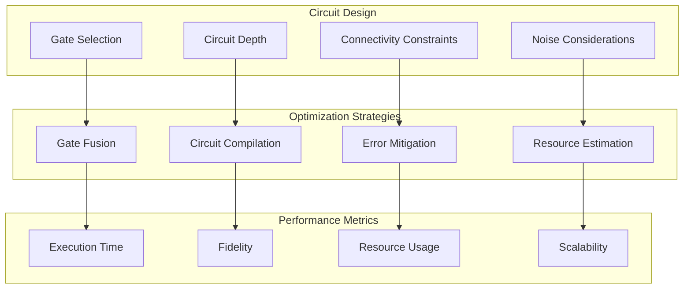
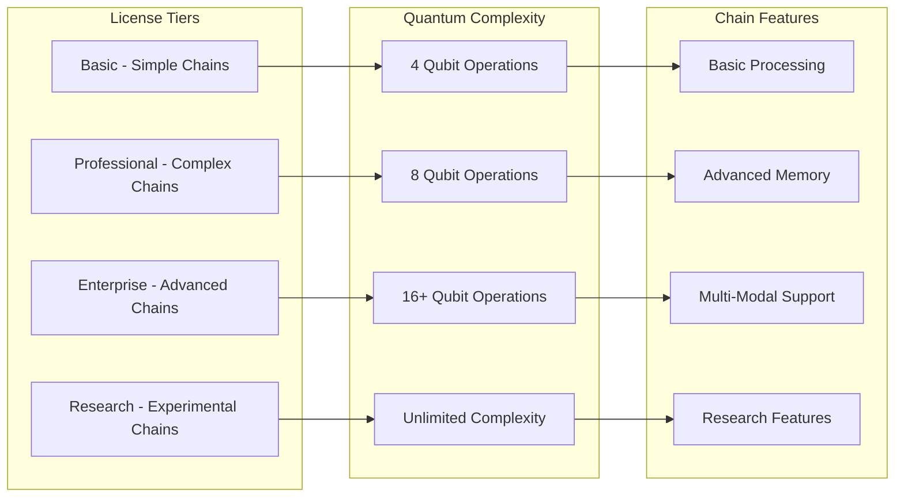
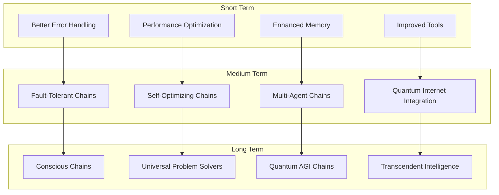

# 🔗 Quantum Chains Module

🔐 **Licensed Component** - Contact: [bajpaikrishna715@gmail.com](mailto:bajpaikrishna715@gmail.com) for licensing

## Quantum Chains Architecture



## 🌟 Core Chain Types

### Sequential Quantum Chain



### Parallel Quantum Chain



## 🔧 Implementation Examples

### Basic Quantum Chain

```python
from quantumlangchain.chains import QuantumChain
from quantumlangchain.prompts import QuantumPromptTemplate

# Create quantum prompt template
prompt = QuantumPromptTemplate(
    template="""
    Quantum Context: {quantum_context}
    Classical Context: {classical_context}
    Question: {question}
    
    Please provide a quantum-enhanced response considering both contexts.
    """,
    quantum_variables=["quantum_context"],
    classical_variables=["classical_context", "question"]
)

# Initialize quantum chain
chain = QuantumChain(
    prompt=prompt,
    backend="qiskit",
    quantum_dim=8,
    classical_dim=1024,
    entanglement_strength=0.7
)

# Execute quantum reasoning
result = await chain.arun({
    "quantum_context": "quantum superposition principles",
    "classical_context": "machine learning optimization",
    "question": "How can quantum superposition improve ML training?"
})
```

### Advanced RAG Quantum Chain

```python
from quantumlangchain.chains import RAGQuantumChain
from quantumlangchain.vectorstores import QuantumVectorStore
from quantumlangchain.embeddings import QuantumEmbeddings

class AdvancedRAGSystem:
    def __init__(self):
        # Quantum embeddings for enhanced representation
        self.embeddings = QuantumEmbeddings(
            classical_dim=768,
            quantum_dim=8,
            entanglement_strength=0.8
        )
        
        # Quantum vector store for enhanced retrieval
        self.vectorstore = QuantumVectorStore(
            embeddings=self.embeddings,
            quantum_search=True,
            superposition_retrieval=True
        )
        
        # RAG quantum chain
        self.rag_chain = RAGQuantumChain(
            vectorstore=self.vectorstore,
            quantum_retrieval_strength=0.9,
            classical_llm_integration=True,
            hybrid_reasoning=True
        )
    
    async def enhanced_qa(self, question, context_filter=None):
        """Enhanced Q&A with quantum-classical hybrid retrieval."""
        # Quantum-enhanced document retrieval
        relevant_docs = await self.vectorstore.quantum_similarity_search(
            question,
            k=10,
            quantum_interference=True,
            filter=context_filter
        )
        
        # Quantum-enhanced answer generation
        answer = await self.rag_chain.arun({
            "question": question,
            "context": relevant_docs,
            "quantum_reasoning_depth": 3
        })
        
        return answer
    
    async def multi_hop_reasoning(self, complex_question):
        """Multi-hop reasoning with quantum enhancement."""
        # Decompose question into sub-questions
        sub_questions = await self.rag_chain.decompose_question(
            complex_question
        )
        
        # Quantum parallel processing of sub-questions
        sub_answers = []
        for sub_q in sub_questions:
            answer = await self.enhanced_qa(sub_q)
            sub_answers.append(answer)
        
        # Quantum synthesis of sub-answers
        final_answer = await self.rag_chain.quantum_synthesis(
            complex_question, sub_answers
        )
        
        return final_answer
```

### Conversational Quantum Chain

```python
from quantumlangchain.chains import ConversationalQuantumChain
from quantumlangchain.memory import QuantumConversationMemory

class QuantumChatbot:
    def __init__(self):
        # Quantum conversation memory
        self.memory = QuantumConversationMemory(
            classical_buffer_size=2048,
            quantum_memory_horizon=10,
            entanglement_persistence=True
        )
        
        # Conversational quantum chain
        self.chain = ConversationalQuantumChain(
            memory=self.memory,
            personality="helpful_quantum_assistant",
            quantum_reasoning_style="creative_analytical"
        )
        
        # Context management
        self.context_manager = QuantumContextManager(
            context_window=8192,
            quantum_context_compression=True
        )
    
    async def chat(self, user_message, session_id=None):
        """Quantum-enhanced chat interaction."""
        # Update quantum context
        await self.context_manager.update_context(
            user_message, session_id
        )
        
        # Generate quantum-enhanced response
        response = await self.chain.arun({
            "input": user_message,
            "session_id": session_id,
            "quantum_creativity": 0.7,
            "classical_grounding": 0.8
        })
        
        # Update conversation memory
        await self.memory.add_exchange(
            user_message, response, session_id
        )
        
        return response
    
    async def multi_turn_reasoning(self, conversation_history):
        """Multi-turn reasoning with quantum memory."""
        # Analyze conversation patterns
        patterns = await self.memory.analyze_conversation_patterns()
        
        # Quantum-enhanced understanding
        deep_context = await self.chain.extract_deep_context(
            conversation_history, patterns
        )
        
        # Generate contextually aware response
        response = await self.chain.context_aware_generation(
            deep_context
        )
        
        return response
```

## 🎯 Specialized Chain Types

### Multi-Modal Quantum Chain



### Tool-Using Quantum Chain

```python
from quantumlangchain.chains import ToolQuantumChain
from quantumlangchain.tools import QuantumToolkit

class QuantumToolAgent:
    def __init__(self):
        # Quantum-enhanced tools
        self.toolkit = QuantumToolkit([
            "quantum_calculator",
            "quantum_search",
            "quantum_analyzer",
            "quantum_synthesizer"
        ])
        
        # Tool-using quantum chain
        self.chain = ToolQuantumChain(
            tools=self.toolkit.get_tools(),
            quantum_tool_selection=True,
            parallel_tool_execution=True
        )
    
    async def solve_with_tools(self, problem):
        """Solve problem using quantum-enhanced tools."""
        # Quantum analysis of problem
        problem_analysis = await self.chain.analyze_problem(problem)
        
        # Quantum tool selection
        selected_tools = await self.chain.quantum_tool_selection(
            problem_analysis
        )
        
        # Parallel tool execution with quantum coordination
        tool_results = await self.chain.parallel_tool_execution(
            selected_tools, problem
        )
        
        # Quantum synthesis of results
        final_solution = await self.chain.quantum_result_synthesis(
            tool_results
        )
        
        return final_solution
```

### Research Quantum Chain



## 📊 Performance Optimization

### Quantum Circuit Optimization



### Hybrid Optimization

```python
class QuantumChainOptimizer:
    def __init__(self, chain):
        self.chain = chain
        self.optimizer = HybridOptimizer()
        
    async def optimize_performance(self):
        """Optimize quantum chain performance."""
        # Analyze current performance
        metrics = await self.chain.get_performance_metrics()
        
        # Optimize quantum components
        quantum_optimizations = await self.optimize_quantum_components(
            metrics
        )
        
        # Optimize classical components
        classical_optimizations = await self.optimize_classical_components(
            metrics
        )
        
        # Optimize hybrid interface
        hybrid_optimizations = await self.optimize_hybrid_interface(
            metrics
        )
        
        # Apply optimizations
        await self.chain.apply_optimizations(
            quantum_optimizations,
            classical_optimizations,
            hybrid_optimizations
        )
    
    async def adaptive_optimization(self):
        """Continuously optimize based on usage patterns."""
        while True:
            # Monitor performance
            current_metrics = await self.chain.get_real_time_metrics()
            
            # Detect performance degradation
            if self.detect_degradation(current_metrics):
                await self.optimize_performance()
            
            # Adaptive parameter tuning
            await self.tune_parameters(current_metrics)
            
            await asyncio.sleep(60)  # Check every minute
```

## 🔒 License Integration

### Chain Complexity Restrictions



### License Enforcement in Chains

```python
from quantumlangchain.licensing import requires_license

class QuantumChain(LicensedComponent):
    @requires_license(tier="basic")
    def __init__(self, **kwargs):
        """Initialize quantum chain with license validation."""
        super().__init__(
            required_features=["quantum_chains"],
            required_tier="basic"
        )
        
        # Validate quantum complexity
        quantum_dim = kwargs.get("quantum_dim", 4)
        max_quantum_dim = self._get_max_quantum_complexity()
        
        if quantum_dim > max_quantum_dim:
            raise LicenseError(
                f"Quantum complexity exceeded. "
                f"License allows {max_quantum_dim} qubits, "
                f"requested {quantum_dim}. "
                f"Contact: bajpaikrishna715@gmail.com"
            )
    
    @requires_license(tier="professional")
    def enable_advanced_memory(self):
        """Enable advanced memory features (Professional+ only)."""
        pass
    
    @requires_license(tier="enterprise")
    def enable_multi_modal(self):
        """Enable multi-modal processing (Enterprise+ only)."""
        pass
    
    @requires_license(tier="research")
    def enable_experimental_features(self):
        """Enable experimental features (Research only)."""
        pass
```

## 🛠️ Configuration and Customization

### Chain Configuration Templates

```python
# Predefined chain configurations
CHAIN_CONFIGS = {
    "basic_qa": {
        "quantum_dim": 4,
        "classical_dim": 512,
        "entanglement_strength": 0.5,
        "temperature": 0.7,
        "max_tokens": 1024
    },
    
    "advanced_reasoning": {
        "quantum_dim": 8,
        "classical_dim": 1024,
        "entanglement_strength": 0.8,
        "reasoning_depth": 3,
        "multi_step_verification": True
    },
    
    "creative_generation": {
        "quantum_dim": 12,
        "classical_dim": 2048,
        "entanglement_strength": 0.9,
        "creativity_boost": 0.8,
        "diversity_enhancement": True
    },
    
    "research_assistant": {
        "quantum_dim": 16,
        "classical_dim": 4096,
        "entanglement_strength": 0.95,
        "research_mode": True,
        "fact_checking": True,
        "citation_generation": True
    }
}
```

### Custom Chain Development

```python
from quantumlangchain.chains.base import BaseQuantumChain

class CustomQuantumChain(BaseQuantumChain):
    def __init__(self, custom_config, **kwargs):
        super().__init__(**kwargs)
        self.custom_config = custom_config
        self._setup_custom_processors()
    
    def _setup_custom_processors(self):
        """Setup custom quantum processors."""
        self.custom_quantum_processor = CustomQuantumProcessor(
            self.custom_config
        )
        
        self.custom_classical_processor = CustomClassicalProcessor(
            self.custom_config
        )
    
    async def _quantum_process(self, input_state):
        """Custom quantum processing logic."""
        # Custom quantum operations
        processed_state = await self.custom_quantum_processor.process(
            input_state
        )
        
        return processed_state
    
    async def _classical_process(self, quantum_output):
        """Custom classical processing logic."""
        # Custom classical operations
        final_output = await self.custom_classical_processor.process(
            quantum_output
        )
        
        return final_output
    
    async def arun(self, inputs, **kwargs):
        """Custom chain execution logic."""
        # Prepare quantum input state
        input_state = await self.prepare_quantum_state(inputs)
        
        # Quantum processing
        quantum_output = await self._quantum_process(input_state)
        
        # Classical processing
        final_output = await self._classical_process(quantum_output)
        
        return final_output
```

## 📚 API Reference

### Core Chain Classes

```python
class QuantumChain:
    def __init__(self, prompt, backend="qiskit", **config):
        """Initialize quantum chain."""
        
    async def arun(self, inputs: Dict[str, Any]) -> Dict[str, Any]:
        """Execute chain asynchronously."""
        
    def run(self, inputs: Dict[str, Any]) -> Dict[str, Any]:
        """Execute chain synchronously."""
        
    async def astream(self, inputs: Dict[str, Any]) -> AsyncIterator[str]:
        """Stream chain execution results."""

class RAGQuantumChain(QuantumChain):
    def __init__(self, vectorstore, **config):
        """Initialize RAG quantum chain."""
        
    async def quantum_retrieval(self, query: str, **params) -> List[Document]:
        """Quantum-enhanced document retrieval."""

class ConversationalQuantumChain(QuantumChain):
    def __init__(self, memory, **config):
        """Initialize conversational quantum chain."""
        
    async def conversation_turn(self, input: str, session_id: str) -> str:
        """Process single conversation turn."""
```

### Chain Utilities

```python
class ChainComposer:
    @staticmethod
    def compose_chains(*chains) -> CompositeQuantumChain:
        """Compose multiple chains into one."""
        
    @staticmethod
    def parallel_chains(*chains) -> ParallelQuantumChain:
        """Execute chains in parallel."""

class ChainOptimizer:
    def __init__(self, chain):
        """Initialize chain optimizer."""
        
    async def optimize(self) -> None:
        """Optimize chain performance."""
        
    def get_optimization_suggestions(self) -> List[str]:
        """Get optimization suggestions."""
```

## 🔮 Future Enhancements

### Planned Chain Features



## 🔐 License Requirements

- **Basic Chains**: Basic license tier (up to 4 qubits)
- **Professional Chains**: Professional license tier (up to 8 qubits)
- **Enterprise Chains**: Enterprise license tier (16+ qubits)
- **Research Chains**: Research license tier (unlimited complexity)

Contact [bajpaikrishna715@gmail.com](mailto:bajpaikrishna715@gmail.com) for licensing.

Quantum Chains represent the core execution framework for quantum-enhanced AI reasoning, providing unprecedented capabilities for complex problem-solving and intelligent automation.
