# 🧠 Quantum Memory Module

🔐 **Licensed Component** - Contact: [bajpaikrishna715@gmail.com](mailto:bajpaikrishna715@gmail.com) for licensing

## Quantum Memory Architecture

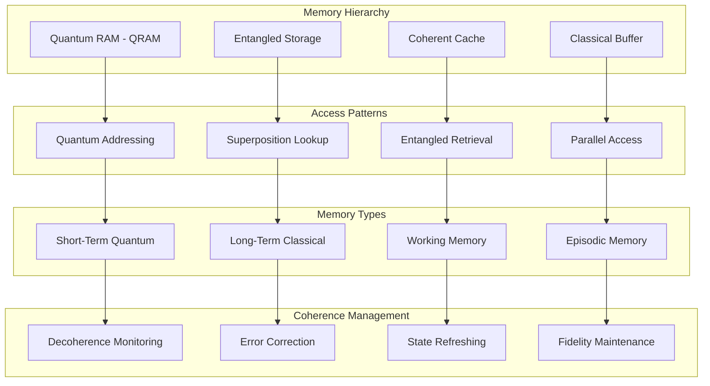

## 🌟 Core Features

### Quantum Associative Memory

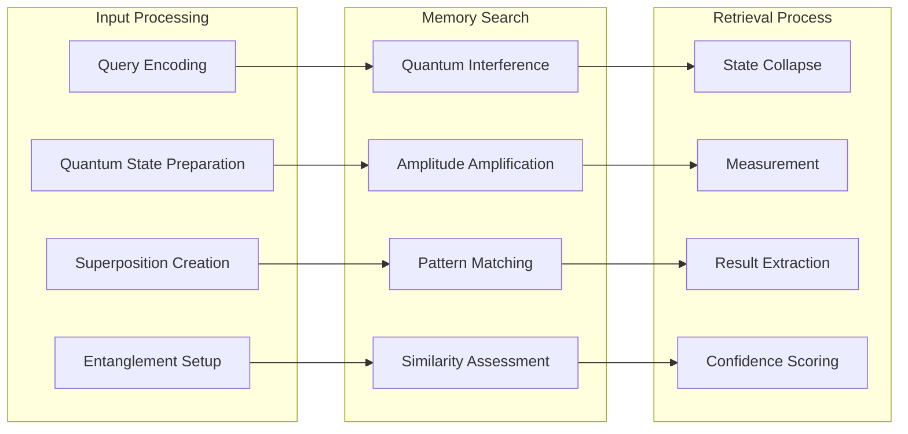

### Memory Consolidation

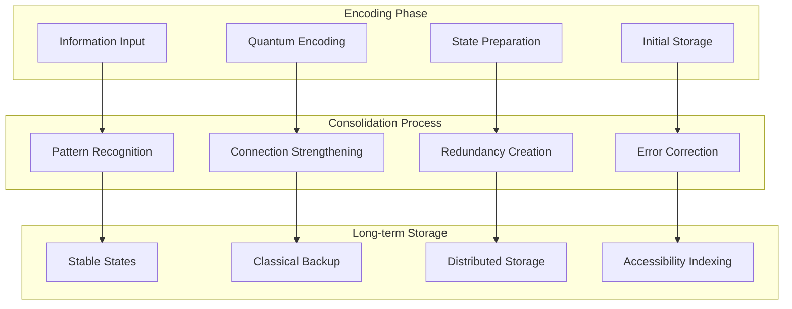

## 🔧 Implementation

### Basic Quantum Memory

```python
from quantumlangchain.memory import QuantumMemory
import numpy as np

# Initialize quantum memory system
memory = QuantumMemory(
    classical_dim=1024,
    quantum_dim=8,
    decoherence_rate=0.01,
    error_correction=True
)

# Store information with quantum encoding
key = "quantum_computing_basics"
value = "Quantum computing uses quantum mechanical phenomena..."
memory.store(key, value, importance=0.9)

# Retrieve with quantum search
result = memory.retrieve("quantum computing", similarity_threshold=0.8)
print(result)
```

### Advanced Memory Configuration

```python
from quantumlangchain.memory import (
    QuantumMemory, 
    EntangledMemory,
    AdaptiveMemory
)

# Multi-layer memory system
class HybridMemorySystem:
    def __init__(self):
        # Fast quantum cache
        self.qcache = QuantumMemory(
            classical_dim=256,
            quantum_dim=4,
            decoherence_rate=0.1,
            refresh_rate="high"
        )
        
        # Long-term entangled storage
        self.entangled_store = EntangledMemory(
            classical_dim=2048,
            quantum_dim=12,
            entanglement_strength=0.9,
            persistence=True
        )
        
        # Adaptive working memory
        self.working_memory = AdaptiveMemory(
            base_dim=512,
            max_expansion=4096,
            adaptation_rate=0.05
        )
    
    async def store_experience(self, experience, context=None):
        """Store experience across memory layers."""
        # Immediate storage in quantum cache
        await self.qcache.store(
            experience["key"], 
            experience["data"],
            tags=experience.get("tags", [])
        )
        
        # Contextual storage in working memory
        if context:
            await self.working_memory.store_with_context(
                experience, context
            )
        
        # Long-term consolidation
        if experience.get("importance", 0) > 0.7:
            await self.entangled_store.consolidate(experience)
```

### Quantum Episodic Memory

```python
from quantumlangchain.memory import EpisodicMemory
from datetime import datetime

# Episodic memory for experiences
episodic_memory = EpisodicMemory(
    temporal_encoding=True,
    spatial_encoding=True,
    emotional_weighting=True
)

# Store episodic experience
experience = {
    "content": "User asked about quantum entanglement",
    "timestamp": datetime.now(),
    "context": "scientific discussion",
    "emotional_tone": "curious",
    "outcome": "provided detailed explanation"
}

await episodic_memory.store_episode(experience)

# Retrieve similar episodes
similar_episodes = await episodic_memory.retrieve_episodes(
    query="quantum physics questions",
    temporal_window="last_week",
    similarity_threshold=0.75
)
```

## 🎯 Memory Types

### Short-Term Quantum Memory

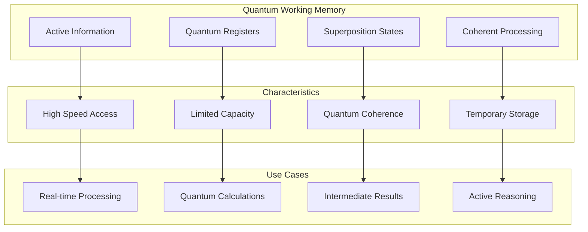

### Long-Term Classical Memory

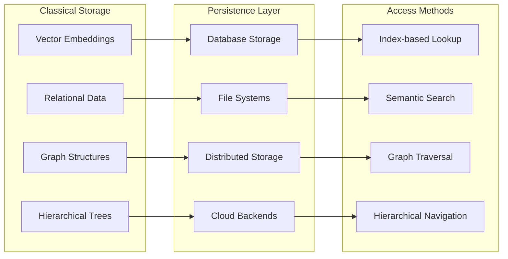

### Entangled Memory Networks

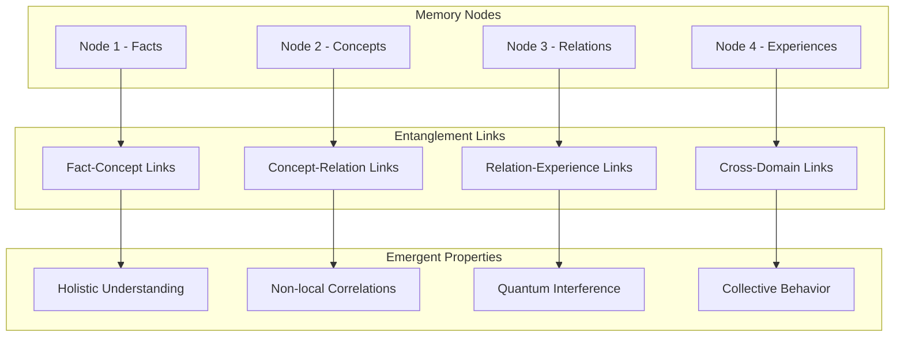

## 📊 Performance Characteristics

### Memory Access Patterns

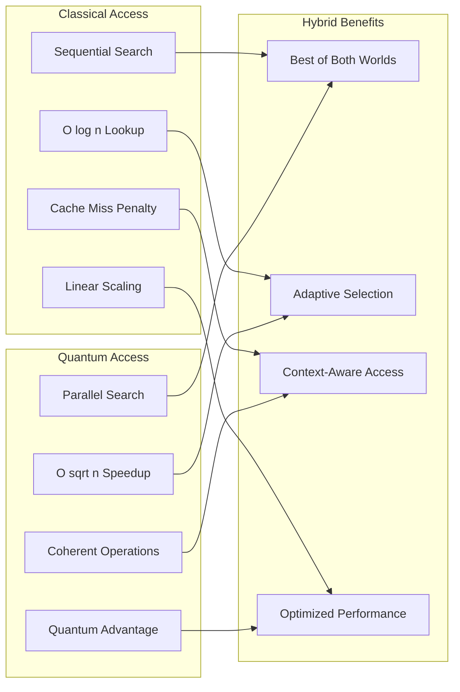

### Capacity Scaling

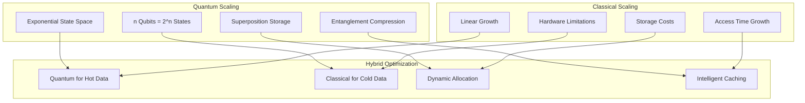

## 🛠️ Configuration Options

### Memory Architecture Configuration

```python
# Memory configuration templates
MEMORY_CONFIGS = {
    "basic": {
        "classical_dim": 512,
        "quantum_dim": 4,
        "decoherence_rate": 0.1,
        "error_correction": False,
        "backup_frequency": "hourly"
    },
    
    "professional": {
        "classical_dim": 1024,
        "quantum_dim": 8,
        "decoherence_rate": 0.01,
        "error_correction": True,
        "distributed": False,
        "compression": True
    },
    
    "enterprise": {
        "classical_dim": 2048,
        "quantum_dim": 16,
        "decoherence_rate": 0.001,
        "error_correction": True,
        "distributed": True,
        "fault_tolerance": True,
        "encryption": True
    },
    
    "research": {
        "classical_dim": 4096,
        "quantum_dim": 32,
        "decoherence_rate": 0.0001,
        "error_correction": True,
        "distributed": True,
        "experimental_features": True,
        "custom_protocols": True
    }
}
```

### Coherence Management

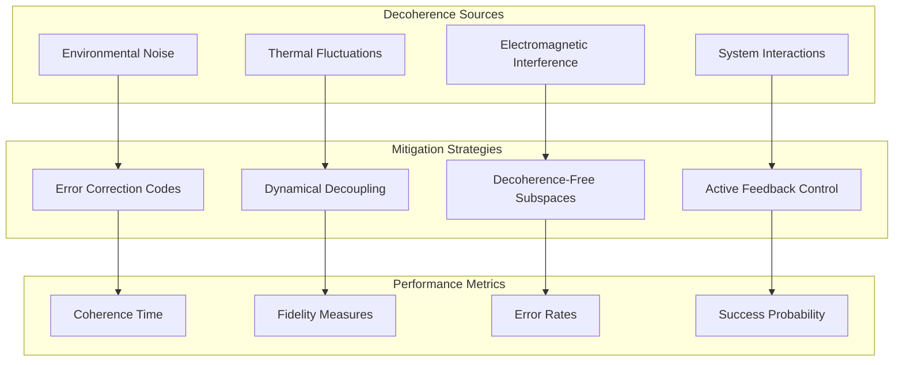

## 🔒 License Integration

### Memory Tier Restrictions

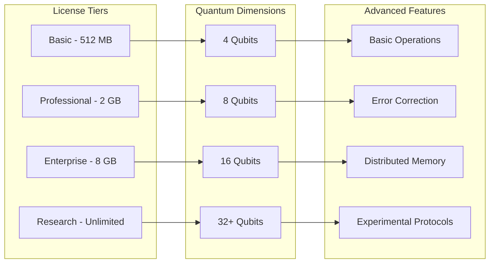

### Memory Access Control

```python
from quantumlangchain.licensing import requires_license

class QuantumMemory(LicensedComponent):
    @requires_license(tier="basic")
    def __init__(self, classical_dim=512, quantum_dim=4, **kwargs):
        """Initialize quantum memory with license validation."""
        super().__init__(
            required_features=["quantum_memory"],
            required_tier="basic"
        )
        
        # Validate memory limits based on license
        max_classical, max_quantum = self._get_memory_limits()
        
        if classical_dim > max_classical:
            raise LicenseError(
                f"Classical memory limit exceeded. "
                f"License allows {max_classical}MB, requested {classical_dim}MB. "
                f"Contact: bajpaikrishna715@gmail.com"
            )
        
        if quantum_dim > max_quantum:
            raise LicenseError(
                f"Quantum dimension limit exceeded. "
                f"License allows {max_quantum} qubits, requested {quantum_dim}. "
                f"Contact: bajpaikrishna715@gmail.com"
            )
    
    @requires_license(tier="professional")
    def enable_error_correction(self):
        """Enable quantum error correction (Professional+ only)."""
        pass
    
    @requires_license(tier="enterprise")
    def enable_distributed_storage(self):
        """Enable distributed memory storage (Enterprise+ only)."""
        pass
```

## 🎯 Advanced Features

### Quantum Memory Patterns

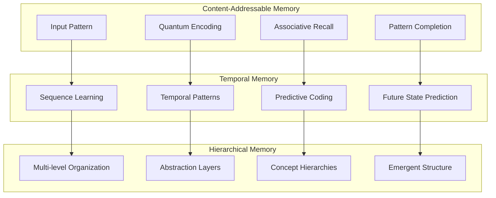

### Memory Optimization

```python
# Advanced memory optimization
class OptimizedQuantumMemory:
    def __init__(self, **config):
        self.config = config
        self.optimizer = MemoryOptimizer()
        
    async def optimize_storage(self):
        """Optimize memory storage patterns."""
        # Analyze access patterns
        patterns = await self.analyzer.analyze_access_patterns()
        
        # Optimize quantum state allocation
        optimal_allocation = self.optimizer.optimize_allocation(
            patterns, self.config
        )
        
        # Reorganize memory structure
        await self.reorganize_memory(optimal_allocation)
    
    async def adaptive_compression(self):
        """Adaptive memory compression based on usage."""
        # Identify rarely accessed memories
        cold_memories = await self.identify_cold_memories()
        
        # Apply quantum compression
        for memory in cold_memories:
            compressed = await self.quantum_compress(memory)
            await self.store_compressed(memory.key, compressed)
    
    async def predictive_prefetch(self, current_context):
        """Predictive memory prefetching."""
        # Predict likely future access patterns
        predictions = await self.predictor.predict_access(
            current_context
        )
        
        # Prefetch predicted memories
        for prediction in predictions:
            if prediction.confidence > 0.8:
                await self.prefetch_memory(prediction.key)
```

## 📚 API Reference

### Core Memory Operations

```python
class QuantumMemory:
    async def store(self, key: str, value: Any, **metadata) -> bool:
        """Store information in quantum memory."""
        
    async def retrieve(self, query: str, **params) -> List[MemoryItem]:
        """Retrieve information using quantum search."""
        
    async def update(self, key: str, value: Any) -> bool:
        """Update existing memory entry."""
        
    async def delete(self, key: str) -> bool:
        """Delete memory entry."""
        
    async def search(self, query: str, **params) -> SearchResults:
        """Semantic search across memory."""
        
    def get_memory_stats(self) -> MemoryStats:
        """Get memory usage statistics."""
        
    async def optimize(self) -> None:
        """Optimize memory organization."""
        
    async def backup(self, location: str) -> bool:
        """Backup memory to specified location."""
```

### Specialized Memory Types

```python
class EpisodicMemory(QuantumMemory):
    async def store_episode(self, experience: Experience) -> bool:
        """Store episodic experience."""
        
    async def retrieve_episodes(self, query: str, **filters) -> List[Episode]:
        """Retrieve similar episodes."""

class SemanticMemory(QuantumMemory):
    async def store_concept(self, concept: Concept) -> bool:
        """Store semantic concept."""
        
    async def retrieve_concepts(self, query: str) -> List[Concept]:
        """Retrieve related concepts."""

class ProceduralMemory(QuantumMemory):
    async def store_procedure(self, procedure: Procedure) -> bool:
        """Store procedural knowledge."""
        
    async def retrieve_procedures(self, task: str) -> List[Procedure]:
        """Retrieve relevant procedures."""
```

## 🔮 Future Enhancements

### Planned Memory Features

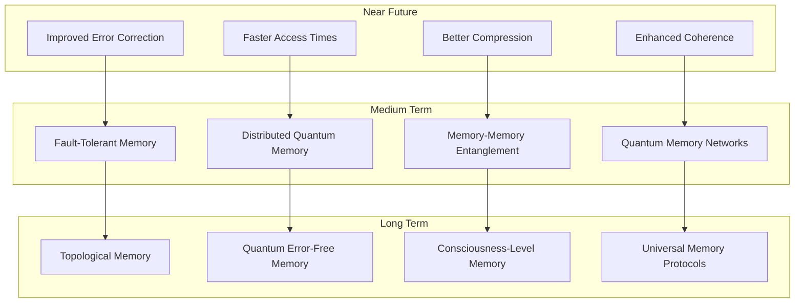

## 🔐 License Requirements

- **Basic Memory**: Basic license tier (512MB classical, 4 qubits)
- **Professional Memory**: Professional license tier (2GB classical, 8 qubits)
- **Enterprise Memory**: Enterprise license tier (8GB+ classical, 16+ qubits)
- **Research Memory**: Research license tier (unlimited capacity)

Contact [bajpaikrishna715@gmail.com](mailto:bajpaikrishna715@gmail.com) for licensing.

Quantum Memory represents the foundation of quantum-enhanced information storage and retrieval, enabling unprecedented memory capabilities for AI systems.
