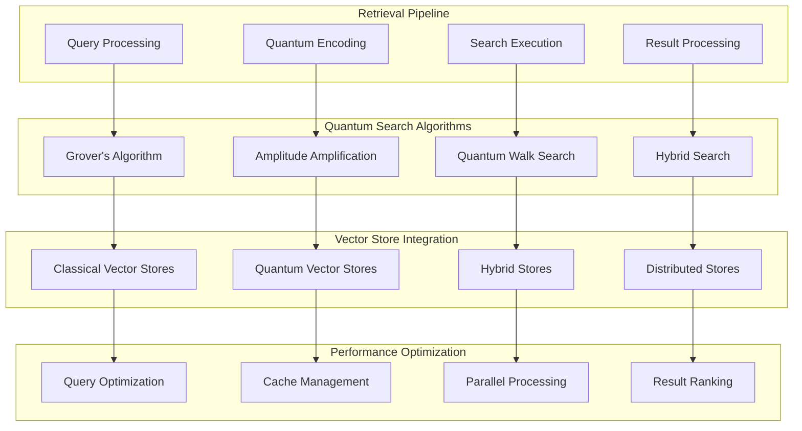
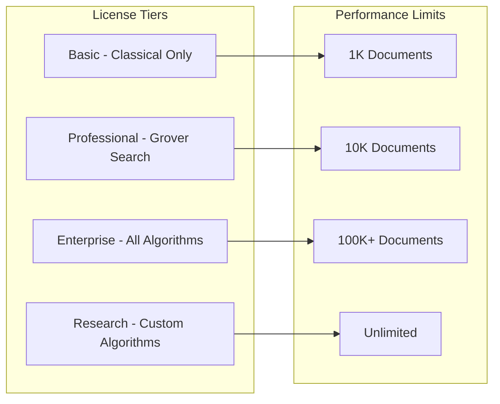

# 🔍 Quantum Retriever Module

🔐 **Licensed Component** - Contact: [bajpaikrishna715@gmail.com](mailto:bajpaikrishna715@gmail.com) for licensing

## Quantum Retriever Architecture



## 🌟 Core Features

### Quantum-Enhanced Search

```mermaid
graph LR
    subgraph "Classical Search"
        A[Linear Search]
        B[Binary Search]
        C[Hash Lookup]
        D[O(n) or O(log n)]
    end
    
    subgraph "Quantum Search"
        E[Grover Search]
        F[Amplitude Amplification]
        G[Quantum Interference]
        H[O(sqrt(n))]
    end
    
    subgraph "Hybrid Benefits"
        I[Best Performance]
        J[Adaptive Selection]
        K[Error Resilience]
        L[Scalable Solutions]
    end
    
    A --> I
    B --> J
    C --> K
    D --> L
    
    E --> I
    F --> J
    G --> K
    H --> L
```

## 🔧 Implementation

### Basic Quantum Retriever

```python
from quantumlangchain.retrievers import QuantumRetriever
from quantumlangchain.vectorstores import QuantumVectorStore

# Initialize quantum retriever
retriever = QuantumRetriever(
    vectorstore=QuantumVectorStore(),
    search_algorithm="grover",
    quantum_dim=8,
    k_results=10
)

# Quantum-enhanced retrieval
docs = await retriever.aget_relevant_documents(
    "quantum computing applications",
    search_kwargs={"quantum_interference": True}
)
```

### Advanced Multi-Modal Retriever

```python
from quantumlangchain.retrievers import MultiModalQuantumRetriever

class AdvancedRetriever:
    def __init__(self):
        self.retriever = MultiModalQuantumRetriever(
            text_vectorstore=text_store,
            image_vectorstore=image_store,
            audio_vectorstore=audio_store,
            cross_modal_entanglement=True
        )
    
    async def quantum_multimodal_search(self, query):
        """Search across multiple modalities with quantum enhancement."""
        results = await self.retriever.quantum_search(
            query,
            modalities=["text", "image", "audio"],
            entanglement_strength=0.9
        )
        return results
```

## 🎯 Search Algorithms

### Grover's Search Implementation

```mermaid
graph TB
    subgraph "Grover's Algorithm"
        A[Initialize Superposition]
        B[Oracle Function]
        C[Diffusion Operator]
        D[Iterate sqrt(N) times]
    end
    
    subgraph "Quantum Advantage"
        E[Quadratic Speedup]
        F[Parallel Search]
        G[Amplitude Amplification]
        H[Optimal Performance]
    end
    
    A --> E
    B --> F
    C --> G
    D --> H
```

### Custom Search Algorithms

```python
class CustomQuantumSearch:
    def __init__(self, vectorstore):
        self.vectorstore = vectorstore
        self.quantum_backend = get_quantum_backend()
    
    async def adaptive_quantum_search(self, query, **kwargs):
        """Adaptive quantum search that selects optimal algorithm."""
        # Analyze query characteristics
        query_complexity = self.analyze_query_complexity(query)
        
        if query_complexity > 0.8:
            # Use amplitude amplification for complex queries
            return await self.amplitude_amplification_search(query)
        elif query_complexity > 0.5:
            # Use Grover's search for medium complexity
            return await self.grover_search(query)
        else:
            # Use classical search for simple queries
            return await self.classical_search(query)
```

## 📊 Performance Metrics

### Search Performance Comparison

```mermaid
graph LR
    subgraph "Classical Performance"
        A[Linear - O(n)]
        B[Binary - O(log n)]
        C[Hash - O(1) avg]
        D[Limited Parallelism]
    end
    
    subgraph "Quantum Performance"
        E[Grover - O(sqrt n)]
        F[Quantum Walk - O(sqrt n)]
        G[Amplitude Amp - O(sqrt n)]
        H[Massive Parallelism]
    end
    
    subgraph "Hybrid Optimization"
        I[Adaptive Algorithm]
        J[Best of Both]
        K[Context Aware]
        L[Maximum Performance]
    end
    
    A --> I
    B --> J
    C --> K
    D --> L
    
    E --> I
    F --> J
    G --> K
    H --> L
```

## 🔒 License Integration

### Retriever Restrictions



### License Enforcement

```python
from quantumlangchain.licensing import requires_license

class QuantumRetriever(LicensedComponent):
    @requires_license(tier="basic")
    def __init__(self, **kwargs):
        """Initialize with license validation."""
        super().__init__(
            required_features=["quantum_retrieval"],
            required_tier="basic"
        )
    
    @requires_license(tier="professional")
    def enable_grover_search(self):
        """Enable Grover's search (Professional+ only)."""
        pass
    
    @requires_license(tier="enterprise")
    def enable_advanced_algorithms(self):
        """Enable advanced search algorithms (Enterprise+ only)."""
        pass
```

## 📚 API Reference

### Core Retriever Classes

```python
class QuantumRetriever:
    def __init__(self, vectorstore, search_algorithm="grover", **config):
        """Initialize quantum retriever."""
        
    async def aget_relevant_documents(self, query: str, **kwargs) -> List[Document]:
        """Get relevant documents asynchronously."""
        
    def get_relevant_documents(self, query: str, **kwargs) -> List[Document]:
        """Get relevant documents synchronously."""
        
    async def quantum_search(self, query: str, **kwargs) -> List[Document]:
        """Perform quantum-enhanced search."""
```

## 🔐 License Requirements

- **Basic Retriever**: Basic license tier (classical search only)
- **Professional Retriever**: Professional license tier (Grover search)
- **Enterprise Retriever**: Enterprise license tier (all algorithms)
- **Research Retriever**: Research license tier (custom algorithms)

Contact [bajpaikrishna715@gmail.com](mailto:bajpaikrishna715@gmail.com) for licensing.

Quantum Retriever provides unprecedented search capabilities for next-generation AI applications.
