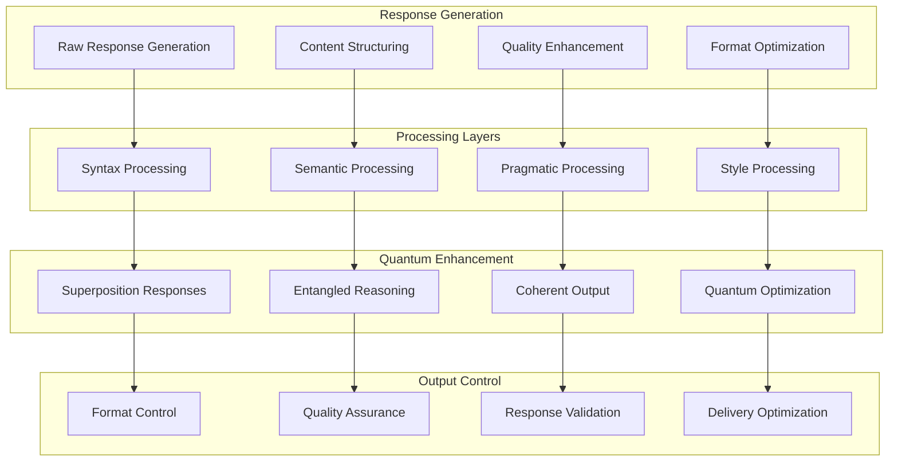
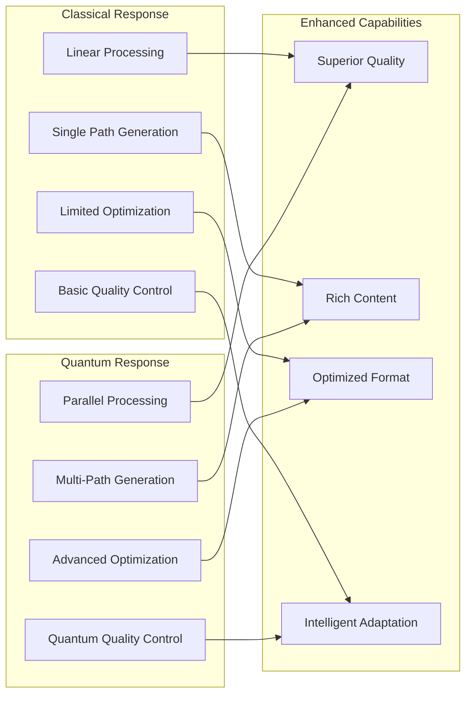
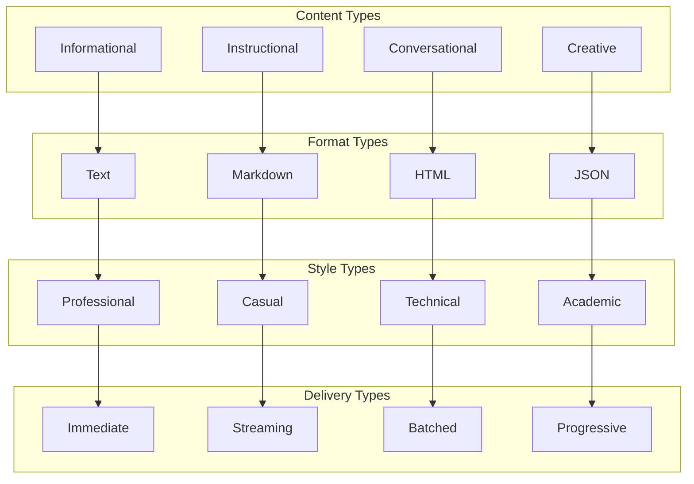
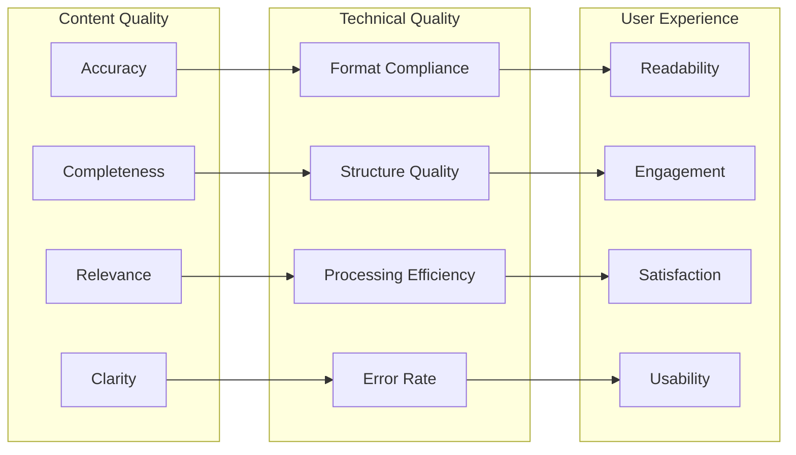
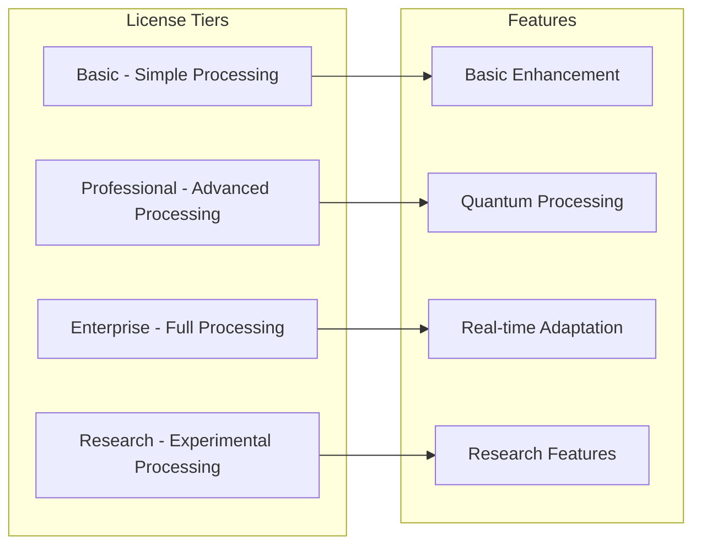
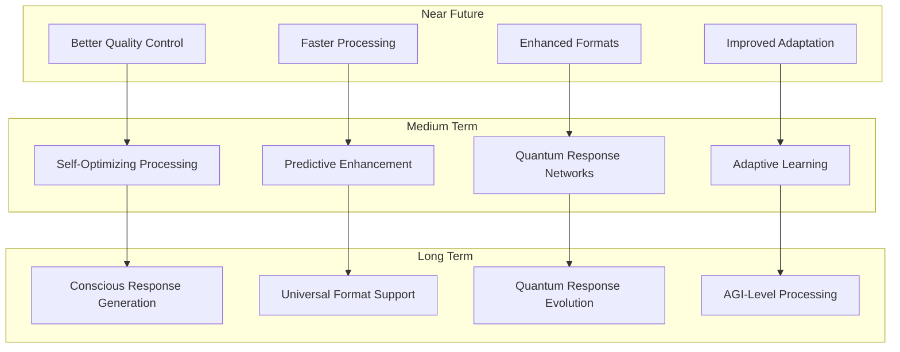

# 🔧 Response Processor Module

🔐 **Licensed Component** - Contact: [bajpaikrishna715@gmail.com](mailto:bajpaikrishna715@gmail.com) for licensing

## Response Processing Architecture



## 🌟 Core Features

### Quantum Response Processing



## 🔧 Implementation

### Basic Response Processor

```python
from quantumlangchain.response import QuantumResponseProcessor

# Initialize response processor
response_processor = QuantumResponseProcessor(
    max_response_length=2048,
    quality_threshold=0.8,
    quantum_optimization=True,
    multi_format_support=True
)

# Process a raw response
raw_response = "This is a basic response that needs processing."

processed_response = await response_processor.process_response(
    raw_response,
    target_format="markdown",
    quality_level="high",
    style="professional"
)

print(processed_response.content)
print(f"Quality Score: {processed_response.quality_score}")
print(f"Processing Time: {processed_response.processing_time}ms")
```

### Advanced Multi-Stage Response Processor

```python
from quantumlangchain.response import MultiStageResponseProcessor

class AdvancedResponseSystem:
    def __init__(self):
        self.response_processor = MultiStageResponseProcessor(
            stages=[
                "content_analysis",
                "structure_optimization",
                "quality_enhancement",
                "format_adaptation",
                "style_refinement",
                "final_validation"
            ],
            quantum_processing=True
        )
        
        # Specialized processors
        self.content_analyzer = ContentAnalyzer()
        self.structure_optimizer = StructureOptimizer()
        self.quality_enhancer = QualityEnhancer()
        self.format_adapter = FormatAdapter()
        self.style_refiner = StyleRefiner()
        self.validator = ResponseValidator()
        
    async def process_advanced_response(self, raw_response, requirements):
        """Process response with advanced multi-stage processing."""
        # Stage 1: Content Analysis
        content_analysis = await self.content_analyzer.analyze(
            raw_response,
            requirements.get("analysis_depth", "standard")
        )
        
        # Stage 2: Structure Optimization
        optimized_structure = await self.structure_optimizer.optimize(
            raw_response,
            content_analysis,
            requirements.get("structure_type", "auto")
        )
        
        # Stage 3: Quality Enhancement
        enhanced_content = await self.quality_enhancer.enhance(
            optimized_structure,
            target_quality=requirements.get("quality_level", 0.8)
        )
        
        # Stage 4: Format Adaptation
        formatted_content = await self.format_adapter.adapt(
            enhanced_content,
            target_format=requirements.get("format", "text"),
            format_options=requirements.get("format_options", {})
        )
        
        # Stage 5: Style Refinement
        refined_content = await self.style_refiner.refine(
            formatted_content,
            style=requirements.get("style", "neutral"),
            tone=requirements.get("tone", "professional")
        )
        
        # Stage 6: Final Validation
        final_response = await self.validator.validate_and_finalize(
            refined_content,
            requirements
        )
        
        return final_response
    
    async def quantum_response_generation(self, query, context, options):
        """Generate response using quantum processing."""
        # Create superposition of possible responses
        response_superposition = await self.create_response_superposition(
            query, context, options
        )
        
        # Apply quantum optimization
        optimized_responses = await self.quantum_optimize_responses(
            response_superposition
        )
        
        # Collapse to best response through measurement
        best_response = await self.quantum_measurement_collapse(
            optimized_responses,
            measurement_criteria=options.get("criteria", "quality")
        )
        
        return best_response
```

### Adaptive Response Processing

```python
class AdaptiveResponseProcessor:
    def __init__(self):
        self.adaptation_engine = ResponseAdaptationEngine()
        self.user_profiler = UserProfiler()
        self.context_analyzer = ContextAnalyzer()
        self.style_predictor = StylePredictor()
        
    async def adaptive_response_processing(self, response, user_profile, context):
        """Process response adaptively based on user and context."""
        # Analyze user preferences
        user_preferences = await self.user_profiler.analyze_preferences(
            user_profile
        )
        
        # Analyze contextual requirements
        contextual_needs = await self.context_analyzer.analyze_context(
            context
        )
        
        # Predict optimal style
        optimal_style = await self.style_predictor.predict_style(
            user_preferences, contextual_needs
        )
        
        # Adapt response processing
        adapted_response = await self.adaptation_engine.adapt_response(
            response,
            user_preferences=user_preferences,
            contextual_needs=contextual_needs,
            target_style=optimal_style
        )
        
        return adapted_response
    
    async def real_time_adaptation(self, response_stream, feedback_stream):
        """Adapt response processing in real-time based on feedback."""
        processed_responses = []
        
        async for response_chunk in response_stream:
            # Check for real-time feedback
            recent_feedback = await feedback_stream.get_recent_feedback()
            
            # Adapt processing based on feedback
            if recent_feedback:
                adaptation_adjustments = await self.calculate_adaptation_adjustments(
                    recent_feedback
                )
                await self.adaptation_engine.apply_real_time_adjustments(
                    adaptation_adjustments
                )
            
            # Process chunk with current adaptations
            processed_chunk = await self.adaptation_engine.process_chunk(
                response_chunk
            )
            
            processed_responses.append(processed_chunk)
        
        return processed_responses
```

## 🎯 Response Types

### Response Categories



### Response Processing Pipeline

```python
class ResponseProcessingPipeline:
    def __init__(self):
        self.stages = {
            "preprocessing": PreprocessingStage(),
            "content_enhancement": ContentEnhancementStage(),
            "structure_optimization": StructureOptimizationStage(),
            "format_conversion": FormatConversionStage(),
            "quality_assurance": QualityAssuranceStage(),
            "postprocessing": PostprocessingStage()
        }
        
    async def process_response(self, raw_response, processing_config):
        """Process response through configurable pipeline."""
        current_response = raw_response
        processing_metadata = {}
        
        # Select active stages based on config
        active_stages = self.select_active_stages(processing_config)
        
        for stage_name in active_stages:
            stage = self.stages[stage_name]
            
            # Configure stage for current processing
            await stage.configure(processing_config)
            
            # Process response through stage
            stage_result = await stage.process(
                current_response,
                processing_metadata
            )
            
            current_response = stage_result.response
            processing_metadata.update(stage_result.metadata)
            
            # Quality check after each stage
            if not await stage.validate_output(current_response):
                # Handle processing error
                fallback_response = await stage.get_fallback_response(
                    raw_response
                )
                current_response = fallback_response
        
        return ProcessedResponse(
            content=current_response,
            metadata=processing_metadata,
            quality_score=await self.calculate_quality_score(current_response)
        )
    
    async def batch_process_responses(self, responses, shared_config):
        """Process multiple responses efficiently."""
        # Optimize pipeline for batch processing
        await self.optimize_for_batch_processing()
        
        # Process responses in parallel where possible
        tasks = []
        for response in responses:
            task = self.process_response(response, shared_config)
            tasks.append(task)
        
        processed_responses = await asyncio.gather(*tasks)
        
        return processed_responses
```

## 📊 Quality Metrics

### Response Quality Assessment



### Quality Enhancement System

```python
class QualityEnhancementSystem:
    def __init__(self):
        self.quality_analyzers = {
            "content": ContentQualityAnalyzer(),
            "structure": StructureQualityAnalyzer(),
            "language": LanguageQualityAnalyzer(),
            "format": FormatQualityAnalyzer(),
            "user_experience": UXQualityAnalyzer()
        }
        
        self.enhancement_engines = {
            "content": ContentEnhancementEngine(),
            "structure": StructureEnhancementEngine(),
            "language": LanguageEnhancementEngine(),
            "format": FormatEnhancementEngine(),
            "user_experience": UXEnhancementEngine()
        }
        
    async def enhance_response_quality(self, response, target_quality=0.9):
        """Enhance response quality to meet target threshold."""
        current_response = response
        enhancement_iterations = 0
        max_iterations = 5
        
        while enhancement_iterations < max_iterations:
            # Analyze current quality
            quality_scores = await self.analyze_quality(current_response)
            
            # Calculate overall quality score
            overall_quality = sum(quality_scores.values()) / len(quality_scores)
            
            if overall_quality >= target_quality:
                break
            
            # Identify areas needing improvement
            improvement_areas = [
                area for area, score in quality_scores.items()
                if score < target_quality
            ]
            
            # Apply targeted enhancements
            for area in improvement_areas:
                enhancer = self.enhancement_engines[area]
                current_response = await enhancer.enhance(
                    current_response,
                    target_score=target_quality
                )
            
            enhancement_iterations += 1
        
        return current_response
    
    async def continuous_quality_improvement(self, feedback_data):
        """Continuously improve quality based on user feedback."""
        # Analyze feedback patterns
        feedback_patterns = await self.analyze_feedback_patterns(feedback_data)
        
        # Identify systematic quality issues
        quality_issues = await self.identify_quality_issues(feedback_patterns)
        
        # Update enhancement algorithms
        for issue in quality_issues:
            affected_enhancer = self.enhancement_engines[issue.area]
            await affected_enhancer.update_algorithms(issue.improvement_data)
        
        # Retrain quality analyzers
        for analyzer in self.quality_analyzers.values():
            await analyzer.retrain_with_feedback(feedback_data)
```

## 🔒 License Integration

### Response Processing Restrictions



### License Enforcement

```python
from quantumlangchain.licensing import requires_license

class QuantumResponseProcessor(LicensedComponent):
    @requires_license(tier="basic")
    def __init__(self, **kwargs):
        """Initialize with license validation."""
        super().__init__(
            required_features=["response_processing"],
            required_tier="basic"
        )
        
        # Validate processing capabilities
        max_length = self._get_max_response_length()
        requested_length = kwargs.get("max_response_length", 1000)
        
        if requested_length > max_length:
            raise LicenseError(
                f"Response length limit exceeded. "
                f"License allows {max_length} tokens, "
                f"requested {requested_length}. "
                f"Contact: bajpaikrishna715@gmail.com"
            )
    
    @requires_license(tier="professional")
    def enable_quantum_processing(self):
        """Enable quantum response processing (Professional+ only)."""
        pass
    
    @requires_license(tier="enterprise")
    def enable_real_time_adaptation(self):
        """Enable real-time adaptation (Enterprise+ only)."""
        pass
    
    @requires_license(tier="research")
    def enable_experimental_features(self):
        """Enable experimental processing features (Research only)."""
        pass
```

## 📚 API Reference

### Core Response Classes

```python
class QuantumResponseProcessor:
    def __init__(self, max_response_length=1000, quality_threshold=0.7, **config):
        """Initialize quantum response processor."""
        
    async def process_response(self, raw_response: str, target_format: str = "text", **options) -> ProcessedResponse:
        """Process a raw response."""
        
    async def batch_process(self, responses: List[str], shared_config: Dict[str, Any]) -> List[ProcessedResponse]:
        """Process multiple responses in batch."""
        
    async def stream_process(self, response_stream: AsyncIterator[str], **options) -> AsyncIterator[ProcessedResponse]:
        """Process streaming response."""
        
    def get_processing_stats(self) -> Dict[str, Any]:
        """Get response processing statistics."""

class ProcessedResponse:
    def __init__(self, content: str, quality_score: float, processing_time: float, **metadata):
        """Initialize processed response."""
        
    def to_dict(self) -> Dict[str, Any]:
        """Convert response to dictionary."""
        
    @classmethod
    def from_dict(cls, data: Dict[str, Any]) -> 'ProcessedResponse':
        """Create response from dictionary."""
```

## 🔮 Future Enhancements

### Planned Response Features



## 🔐 License Requirements

- **Basic Processing**: Basic license tier (simple response processing)
- **Professional Processing**: Professional license tier (quantum enhancement)
- **Enterprise Processing**: Enterprise license tier (real-time adaptation)
- **Research Processing**: Research license tier (experimental features)

Contact [bajpaikrishna715@gmail.com](mailto:bajpaikrishna715@gmail.com) for licensing.

Response Processor provides quantum-enhanced response processing and optimization capabilities for superior AI output quality.
