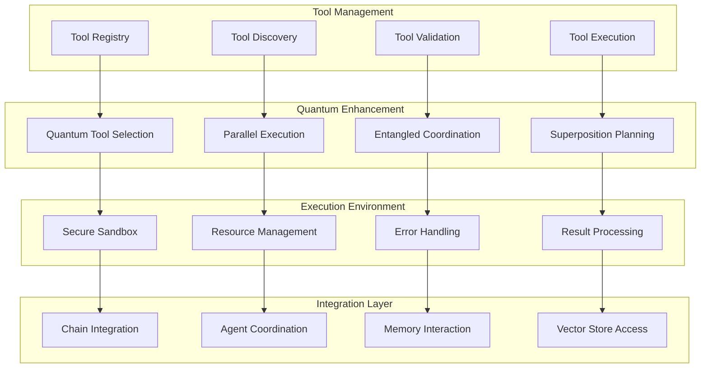
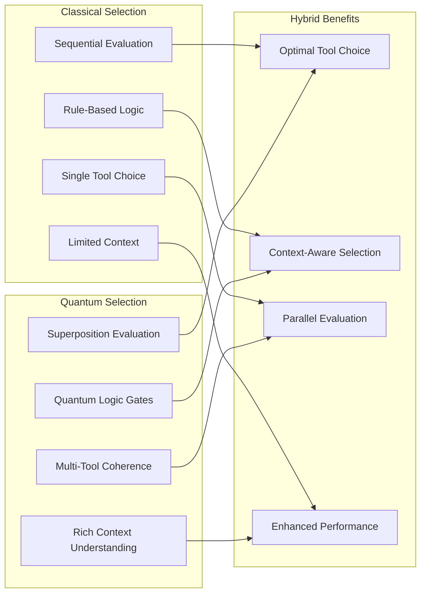
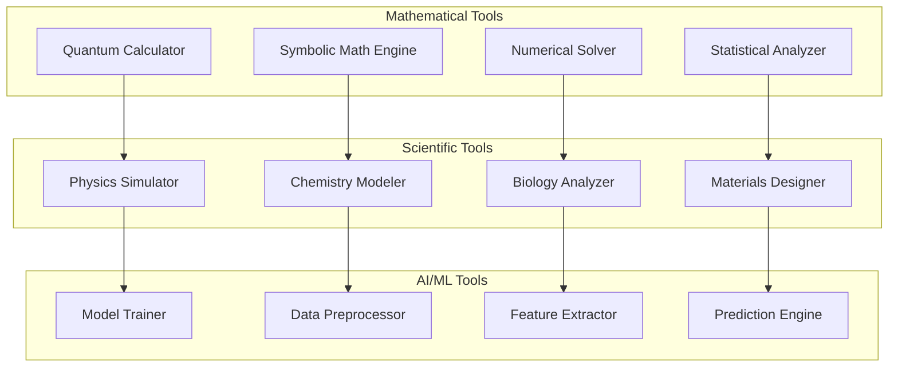
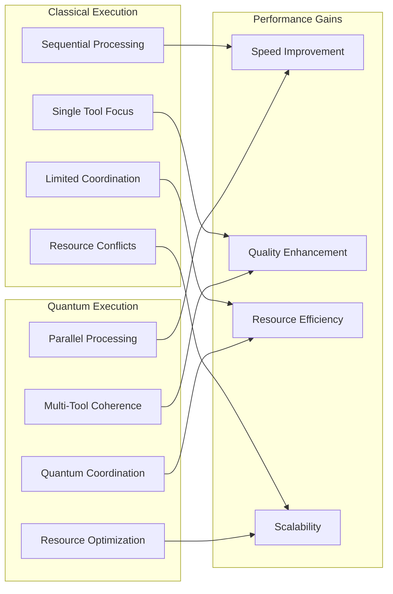
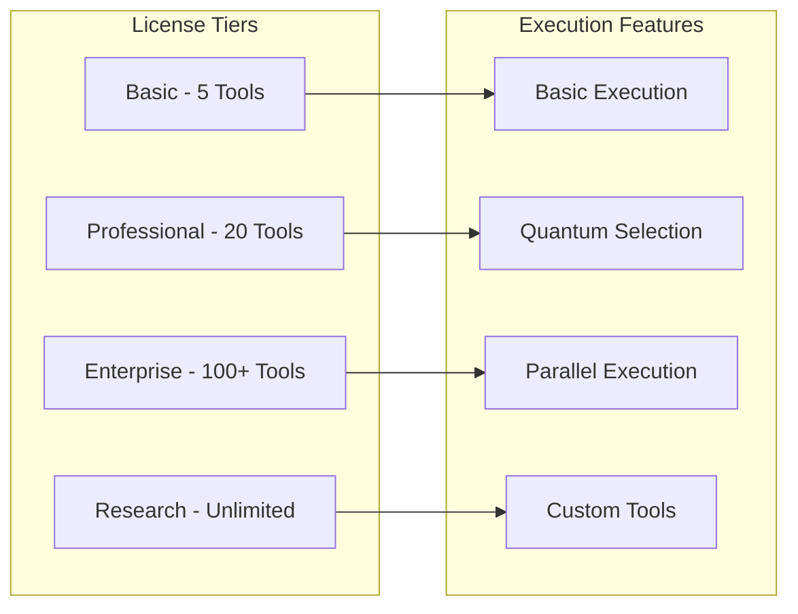
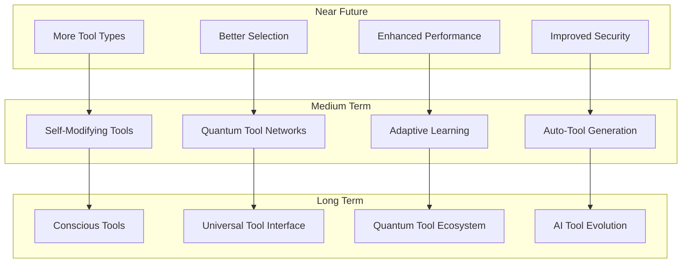

# 🛠️ Tool Executor Module

🔐 **Licensed Component** - Contact: [bajpaikrishna715@gmail.com](mailto:bajpaikrishna715@gmail.com) for licensing

## Tool Executor Architecture



## 🌟 Core Features

### Quantum Tool Selection



## 🔧 Implementation

### Basic Tool Executor

```python
from quantumlangchain.tools import QuantumToolExecutor
from quantumlangchain.tools.base import QuantumTool

# Initialize tool executor
executor = QuantumToolExecutor(
    quantum_selection=True,
    parallel_execution=True,
    error_correction=True
)

# Register tools
calculator = QuantumTool(name="calculator", func=calculate)
searcher = QuantumTool(name="search", func=web_search)
analyzer = QuantumTool(name="analyzer", func=analyze_data)

executor.register_tools([calculator, searcher, analyzer])

# Execute with quantum enhancement
result = await executor.execute(
    "Calculate the square root of 144 and search for its applications",
    quantum_coordination=True
)
```

### Advanced Multi-Agent Tool Execution

```python
from quantumlangchain.tools import DistributedQuantumToolExecutor

class AdvancedToolSystem:
    def __init__(self):
        self.executor = DistributedQuantumToolExecutor(
            agents=["coordinator", "executor", "validator"],
            quantum_coordination=True,
            fault_tolerance=True
        )
        
        # Tool categories
        self.computational_tools = [
            "quantum_calculator",
            "symbolic_math",
            "numerical_solver"
        ]
        
        self.data_tools = [
            "data_analyzer",
            "pattern_recognizer",
            "visualization_engine"
        ]
        
        self.ai_tools = [
            "language_model",
            "image_generator",
            "code_assistant"
        ]
    
    async def complex_task_execution(self, task_description):
        """Execute complex tasks using quantum-coordinated tools."""
        # Quantum task decomposition
        subtasks = await self.executor.quantum_decompose_task(
            task_description
        )
        
        # Parallel tool execution with entanglement
        results = []
        for subtask in subtasks:
            optimal_tools = await self.executor.quantum_tool_selection(
                subtask
            )
            result = await self.executor.entangled_execution(
                subtask, optimal_tools
            )
            results.append(result)
        
        # Quantum result synthesis
        final_result = await self.executor.quantum_synthesis(results)
        return final_result
```

### Quantum Tool Coordination

```python
class QuantumToolCoordinator:
    def __init__(self, tools):
        self.tools = tools
        self.quantum_state = QuantumState(len(tools))
        
    async def coordinate_tool_execution(self, task):
        """Coordinate multiple tools using quantum entanglement."""
        # Create quantum superposition of tool combinations
        tool_combinations = await self.create_tool_superposition(task)
        
        # Execute in quantum parallel
        quantum_results = await self.quantum_parallel_execution(
            tool_combinations
        )
        
        # Measure optimal result
        optimal_result = await self.quantum_measurement(
            quantum_results
        )
        
        return optimal_result
    
    async def adaptive_tool_learning(self):
        """Learn optimal tool usage patterns."""
        # Analyze historical execution patterns
        patterns = await self.analyze_execution_history()
        
        # Update quantum model
        await self.update_quantum_model(patterns)
        
        # Optimize tool selection strategies
        await self.optimize_selection_strategies()
```

## 🎯 Tool Categories

### Computational Tools



### Integration Tools

```python
# Tool integration examples
TOOL_REGISTRY = {
    "computational": {
        "quantum_calculator": {
            "description": "Quantum-enhanced mathematical calculations",
            "input_types": ["numbers", "expressions"],
            "output_types": ["results", "visualizations"],
            "quantum_advantage": True
        },
        "symbolic_solver": {
            "description": "Symbolic mathematics and equation solving",
            "input_types": ["equations", "expressions"],
            "output_types": ["solutions", "proofs"],
            "quantum_advantage": False
        }
    },
    
    "data_analysis": {
        "pattern_recognizer": {
            "description": "Quantum pattern recognition in data",
            "input_types": ["datasets", "images", "text"],
            "output_types": ["patterns", "insights"],
            "quantum_advantage": True
        },
        "data_visualizer": {
            "description": "Advanced data visualization",
            "input_types": ["data", "specifications"],
            "output_types": ["charts", "graphs", "interactive"],
            "quantum_advantage": False
        }
    },
    
    "ai_assistance": {
        "code_generator": {
            "description": "AI-powered code generation",
            "input_types": ["requirements", "specifications"],
            "output_types": ["code", "documentation"],
            "quantum_advantage": True
        }
    }
}
```

## 📊 Performance Optimization

### Execution Performance



### Tool Performance Analytics

```python
class ToolPerformanceAnalyzer:
    def __init__(self, executor):
        self.executor = executor
        self.metrics_collector = MetricsCollector()
        
    async def analyze_tool_performance(self):
        """Analyze performance of individual tools and combinations."""
        # Collect execution metrics
        metrics = await self.metrics_collector.get_execution_metrics()
        
        # Analyze quantum vs classical performance
        quantum_performance = await self.analyze_quantum_performance(
            metrics
        )
        
        # Identify optimization opportunities
        optimizations = await self.identify_optimizations(metrics)
        
        return {
            "quantum_advantage": quantum_performance,
            "optimization_suggestions": optimizations,
            "performance_trends": await self.analyze_trends(metrics)
        }
    
    async def optimize_tool_selection(self):
        """Optimize tool selection based on performance data."""
        # Machine learning on tool performance
        model = await self.train_selection_model()
        
        # Update quantum selection algorithms
        await self.executor.update_selection_algorithm(model)
        
        # Validate improvements
        improvements = await self.validate_optimizations()
        return improvements
```

## 🔒 License Integration

### Tool Access Restrictions



### License Enforcement

```python
from quantumlangchain.licensing import requires_license

class QuantumToolExecutor(LicensedComponent):
    @requires_license(tier="basic")
    def __init__(self, **kwargs):
        """Initialize with license validation."""
        super().__init__(
            required_features=["tool_execution"],
            required_tier="basic"
        )
        
        # Validate tool limits
        max_tools = self._get_max_tools()
        if len(kwargs.get("tools", [])) > max_tools:
            raise LicenseError(
                f"Tool limit exceeded. License allows {max_tools} tools. "
                f"Contact: bajpaikrishna715@gmail.com"
            )
    
    @requires_license(tier="professional")
    def enable_quantum_selection(self):
        """Enable quantum tool selection (Professional+ only)."""
        pass
    
    @requires_license(tier="enterprise")
    def enable_parallel_execution(self):
        """Enable parallel tool execution (Enterprise+ only)."""
        pass
```

## 📚 API Reference

### Core Tool Executor Classes

```python
class QuantumToolExecutor:
    def __init__(self, tools=None, quantum_selection=True, **config):
        """Initialize quantum tool executor."""
        
    async def execute(self, task: str, tools: List[str] = None, **kwargs) -> Any:
        """Execute task using selected tools."""
        
    def register_tool(self, tool: QuantumTool) -> None:
        """Register a new tool."""
        
    def register_tools(self, tools: List[QuantumTool]) -> None:
        """Register multiple tools."""
        
    async def quantum_tool_selection(self, task: str) -> List[str]:
        """Select optimal tools using quantum algorithms."""

class QuantumTool:
    def __init__(self, name: str, func: Callable, description: str = "", **metadata):
        """Initialize quantum tool."""
        
    async def arun(self, *args, **kwargs) -> Any:
        """Run tool asynchronously."""
        
    def run(self, *args, **kwargs) -> Any:
        """Run tool synchronously."""
```

## 🔮 Future Enhancements

### Planned Tool Features



## 🔐 License Requirements

- **Basic Tools**: Basic license tier (up to 5 tools)
- **Professional Tools**: Professional license tier (up to 20 tools)
- **Enterprise Tools**: Enterprise license tier (100+ tools)
- **Research Tools**: Research license tier (unlimited tools)

Contact [bajpaikrishna715@gmail.com](mailto:bajpaikrishna715@gmail.com) for licensing.

Tool Executor provides quantum-enhanced tool management and execution capabilities for advanced AI automation and problem-solving.
