# 🧬 QuantumLangChain: Complete Theory & Architecture

## 📋 Table of Contents

1. [License Requirements](#-license-requirements)
2. [Theoretical Foundation](#-theoretical-foundation)
3. [System Architecture](#-system-architecture)
4. [Quantum-Classical Hybridization](#-quantum-classical-hybridization)
5. [Implementation Details](#-implementation-details)
6. [License Integration Points](#-license-integration-points)
7. [Development Guidelines](#-development-guidelines)

---

## 🔐 License Requirements

**⚠️ IMPORTANT: ALL features require valid licensing with 24-hour grace period for evaluation.**

### License Tiers

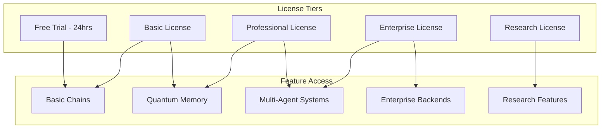

### Grace Period Policy

- **Duration**: 24 hours from first use
- **Contact**: bajpaikrishna715@gmail.com with machine ID
- **Machine ID**: Automatically generated hardware fingerprint
- **Features**: Limited to basic functionality during grace period

---

## 🧠 Theoretical Foundation

### Quantum Information Theory

QuantumLangChain is built upon fundamental principles of quantum information theory, extended to classical AI systems through mathematical abstractions.

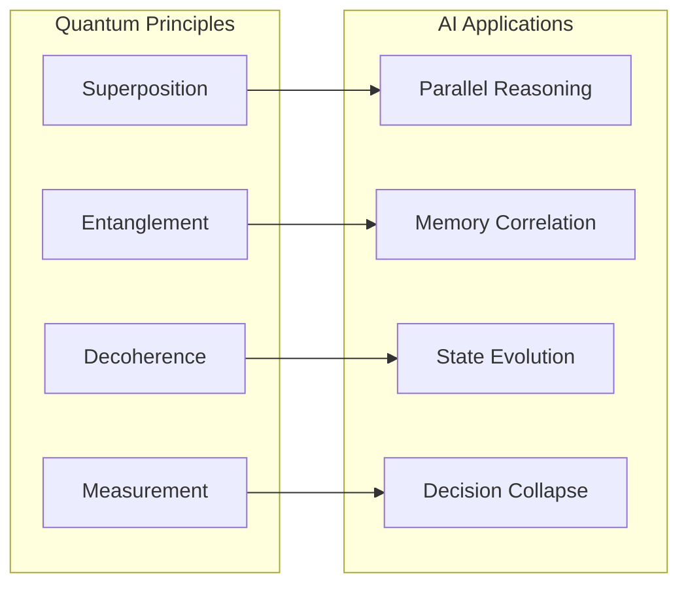

#### Mathematical Foundation

**Quantum State Representation**
```
|ψ⟩ = α|0⟩ + β|1⟩
where |α|² + |β|² = 1
```

**Entangled Memory States**
```
|Ψ⟩ = (α|00⟩ + β|11⟩)/√2
```

**Decoherence Evolution**
```
ρ(t) = e^(-γt)ρ(0) + (1-e^(-γt))ρ_mixed
```

### Hybrid Quantum-Classical Framework

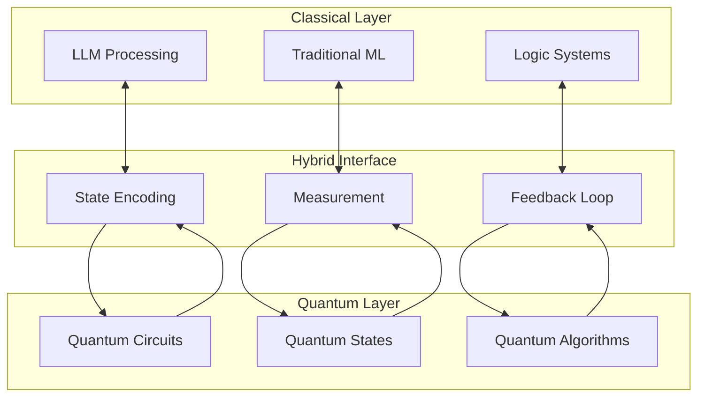

---

## 🏗️ System Architecture

### Complete System Overview

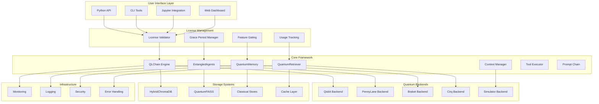

### License Integration Points

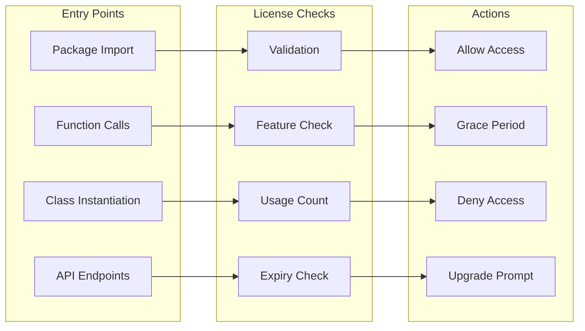

---

## ⚛️ Quantum-Classical Hybridization

### Theoretical Model

The hybridization follows a structured approach where quantum operations enhance classical computations:

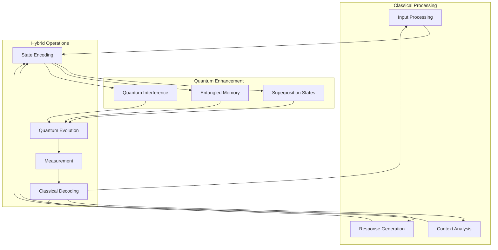

### Quantum Memory Architecture

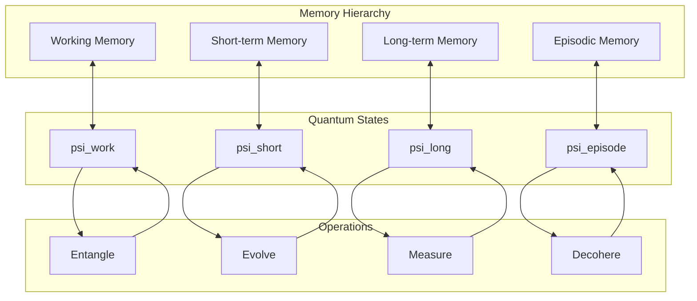

### Multi-Agent Entanglement

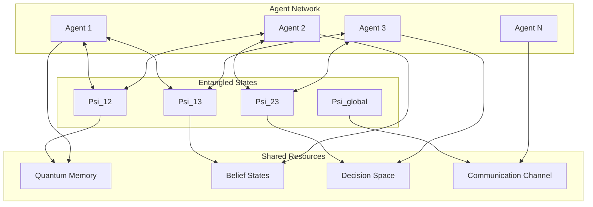

---

## 🔧 Implementation Details

### Core Components

#### QLChain Engine

```python
# Licensed quantum chain implementation
class QLChain:
    def __init__(self, **kwargs):
        self._validate_license("quantumlangchain", ["core"])
        self.quantum_state = None
        self.decoherence_level = 0.0
        # ... implementation
    
    async def arun(self, query: str) -> Dict:
        self._validate_license("quantumlangchain", ["execution"])
        # Quantum-enhanced processing
        # ... implementation
```

#### Quantum Memory System

```python
class QuantumMemory:
    def __init__(self, classical_dim: int, quantum_dim: int):
        self._validate_license("quantumlangchain", ["memory"])
        self.classical_memory = np.zeros(classical_dim)
        self.quantum_memory = QuantumRegister(quantum_dim)
        # ... implementation
    
    async def store(self, key: str, value: Any):
        self._validate_license("quantumlangchain", ["storage"])
        # Quantum storage with entanglement
        # ... implementation
```

#### Entangled Agents

```python
class EntangledAgents:
    def __init__(self, agent_count: int):
        self._validate_license("quantumlangchain", ["multi-agent"])
        self.agents = []
        self.entanglement_matrix = np.zeros((agent_count, agent_count))
        # ... implementation
    
    async def collaborate(self, task: str):
        self._validate_license("quantumlangchain", ["collaboration"])
        # Multi-agent quantum collaboration
        # ... implementation
```

### License Validation System

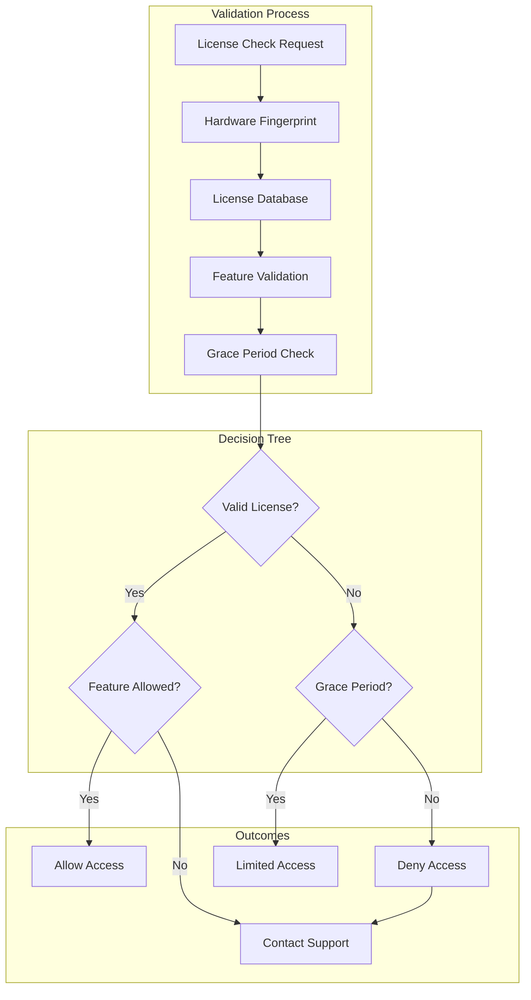

---

## License Integration Points

### Package-Level Integration

```python
# quantumlangchain/__init__.py
from .licensing import LicenseManager, validate_license

# Global license validation on import
_license_manager = LicenseManager()

def _check_package_license():
    """Validate package license on import."""
    try:
        validate_license("quantumlangchain", grace_hours=24)
        print("✅ QuantumLangChain: License validated")
    except LicenseExpiredError:
        print("❌ License expired. Contact: bajpaikrishna715@gmail.com")
        print(f"🔧 Machine ID: {_license_manager.get_machine_id()}")
        # Allow 24-hour grace period
        _license_manager.start_grace_period()
    except LicenseNotFoundError:
        print("⚠️ No license found. Starting 24-hour evaluation period.")
        print(f"📧 Contact: bajpaikrishna715@gmail.com")
        print(f"🔧 Machine ID: {_license_manager.get_machine_id()}")
        _license_manager.start_grace_period()

# Automatic license check
_check_package_license()
```

### Function-Level Decorators

```python
from functools import wraps
from .licensing import validate_license, FeatureNotLicensedError

def requires_license(features=None, tier="basic"):
    """Decorator for license-protected functions."""
    def decorator(func):
        @wraps(func)
        async def async_wrapper(*args, **kwargs):
            try:
                validate_license("quantumlangchain", features, tier)
                return await func(*args, **kwargs)
            except FeatureNotLicensedError as e:
                raise RuntimeError(
                    f"Feature '{func.__name__}' requires {tier} license. "
                    f"Contact: bajpaikrishna715@gmail.com"
                )
        
        @wraps(func)
        def sync_wrapper(*args, **kwargs):
            try:
                validate_license("quantumlangchain", features, tier)
                return func(*args, **kwargs)
            except FeatureNotLicensedError as e:
                raise RuntimeError(
                    f"Feature '{func.__name__}' requires {tier} license. "
                    f"Contact: bajpaikrishna715@gmail.com"
                )
        
        return async_wrapper if asyncio.iscoroutinefunction(func) else sync_wrapper
    return decorator
```

### Class-Level Licensing

```python
class LicensedQuantumComponent:
    """Base class for all licensed quantum components."""
    
    def __init__(self, required_features=None, tier="basic"):
        self.required_features = required_features or ["core"]
        self.tier = tier
        self._validate_access()
    
    def _validate_access(self):
        """Validate license access for this component."""
        try:
            validate_license("quantumlangchain", self.required_features, self.tier)
        except LicenseError as e:
            machine_id = LicenseManager().get_machine_id()
            raise RuntimeError(
                f"License required for {self.__class__.__name__}. "
                f"Contact: bajpaikrishna715@gmail.com with Machine ID: {machine_id}"
            )
    
    def _check_feature_access(self, feature):
        """Check access to specific feature."""
        try:
            validate_license("quantumlangchain", [feature], self.tier)
            return True
        except FeatureNotLicensedError:
            return False
```

### Usage Tracking

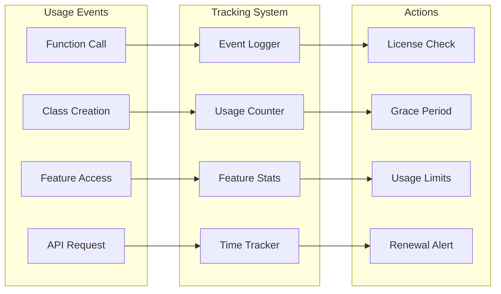

---

## 🛠️ Development Guidelines

### License-First Development

1. **Every Component**: Must include license validation
2. **Clear Messaging**: User-friendly license error messages
3. **Grace Period**: 24-hour evaluation period
4. **Contact Information**: Always provide contact details
5. **Machine ID**: Include hardware fingerprint in errors
6. **Feature Gating**: Tier-based feature access

### Error Handling Strategy

```python
class QuantumLicenseError(Exception):
    """Base class for quantum license errors."""
    
    def __init__(self, message, machine_id=None, contact_email="bajpaikrishna715@gmail.com"):
        self.machine_id = machine_id or LicenseManager().get_machine_id()
        self.contact_email = contact_email
        
        full_message = (
            f"{message}\n"
            f"📧 Contact: {self.contact_email}\n"
            f"🔧 Machine ID: {self.machine_id}\n"
            f"⏰ Grace Period: 24 hours from first use"
        )
        super().__init__(full_message)

class LicenseExpiredError(QuantumLicenseError):
    """License has expired."""
    pass

class FeatureNotLicensedError(QuantumLicenseError):
    """Feature not available in current license tier."""
    pass

class GracePeriodExpiredError(QuantumLicenseError):
    """Grace period has expired."""
    pass
```

### Testing with License Mocks

```python
import pytest
from unittest.mock import patch

@pytest.fixture
def mock_valid_license():
    """Mock valid license for testing."""
    with patch('quantumlangchain.licensing.validate_license', return_value=True):
        yield

@pytest.fixture
def mock_expired_license():
    """Mock expired license for testing."""
    with patch('quantumlangchain.licensing.validate_license', 
               side_effect=LicenseExpiredError("License expired")):
        yield

def test_quantum_chain_with_license(mock_valid_license):
    """Test quantum chain with valid license."""
    chain = QLChain()
    result = chain.run("test query")
    assert result is not None

def test_quantum_chain_without_license(mock_expired_license):
    """Test quantum chain behavior without license."""
    with pytest.raises(RuntimeError, match="License required"):
        QLChain()
```

### Documentation Standards

Every component must include:

1. **License Requirements**: Clear tier requirements
2. **Grace Period Notice**: 24-hour evaluation period
3. **Contact Information**: bajpaikrishna715@gmail.com
4. **Feature Matrix**: What features require which tier
5. **Error Handling**: Expected license-related errors
6. **Examples**: License-aware usage examples

---

## 📊 Feature Matrix

```mermaid
graph TB
    subgraph "Feature Tiers"
        A[Basic - $29/month]
        B[Professional - $99/month]
        C[Enterprise - $299/month]
        D[Research - $49/month]
    end
    
    subgraph "Core Features"
        E[Basic Chains]
        F[Quantum Memory]
        G[Simple Backends]
    end
    
    subgraph "Professional Features"
        H[Multi-Agent Systems]
        I[Advanced Backends]
        J[Quantum Retrieval]
    end
    
    subgraph "Enterprise Features"
        K[Distributed Systems]
        L[Custom Backends]
        M[Advanced Analytics]
    end
    
    subgraph "Research Features"
        N[Experimental APIs]
        O[Research Backends]
        P[Academic License]
    end
    
    A --> E
    A --> F
    A --> G
    
    B --> E
    B --> F
    B --> G
    B --> H
    B --> I
    B --> J
    
    C --> E
    C --> F
    C --> G
    C --> H
    C --> I
    C --> J
    C --> K
    C --> L
    C --> M
    
    D --> N
    D --> O
    D --> P
```

This comprehensive architecture ensures that every aspect of QuantumLangChain is properly licensed, with clear user guidance and a generous 24-hour grace period for evaluation.
