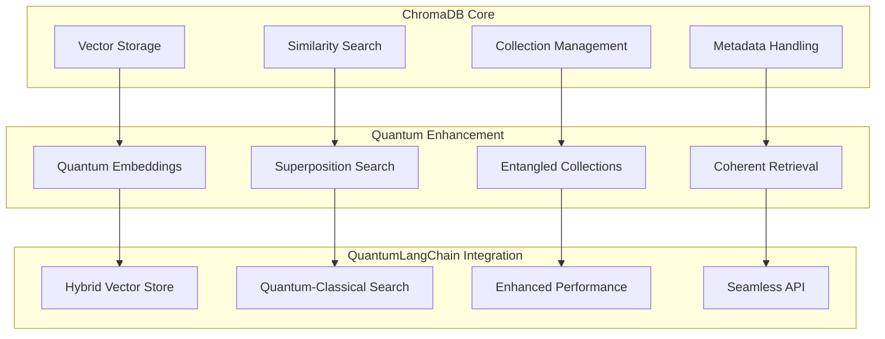

# 🔗 ChromaDB Integration

🔐 **Licensed Component** - Contact: [bajpaikrishna715@gmail.com](mailto:bajpaikrishna715@gmail.com) for licensing

## ChromaDB Quantum Integration



## 🌟 Core Features

### Quantum-Enhanced ChromaDB

```python
from quantumlangchain.vectorstores import QuantumChromaDB

# Initialize quantum ChromaDB
vectorstore = QuantumChromaDB(
    collection_name="quantum_docs",
    quantum_embeddings=True,
    superposition_search=True,
    persist_directory="./chroma_db"
)

# Add documents with quantum enhancement
await vectorstore.aadd_texts(
    texts=documents,
    quantum_encoding=True
)

# Quantum similarity search
results = await vectorstore.asimilarity_search(
    query="quantum computing",
    k=5,
    quantum_interference=True
)
```

## 🔐 License Requirements

- **Basic ChromaDB**: Basic license tier (standard integration)
- **Professional ChromaDB**: Professional license tier (quantum enhancements)
- **Enterprise ChromaDB**: Enterprise license tier (advanced features)
- **Research ChromaDB**: Research license tier (experimental features)

Contact [bajpaikrishna715@gmail.com](mailto:bajpaikrishna715@gmail.com) for licensing.
