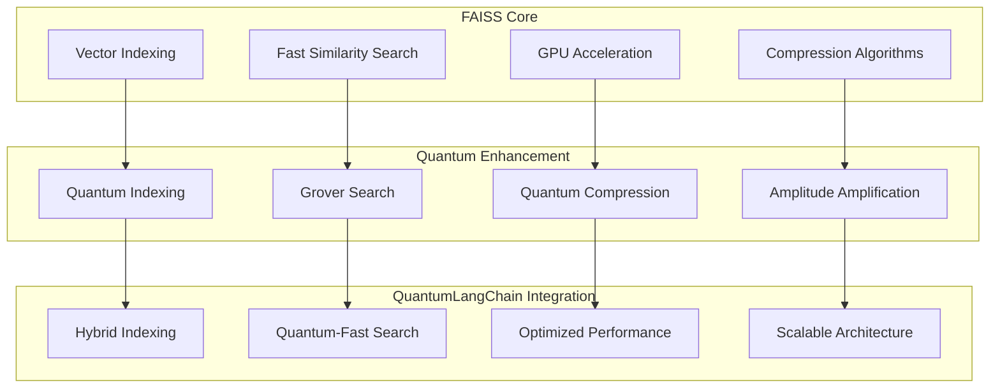

# ⚡ FAISS Integration

🔐 **Licensed Component** - Contact: [bajpaikrishna715@gmail.com](mailto:bajpaikrishna715@gmail.com) for licensing

## FAISS Quantum Integration



## 🌟 Core Features

### Quantum-Enhanced FAISS

```python
from quantumlangchain.vectorstores import QuantumFAISS

# Initialize quantum FAISS
vectorstore = QuantumFAISS(
    index_type="IVF",
    quantum_indexing=True,
    gpu_acceleration=True,
    quantum_compression=True
)

# Build quantum-enhanced index
await vectorstore.build_quantum_index(
    embeddings=embeddings,
    quantum_optimization=True
)

# Ultra-fast quantum search
results = await vectorstore.quantum_search(
    query_vector=query_embedding,
    k=10,
    grover_acceleration=True
)
```

## 🔐 License Requirements

- **Basic FAISS**: Basic license tier (standard integration)
- **Professional FAISS**: Professional license tier (quantum indexing)
- **Enterprise FAISS**: Enterprise license tier (GPU + quantum)
- **Research FAISS**: Research license tier (experimental algorithms)

Contact [bajpaikrishna715@gmail.com](mailto:bajpaikrishna715@gmail.com) for licensing.
