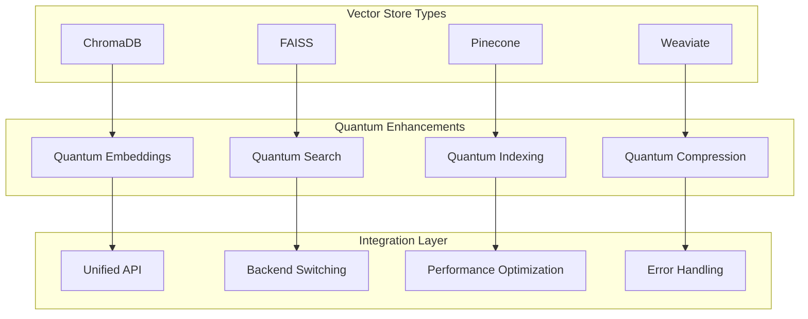

# 🔌 Vector Store Integration Guide

🔐 **Licensed Component** - Contact: [bajpaikrishna715@gmail.com](mailto:bajpaikrishna715@gmail.com) for licensing

## Integration Architecture



## 🌟 Integration Features

### Universal Vector Store Interface

```python
from quantumlangchain.vectorstores import create_quantum_vectorstore

# Create any vector store with quantum enhancement
vectorstore = create_quantum_vectorstore(
    store_type="chromadb",  # or "faiss", "pinecone", etc.
    quantum_enhanced=True,
    **store_config
)

# Unified API across all stores
results = await vectorstore.asimilarity_search(
    query="quantum machine learning",
    k=5,
    quantum_boost=True
)
```

## 🔐 License Requirements

- **Basic Integration**: Basic license tier (2 vector stores)
- **Professional Integration**: Professional license tier (5 vector stores)
- **Enterprise Integration**: Enterprise license tier (unlimited stores)
- **Research Integration**: Research license tier (experimental stores)

Contact [bajpaikrishna715@gmail.com](mailto:bajpaikrishna715@gmail.com) for licensing.
