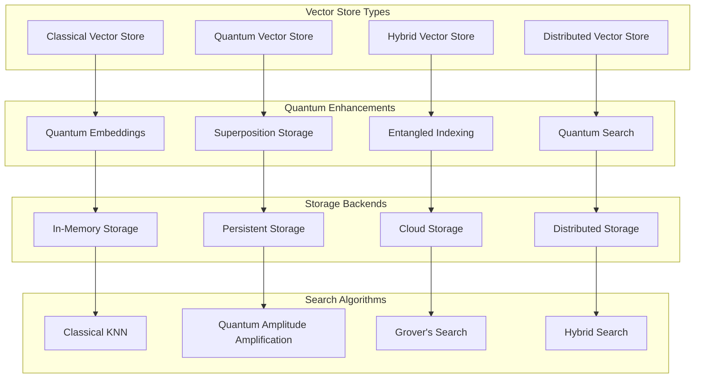
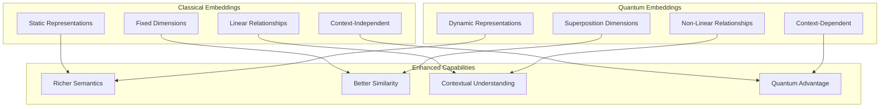
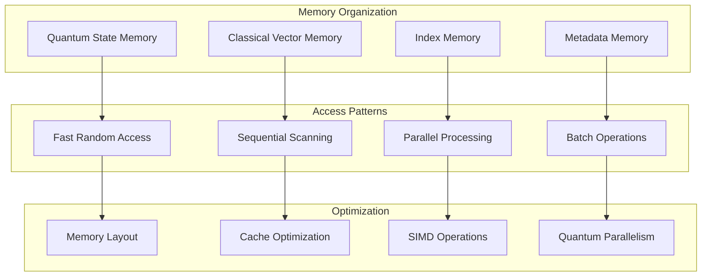
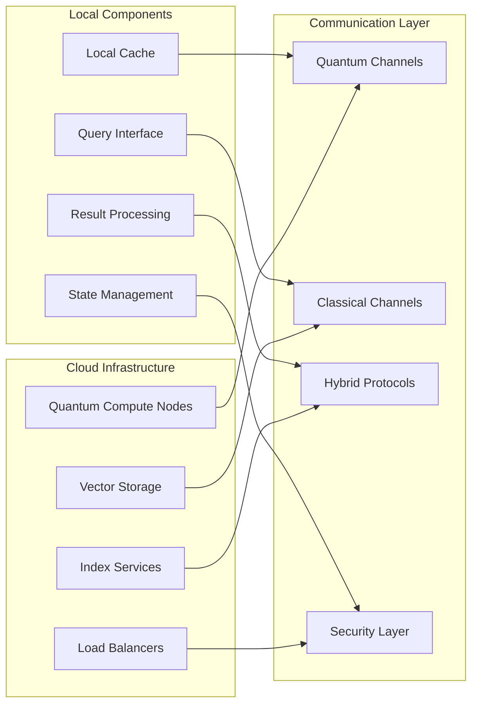
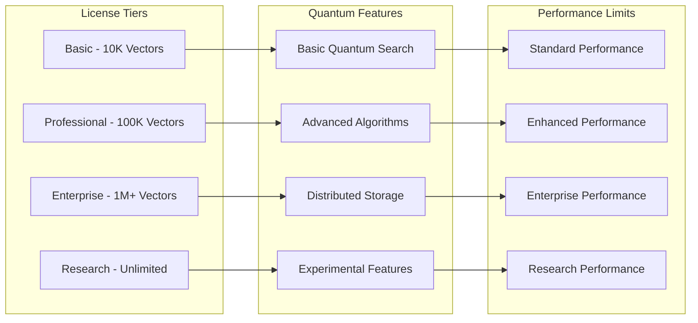
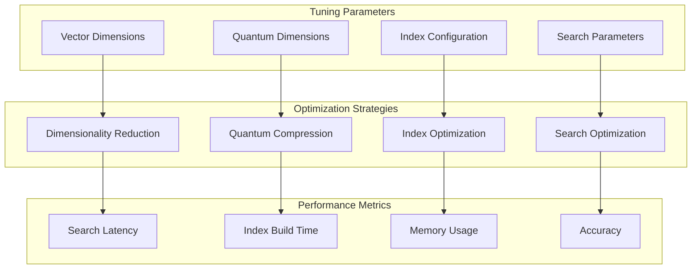
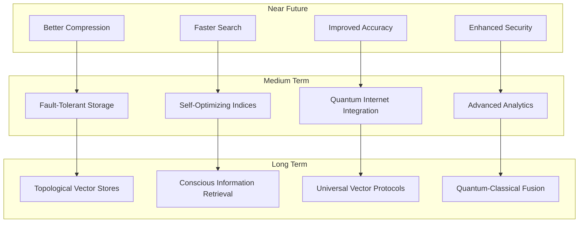

# 📊 Vector Stores

🔐 **Licensed Component** - Contact: [bajpaikrishna715@gmail.com](mailto:bajpaikrishna715@gmail.com) for licensing

## Quantum Vector Store Architecture



## 🌟 Core Features

### Quantum-Enhanced Similarity Search

```mermaid
graph LR
    subgraph "Classical Search"
        A[Linear Scan]
        B[Tree Traversal]
        C[Approximate Methods]
        D[O(n) Complexity]
    end
    
    subgraph "Quantum Search"
        E[Amplitude Amplification]
        F[Quantum Interference]
        G[Superposition Search]
        H[O(sqrt(n)) Complexity]
    end
    
    subgraph "Hybrid Advantages"
        I[Best of Both Worlds]
        J[Adaptive Selection]
        K[Context-Aware Search]
        L[Optimal Performance]
    end
    
    A --> I
    B --> J
    C --> K
    D --> L
    
    E --> I
    F --> J
    G --> K
    H --> L
```

### Quantum Embeddings Integration



## 🔧 Implementation

### Basic Quantum Vector Store

```python
from quantumlangchain.vectorstores import QuantumVectorStore
from quantumlangchain.embeddings import QuantumEmbeddings

# Initialize quantum embeddings
embeddings = QuantumEmbeddings(
    classical_dim=768,
    quantum_dim=8,
    entanglement_strength=0.8
)

# Create quantum vector store
vectorstore = QuantumVectorStore(
    embeddings=embeddings,
    quantum_search=True,
    superposition_storage=True,
    dimension=768 + 256  # Classical + quantum dimensions
)

# Add documents with quantum enhancement
documents = [
    "Quantum computing uses quantum mechanical phenomena",
    "Machine learning optimizes model parameters",
    "Natural language processing understands human language"
]

# Store with quantum encoding
await vectorstore.aadd_texts(
    documents,
    quantum_enhancement=True,
    entanglement_grouping=True
)

# Quantum similarity search
results = await vectorstore.asimilarity_search(
    "quantum machine learning",
    k=5,
    quantum_interference=True,
    search_type="quantum_enhanced"
)
```

### Advanced Hybrid Vector Store

```python
from quantumlangchain.vectorstores import HybridVectorStore
from quantumlangchain.backends import QiskitBackend

class AdvancedVectorSystem:
    def __init__(self):
        # Quantum backend configuration
        self.quantum_backend = QiskitBackend(
            backend_name="qasm_simulator",
            shots=1024,
            optimization_level=2
        )
        
        # Quantum embeddings with error correction
        self.embeddings = QuantumEmbeddings(
            classical_dim=1024,
            quantum_dim=12,
            backend=self.quantum_backend,
            error_correction=True,
            decoherence_mitigation=True
        )
        
        # Hybrid vector store
        self.vectorstore = HybridVectorStore(
            embeddings=self.embeddings,
            classical_backend="faiss",
            quantum_backend=self.quantum_backend,
            hybrid_search_strategy="adaptive"
        )
        
        # Search optimizer
        self.search_optimizer = QuantumSearchOptimizer(
            vectorstore=self.vectorstore
        )
    
    async def intelligent_storage(self, documents, metadata=None):
        """Intelligent document storage with quantum optimization."""
        # Analyze document characteristics
        doc_analysis = await self.analyze_documents(documents)
        
        # Optimize storage strategy
        storage_strategy = await self.optimize_storage_strategy(
            doc_analysis
        )
        
        # Apply quantum encoding based on content type
        if storage_strategy["use_quantum_encoding"]:
            await self.vectorstore.quantum_add_documents(
                documents,
                metadata=metadata,
                entanglement_pattern=storage_strategy["entanglement_pattern"],
                compression_level=storage_strategy["compression_level"]
            )
        else:
            await self.vectorstore.classical_add_documents(
                documents,
                metadata=metadata
            )
    
    async def adaptive_search(self, query, search_params=None):
        """Adaptive search with quantum-classical optimization."""
        # Analyze query characteristics
        query_analysis = await self.analyze_query(query)
        
        # Select optimal search strategy
        if query_analysis["complexity"] > 0.7:
            # Use quantum search for complex queries
            results = await self.vectorstore.quantum_search(
                query,
                k=search_params.get("k", 10),
                quantum_interference=True,
                amplitude_amplification=True
            )
        else:
            # Use classical search for simple queries
            results = await self.vectorstore.classical_search(
                query,
                k=search_params.get("k", 10)
            )
        
        # Post-process results with quantum enhancement
        enhanced_results = await self.enhance_search_results(
            results, query_analysis
        )
        
        return enhanced_results
```

### Distributed Quantum Vector Store

```python
from quantumlangchain.vectorstores import DistributedQuantumVectorStore

class DistributedVectorSystem:
    def __init__(self, cluster_config):
        # Distributed quantum vector store
        self.vectorstore = DistributedQuantumVectorStore(
            cluster_config=cluster_config,
            quantum_sharding=True,
            entanglement_across_nodes=True,
            fault_tolerance=True
        )
        
        # Load balancer for quantum operations
        self.load_balancer = QuantumLoadBalancer(
            cluster_config
        )
        
        # Consistency manager
        self.consistency_manager = QuantumConsistencyManager(
            vectorstore=self.vectorstore
        )
    
    async def distributed_storage(self, documents, replication_factor=3):
        """Store documents across distributed quantum nodes."""
        # Partition documents optimally
        partitions = await self.optimal_partitioning(documents)
        
        # Distribute with quantum entanglement
        for partition in partitions:
            target_nodes = await self.load_balancer.select_nodes(
                partition, replication_factor
            )
            
            await self.vectorstore.distribute_partition(
                partition,
                target_nodes,
                entanglement_links=True
            )
    
    async def quantum_distributed_search(self, query, global_search=True):
        """Distributed search with quantum coordination."""
        if global_search:
            # Search across all nodes with quantum coordination
            search_tasks = []
            for node in self.vectorstore.get_active_nodes():
                task = self.vectorstore.quantum_search_on_node(
                    query, node
                )
                search_tasks.append(task)
            
            # Quantum interference across results
            node_results = await asyncio.gather(*search_tasks)
            global_results = await self.quantum_result_fusion(
                node_results
            )
            
            return global_results
        else:
            # Intelligent node selection
            target_nodes = await self.select_relevant_nodes(query)
            
            # Parallel search on selected nodes
            results = await self.vectorstore.parallel_search(
                query, target_nodes
            )
            
            return results
```

## 🎯 Vector Store Types

### In-Memory Quantum Vector Store



### Persistent Quantum Vector Store

```python
from quantumlangchain.vectorstores import PersistentQuantumVectorStore

class PersistentVectorSystem:
    def __init__(self, storage_path):
        self.vectorstore = PersistentQuantumVectorStore(
            storage_path=storage_path,
            quantum_state_persistence=True,
            incremental_updates=True,
            backup_strategy="quantum_redundancy"
        )
        
        # Persistence manager
        self.persistence_manager = QuantumPersistenceManager(
            storage_path
        )
    
    async def save_quantum_state(self):
        """Save quantum states to persistent storage."""
        # Serialize quantum states
        quantum_states = await self.vectorstore.get_quantum_states()
        serialized_states = await self.serialize_quantum_states(
            quantum_states
        )
        
        # Save with error correction
        await self.persistence_manager.save_with_redundancy(
            serialized_states
        )
    
    async def load_quantum_state(self):
        """Load quantum states from persistent storage."""
        # Load with error correction
        serialized_states = await self.persistence_manager.load_with_verification()
        
        # Deserialize quantum states
        quantum_states = await self.deserialize_quantum_states(
            serialized_states
        )
        
        # Restore quantum vector store
        await self.vectorstore.restore_quantum_states(quantum_states)
    
    async def incremental_update(self, new_documents):
        """Incrementally update persistent store."""
        # Add new documents
        await self.vectorstore.aadd_texts(new_documents)
        
        # Update indices
        await self.vectorstore.update_indices()
        
        # Save changes
        await self.save_quantum_state()
```

### Cloud Quantum Vector Store



## 📊 Performance Characteristics

### Search Performance Comparison

```mermaid
graph TB
    subgraph "Classical Performance"
        A[Linear Search - O(n)]
        B[Tree Search - O(log n)]
        C[Hash Search - O(1)]
        D[Approximate - O(log n)]
    end
    
    subgraph "Quantum Performance"
        E[Grover Search - O(sqrt n)]
        F[Amplitude Amplification]
        G[Quantum Interference]
        H[Superposition Parallelism]
    end
    
    subgraph "Performance Metrics"
        I[Query Latency]
        J[Throughput]
        K[Accuracy]
        L[Scalability]
    end
    
    A --> I
    B --> J
    C --> K
    D --> L
    
    E --> I
    F --> J
    G --> K
    H --> L
```

### Storage Efficiency

```python
class VectorStoreAnalytics:
    def __init__(self, vectorstore):
        self.vectorstore = vectorstore
        self.analytics = QuantumAnalytics()
    
    async def analyze_storage_efficiency(self):
        """Analyze storage efficiency metrics."""
        metrics = {
            "storage_overhead": await self.calculate_storage_overhead(),
            "compression_ratio": await self.calculate_compression_ratio(),
            "quantum_advantage": await self.calculate_quantum_advantage(),
            "search_speedup": await self.calculate_search_speedup()
        }
        
        return metrics
    
    async def calculate_quantum_advantage(self):
        """Calculate quantum advantage for specific use case."""
        # Benchmark classical vs quantum search
        classical_time = await self.benchmark_classical_search()
        quantum_time = await self.benchmark_quantum_search()
        
        advantage = classical_time / quantum_time
        
        return {
            "speedup_factor": advantage,
            "classical_time": classical_time,
            "quantum_time": quantum_time
        }
    
    async def optimize_configuration(self):
        """Optimize vector store configuration."""
        # Analyze access patterns
        access_patterns = await self.analytics.analyze_access_patterns()
        
        # Optimize based on patterns
        if access_patterns["search_frequency"] > 0.8:
            # Optimize for search performance
            await self.vectorstore.optimize_for_search()
        elif access_patterns["update_frequency"] > 0.8:
            # Optimize for update performance
            await self.vectorstore.optimize_for_updates()
        else:
            # Balanced optimization
            await self.vectorstore.optimize_balanced()
```

## 🔒 License Integration

### Vector Store Capacity Restrictions



### License Enforcement

```python
from quantumlangchain.licensing import requires_license

class QuantumVectorStore(LicensedComponent):
    @requires_license(tier="basic")
    def __init__(self, **kwargs):
        """Initialize quantum vector store with license validation."""
        super().__init__(
            required_features=["vector_stores"],
            required_tier="basic"
        )
        
        # Validate capacity limits
        max_vectors = self._get_max_vector_capacity()
        requested_capacity = kwargs.get("capacity", 10000)
        
        if requested_capacity > max_vectors:
            raise LicenseError(
                f"Vector capacity exceeded. "
                f"License allows {max_vectors} vectors, "
                f"requested {requested_capacity}. "
                f"Contact: bajpaikrishna715@gmail.com"
            )
    
    @requires_license(tier="professional")
    def enable_advanced_search(self):
        """Enable advanced search algorithms (Professional+ only)."""
        pass
    
    @requires_license(tier="enterprise")
    def enable_distributed_storage(self):
        """Enable distributed storage (Enterprise+ only)."""
        pass
    
    async def add_vectors(self, vectors, **kwargs):
        """Add vectors with license validation."""
        current_count = await self.get_vector_count()
        new_count = current_count + len(vectors)
        max_vectors = self._get_max_vector_capacity()
        
        if new_count > max_vectors:
            raise LicenseError(
                f"Adding {len(vectors)} vectors would exceed limit. "
                f"Current: {current_count}, Limit: {max_vectors}. "
                f"Contact: bajpaikrishna715@gmail.com"
            )
        
        await super().add_vectors(vectors, **kwargs)
```

## 🛠️ Configuration and Optimization

### Vector Store Configuration

```python
# Vector store configuration templates
VECTORSTORE_CONFIGS = {
    "basic_config": {
        "dimension": 768,
        "quantum_dim": 4,
        "similarity_metric": "cosine",
        "index_type": "flat",
        "quantum_search": False
    },
    
    "professional_config": {
        "dimension": 1024,
        "quantum_dim": 8,
        "similarity_metric": "quantum_cosine",
        "index_type": "quantum_hnsw",
        "quantum_search": True,
        "error_correction": True
    },
    
    "enterprise_config": {
        "dimension": 2048,
        "quantum_dim": 16,
        "similarity_metric": "quantum_hybrid",
        "index_type": "distributed_quantum",
        "quantum_search": True,
        "distributed": True,
        "fault_tolerance": True
    },
    
    "research_config": {
        "dimension": 4096,
        "quantum_dim": 32,
        "similarity_metric": "experimental",
        "index_type": "adaptive_quantum",
        "quantum_search": True,
        "experimental_features": True,
        "custom_algorithms": True
    }
}
```

### Performance Tuning



## 📚 API Reference

### Core Vector Store Classes

```python
class QuantumVectorStore:
    def __init__(self, embeddings, **config):
        """Initialize quantum vector store."""
        
    async def aadd_texts(self, texts: List[str], **kwargs) -> List[str]:
        """Add texts to vector store."""
        
    async def asimilarity_search(self, query: str, k: int = 4, **kwargs) -> List[Document]:
        """Perform similarity search."""
        
    async def asimilarity_search_with_score(self, query: str, k: int = 4) -> List[Tuple[Document, float]]:
        """Similarity search with scores."""
        
    async def amax_marginal_relevance_search(self, query: str, k: int = 4, **kwargs) -> List[Document]:
        """Maximum marginal relevance search."""

class HybridVectorStore(QuantumVectorStore):
    async def quantum_search(self, query: str, **kwargs) -> List[Document]:
        """Quantum-enhanced search."""
        
    async def classical_search(self, query: str, **kwargs) -> List[Document]:
        """Classical search fallback."""
        
    async def adaptive_search(self, query: str, **kwargs) -> List[Document]:
        """Adaptive quantum-classical search."""
```

### Vector Store Utilities

```python
class VectorStoreManager:
    def __init__(self, vectorstore):
        """Initialize vector store manager."""
        
    async def optimize_index(self) -> None:
        """Optimize vector store index."""
        
    async def backup(self, location: str) -> bool:
        """Backup vector store."""
        
    async def restore(self, location: str) -> bool:
        """Restore vector store from backup."""
        
    def get_statistics(self) -> Dict[str, Any]:
        """Get vector store statistics."""

class QuantumSearchOptimizer:
    def __init__(self, vectorstore):
        """Initialize search optimizer."""
        
    async def optimize_search_parameters(self, query_samples: List[str]) -> Dict[str, Any]:
        """Optimize search parameters based on query samples."""
        
    async def benchmark_search_methods(self) -> Dict[str, float]:
        """Benchmark different search methods."""
```

## 🔮 Future Enhancements

### Planned Vector Store Features



## 🔐 License Requirements

- **Basic Vector Store**: Basic license tier (up to 10K vectors)
- **Professional Vector Store**: Professional license tier (up to 100K vectors)
- **Enterprise Vector Store**: Enterprise license tier (1M+ vectors)
- **Research Vector Store**: Research license tier (unlimited capacity)

Contact [bajpaikrishna715@gmail.com](mailto:bajpaikrishna715@gmail.com) for licensing.

Vector Stores provide the foundation for quantum-enhanced information retrieval and similarity search, enabling next-generation AI applications with unprecedented search capabilities.
